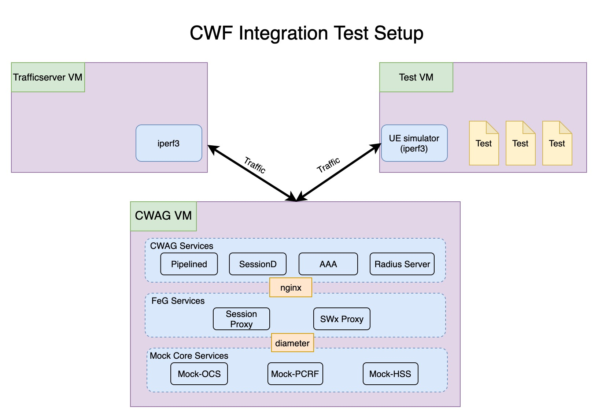

## Integration Test Setup
This integration currently uses 3 separate VMs to run the tests: `cwag-test`
and `cwag-dev` in `magma/cwf/gateway`, and `magma-trfserver` in `magma/lte/gateway`.
The fabfile in this directory can be used to automate the setup needed to run
the test.

###  `cwag-dev`
This VM will build and run all cwag services and mock core services needed to
run the test. See the various `docker-compose` files in `cwf/gateway/docker`
to see the complete list of services.

### `cwag-test`
This VM will be used to run the tests. We will also run a UE simulator service
to simulate a UE device in the test.

### `magma-trfserver`
This VM runs an iperf3 server.

## Current Tests

* UE Authentication
* Basic Traffic test with pass all policies
* Gx Credit Control Request/Answer flow for Init/Update/Terminate
* Gx ReAuth Request/Answer flow
* Gx rule enforcement
  * Static and dynamic rules
  * Rule base mappings
  * Omnipresent (Network wide rules)
  * Rule activation/deactivation time
* Gx usage monitor installation/enforcement
* Gx Abort Session Request/Answer flow
* Gx QoS downgrade and negotiation
* Gy ReAuth Request/Answer flow
* Gy Final-Unit-Action-Terminate enforcement

## Running the test
#### Requirements
* fabric3
* see https://magma.github.io/magma/docs/basics/prerequisites for
our prerequisites on running our VMs.

To the run the test, run `fab integ_test` from `magma/cwf/gateway`.
This fabfile will
* Provision the 3 VMs
* Build and start docker containers on `cwag-dev`
* Start the UE simulator service on `cwag-test`
* Start the iperf3 server on `magma-trfserver`
* Run the integration test on `cwag-test`
* Clean up (Kill the UE sim on `cwag-test` and stop the iperf3 server on `magma-trfserver`)

#### Fab script parameters
* `no_build`: The fabfile by default stops, rebuilds, and starts all containers. If you
only want to restart the containers, and not rebuild everything, run
`fab integ_test:no_build=True`.
* `tests_to_run`: By default, the fab script will run all existing tests. You can
specify a subset of them with this flag. For example, run `fab integ_test:tests_to_run=gx`,
to only run Gx tests. See the fabfile for more options.

## Debugging on `cwag-dev` VM
* To see the list of running services, run `docker ps` in the `cwag-dev` VM.
* To see per-service logs, run `docker-compose logs <container_name>`
* To go into a running container, run `docker-compose exec <container_name> bash`
* `/usr/local/bin/pipelined_cli.py` in pipelined service maybe useful for
viewing installed flows for debugging.

## Before you commit any code...
Before committing, please make sure you run the commands below to test and format.
  * If you touch anything in `magma/cwf/gateway`, run `make precommit` on the
  `cwag-dev` VM, under `magma/cwf/gateway`.
  * If you touch anything in `magma/feg/gateway`, run `make precommit` inside
  the FeG test container.
    * `cd magma/feg/gateway/docker`
    * `docker-compose up -d test`
    * `docker-compose exec test /bin/bash`
    * `make precommit`
  * If you touch anything in `magma/.../cloud/go`, please run the
  orc8r precommit.
    * `cd magma/orc8r/cloud/go/docker`
    * `./build.py --mount`
    * `make precommit`

Additionally, if you write any new tests, please summarize what the test does
in a comment above the test. See existing tests for example.

## FAQ

#### Unit tests are not able to run: `/cwf/gateway: No such file or directory`

&rightarrow; The cwag-dev VM probably did not provision properly. Run
`vagrant provision cwag` in `magma/cwf/gateway` to provision the VM again
to see specific errors.

#### Docker is failing to build due to lack of space

&rightarrow; Since docker does not garbage collect previously built images, we
will have to manually prune them. Run `docker system df` to see memory usage
and what can be deleted. To remove these images, run
`docker image prune --filter until=12h`.

#### All traffic hang and then fail
&rightarrow; This is an issue we've observed occasionally. We have not found
the root cause yet. Assuming the issue is not with the CWAG services, one
remedy you can try is to destroy all VMs and start them again.
