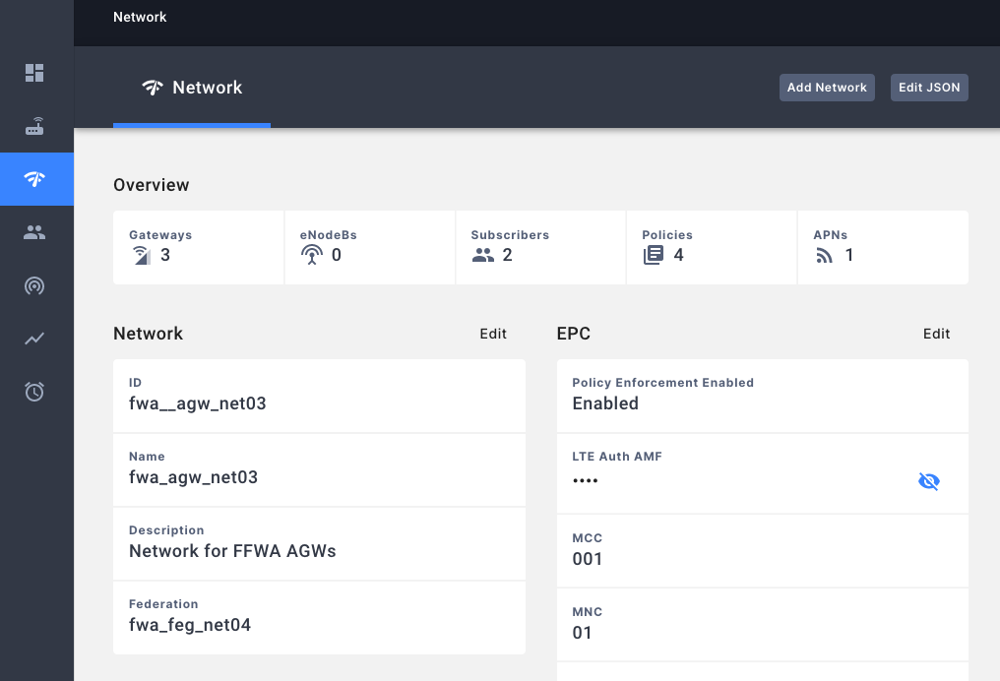
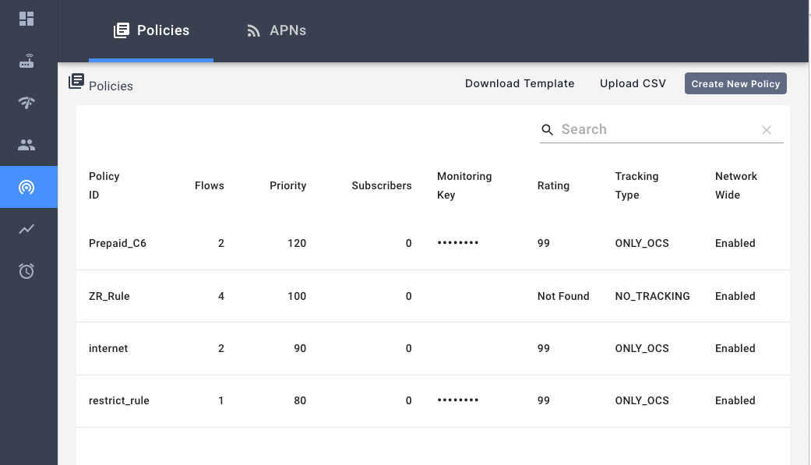
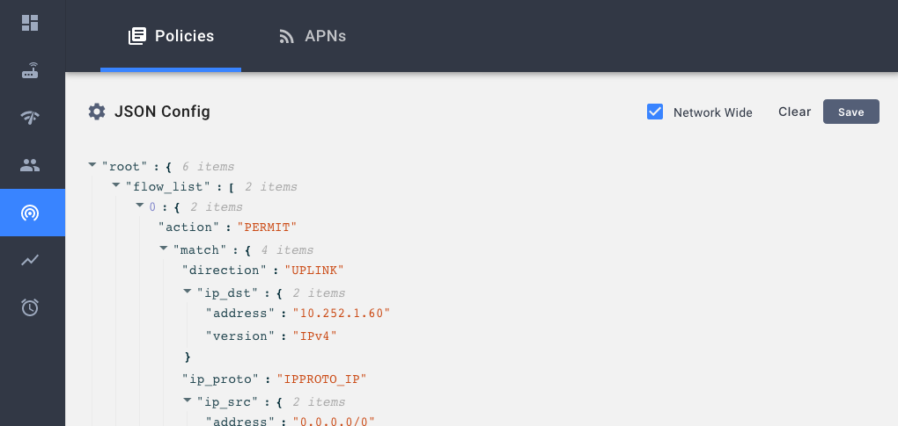

# Federated-FWA Setup Guide

## Basic Configuration Steps

For Basic installation instructions follow "[Installing Federation Gateway](../feg/deploy_install)"

There are a few configuration steps that are not yet exposed in NMS that must be done manually via the REST API.

Magma has two important concepts on federation:

* **Federation Network:** An entity holding the higher level configuration of a given federation method. For example, in a system without a PCRF federation this may hold the network-wide policy rules.
* **Federated LTE Network:** An entity holding the specific configurations for a given LTE federation. For example, this may hold Gx/Gy/S6a specific configurations such as the availability of each interface on the gateway and the target servers.

When configuring an integration with LTE nodes, it is necessary to link these two entities as described in the following sections.

### Associating FederatedLTE network to a Federation network

In the **Federated LTE** **Network**’s NMS page, the Federation config should be the **Federation** **Network**’s network ID.



### Associating Federation network to a FederatedLTE network

In order to complete the association, we also need to modify the **Federation Network**‘s federation configuration.


Ensure that the following field “served_network_ids” has the **Federated LTE** **Network** networkID.

```
  "served_network_ids": [
    "fwa_agw_1"
  ]
```

### Enabling Relay To FeG

In **Federated LTE** **Network**’s EPC configuration, ensure both of the relay flags are set to `true`.


```
  "gx_gy_relay_enabled": true,
  "hss_relay_enabled": true,
```

### Configuring Policies

The NMS page for  **Federated LTE Network** has the following policy configuration page.



### Configuring Omnipresent/Network-Wide Policies

Omnipresent rules or Network-Wide polices are policies that do not require a PCRF to install. On Session creation, all network wide policies will be installed for the session along with any other policies configured by the PCRF.
In the policy configuration’s edit dialogue, use the **Network Wide** check box to toggle the configuration.




## Advanced Configuration Steps

### Enabling Redirection Support

In order to enable FUA-redirection support, enable the `redirectd` service in the magmad configuration.


```
"dynamic_services": ["eventd","td-agent-bit","redirectd"]
```

### Disable Gx / Gy

**DisableGy**: Useful for cases where no OCS / charging policies are configured.

**DisableGx**: For PCRF-less deployments. In this setting, omnipresent policies must be added to the networks’ subscriber_config. If the rules contain a rating group, credit usage will be reported through the Gy interface.


The relevant configurations for disabling Gx/Gy are:

```
"gx": {
    "disableGx": false,
},
"gy": {
    "disableGy": false,
}
```


### PLMN filter

FEG allows filtering subscribers by PLMN id. If the subscriber does not belong
to a PLMN, the request will not be sent to HSS and FEG will return an
UNAUTHORIZED message.

To enable this feature add a list `plmn_ids` to `s6a` and add a list of PLMN
ids. The list can contain 5 digit or 6 digit PLMN ids. If the list is empty or
null, s6a will send any IMSI request to HSS.


```
"s6a": {
    "plmn_ids": [
      "123456"
    ],
}
```

This feature is disabled by default (so any session request from any IMSI will be sent to HSS)

### Virtual APN
To replace UE specified APNs with a config specified APN for Gx and Gy, use the
Federation API endpoint.
Under either Gx or Gy configuration, you can specify a list of filters and
virtual APN value.

For example, the configuration below will replace any APNs of sessions with
APN of form `internet.*` and charging characteristic 12. However, the virtual
APN will only be applied for the Gx interactions, as the config for Gy is empty.
```
"gx": {
    ...
    "virtual_apn_rules": [
        {
            "apn_filter": "internet.*",
            "apn_overwrite": "new.apn!",
            "charging_characteristics_filter": "12"
        }
    ]
  },
  "gy": {
    ...
    "virtual_apn_rules": []
  },
```

## Basic Sanity Checks

### FeG

* Here are the steps to test the FeG <  > Gx/Gy/S6a connections
    * Exec into `session_proxy` container: `docker exec -it session_proxy bash`
    * Run `/var/opt/magma/bin/gx_client_cli `with the following parameters
        * --commands=IT
        * --dest_host
        * --dest_realm
        * --addr
        * --realm
        * --host
        * --imsi
    * Run `/var/opt/magma/bin/gy_client_cli` with the following parameters
        * --commands=IT
        * --addr
    * Run `/var/opt/magma/bin/s6a_client_cli air <IMSI>`
        * Example: `/var/opt/magma/bin/s6a_cli air 001010000091111`

### AGW

* Ensure the basic AGW features are healthy. (Checkin, Bootstrapping, etc.)
* Ensure that **enable_config_streamer** is set in `/etc/magma/magmad.yml`
* Ensure that the streamed SessionD config shows **gxGyRelayEnabled** as set
    * Run `magma_get_config.py -s sessiond`
* Ensure that the streamed SubscriberDB config shows **hssRelayEnabled** as set
    * Run `magma_get_config.py -s subscriberdb`

## Various Debugging / Issue Reporting Tips

### PCAPs

* For any Gx/Gy/S6a issues, a PCAP on FeG is extremely helpful.
* For any AGW issue, a PCAP on AGW is probably useful.
* For Gx/Gy issues, SessionD + SessionProxy logs are useful
* For datapath issues, SessionD + PipelineD logs are useful


### Log Levels

* SessionD’s log level at ‘DEBUG’ level to get granular insight on data usage tracking
* Enabling logging for GRPC messages between services
    * For AGW, modify `/etc/environment` to include `MAGMA_PRINT_GRPC_PAYLOAD="1"` and restart all services. This flag will only work for the SessionD service on the AGW.
    * For FeG, add the environment variable in the docker-compose file as the following.
```
environment:
    MAGMA_PRINT_GRPC_PAYLOAD: 1
```
