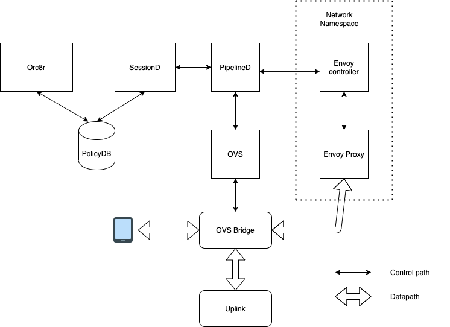
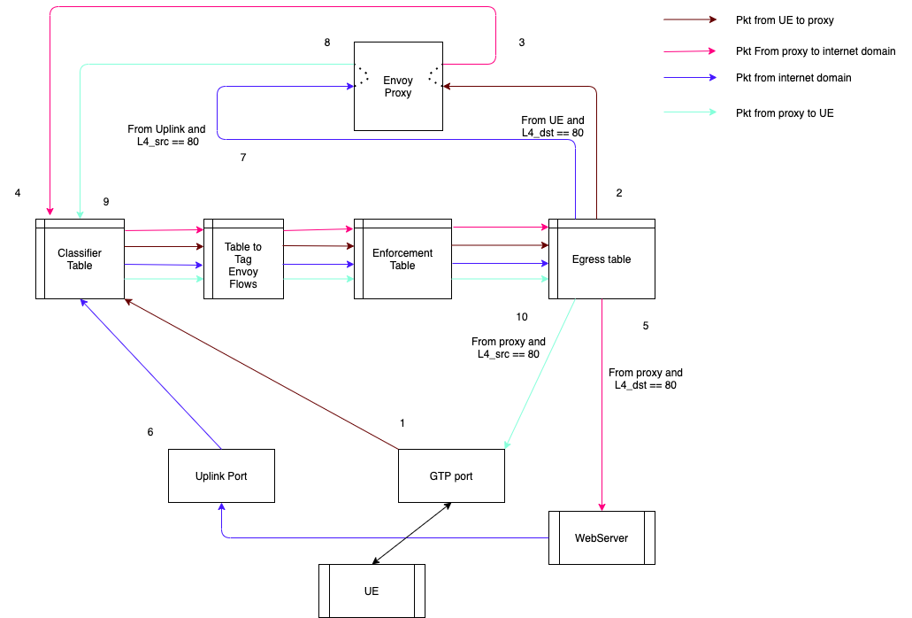

# Header enrichment

*Status: Accepted*\
*Feature owner: @pbshelar*\
*Feedback requested from: @amarpad, @koolzz, @kozat*\
*Last Updated: 10/27*

## Summary

This feature would allow operators to enable header enrichment for UE HTTP traffic. This way AGW could add subscriber
information to HTTP requests. There could be privacy implication of this feature, so operator should check local
laws before using this feature.

## Use cases

**Captive portals**

AGW can add HTTP headers that sets IMSI and MSISDN of the user initiating HTTP requests. This would allow Carrier Captive
portals to retrieve user context from HTTP headers to implement seamless authentication in captive portals.

**Differential service**

Operators can provide different classes of services by learning IP to IMSI mapping from HTTP header. Actual implementation
of the service is out of scope of this feature.

## API
Operators can set target URLs in policy rules via API. This would enable header enrichment for HTTP requests towards those
URLs

## Implementation Phases

The implementation will be done in multiple phases.

**Phase 1 - MVP**

(October - November 27)

This adds support to append plain text HTTP headers for IMSI and MSISDSN. This would be configurable via orc8r API.
Operator needs to set policy rules in orc8r with target URLs and destination IP addresses. The destination IP address
would allow AGW to create an efficient L3 filter for HTTP proxy traffic.
In case of null destination IP address, all traffic would enter HTTP header enrichment proxy, which works but
has implications on performance.\
In short header enrichment can be enabled for specific UE traffic to specific destination IP address and to HTTP URL.

**Phase 2 - Advanced Header enrichment**

(December - January)

In the second phase, features will be provided for the option to encrypt these headers.
This will also expand header enrichment API via dynamic rule.

**Phase 3**

Add ability to set user defined HTTP headers.

## Design
#### Configuration options
There are multiple options for intercepting HTTP traffic from UE and adding headers.

**UE aware HTTP proxy**

In this model the operator needs to push http_proxy configuration to UE. UE could connect to this proxy for all HTTP traffic.
Direct HTTP traffic would be dropped in AGW. There are multiple options to automatically configure proxy. But none
of them works on every setup.

**Transparent HTTP proxy**

In this model AGW intercepts HTTP traffic from UE and sends it to the local HTTP proxy process. HTTP proxy make upstream
connection and responds back to UE. UE is not aware that it is actually connected to the proxy.

Given issues with configuring proxy URLs in UE, we have decided to implement transparent proxy.

### HTTP Proxy options
Simple google search would list a bunch of HTTP proxy options. Out of those we has decided to use Envoy for
following reason:
1. Envoy is de facto HTTP proxy used for service mesh, it has large community behind it
2. Envoy is highly programmable via gRPC API
3. Envoy dataplane can scale up and scale down according to resource on AGW
4. Envoy supports wide variety of protocol like HTTP1 and HTTP2
5. Envoy supports transparent HTTP/1.1 to HTTP/2 proxy is supported
6. There are bunch of observability features

#### Various components involved in header enrichment:

## Datapath design

Header enrichment needs UE HTTP connection termination on AGW and new connection to upstream server. Therefore For each
header enrichment policy would result in four datapath flows rather than two.
1. From UE to Proxy
2. From Proxy to UE
3. From Proxy to Upstream server
4. From upstream server to Proxy

Following diagram shows various tables involved in handling the flows. For this feature new table is added that handles
tagging the flow so that it can be steered to correct port on egress table.

## Performance
Enabling Header enrichment is going to impact packet processing performance of the AGW. This also would result in
increased memory utilization due to HTTP proxy process.
