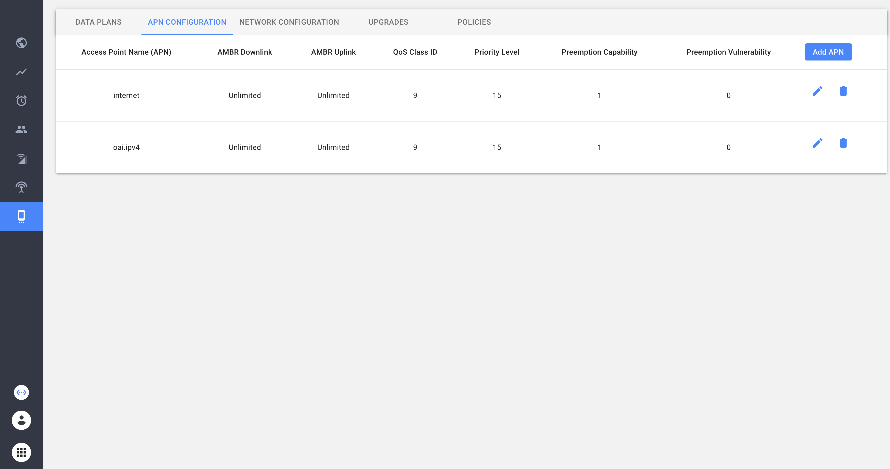
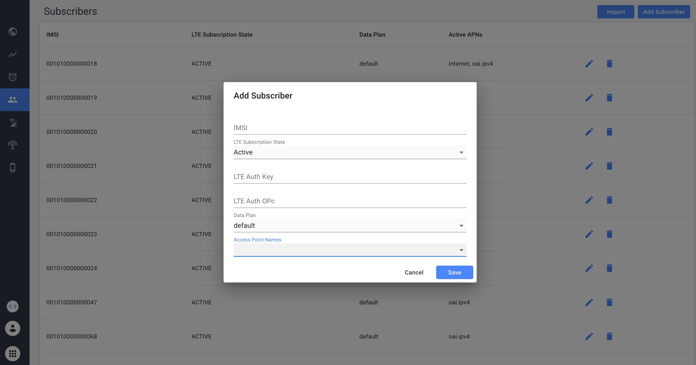

# Configure Access Point Name

Before any of your subscribers can attach to your network, you will first have
to provision at least one APN.

UEs can successfully attach and connected to the Magma AGWs if they have a
valid APN configuration in their subscription profile on the network side.
Typically, UEs send APN information explicitly in their connection requests.
The AGW pulls APN information from subscription data synced down from
Orchestrator to verify that UEs have a valid subscription for the requested APN.
If APN information is missing from the connection request, the AGW picks the
first APN in the subscriber profile as the default APN and establishes a
connection session according to that default APN. Once APN information is
selected, Magma allocates IP address for the UE under that APN.

## Define APN Configurations

First, check that there is at least one APN provisioned for your network:

- Navigate to your NMS instance and on the sidebar click on "Configure" button.

- In the newly opened page, on the top bar select "APN CONFIGURATION".
If there are already APNs defined, it will show up on this page.

- You can edit or delete any of the existing APN configurations.
Note that the updates and deletions will be reflected automatically in
subscriber profiles and any new attaches as well as PDN connection requests
will be impacted by these changes.

- You can also add a new APN configuration by clicking on the "Add APN"
button and filling out the requested fields. After saving these changes, the
page should refresh with the new list of APNs and their configurations.



## Add APN Configurations to Subscriber Profiles

The next step is to add one or more APN configurations to subscriber profiles
so that UEs can start consuming network services based on their APNs:

- For an existing subscriber, to update its subscription profile, click on the
edit field and perform a multi-select under the "Access Point Names".
- For a new subscriber, fill out the fields including the "Access Point Names"
field (screenshot below shows the view after clicking on the "Add Subscriber"
button). Once you save the updated or new subscriber information, the APNs
added to the subscriber profile will show be reflected on the page.



### Notes

- The first APN listed under "Active APNs" for each subscriber becomes the
default APN that will be used if the UE omits the APN information in its
connection requests.

- The subscriber data is streamed down to AGWs periodically and the new configs
should be reflected on AGW with some lag (typically, 1-2 minutes).

- To check if an AGW is already updated, on the AGW, you can run the following
command to retrieve local subscriber data:

`subscriber_cli.py get IMSI<15 digit IMSI>`

An example output for a hypothetical user with IMSI 001010000000001 and APNs
`internet`, `ims` is shown below:

```
sid {
  id: "001010000000001"
}
lte {
  state: ACTIVE
  auth_key: "..." # not shown in this example
}
network_id {
  id: "my_network"
}
state {
}
sub_profile: "default"
non_3gpp {
  apn_config {
    service_selection: "ims"
    qos_profile {
      class_id: 5
      priority_level: 9
    }
    ambr {
      max_bandwidth_ul: 100000
      max_bandwidth_dl: 100000
    }
  }
  apn_config {
    service_selection: "internet"
    qos_profile {
      class_id: 9
      priority_level: 15
    }
    ambr {
      max_bandwidth_ul: 100000000
      max_bandwidth_dl: 200000000
    }
  }
}
```

## APN Override Config in MME
To override the UE requested APN with a network specified APN, you can use the
`enable_apn_correction` and `apn_correction_map_list` in `/etc/magma/mme.yml`.
```
enable_apn_correction: false
apn_correction_map_list:
        - imsi_prefix: "00101"
          apn_override: "magma.ipv4"
```
If `enable_apn_correction` is set to `true`, MME will override the original APN
based on the specified IMSI-prefix filtering.
We support up to 10 IMSI prefix filters and corresponding APNs.
See under Proposals for a more detailed design doc.
