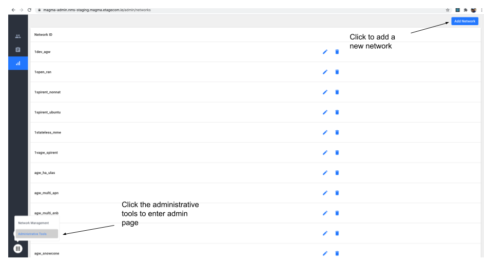
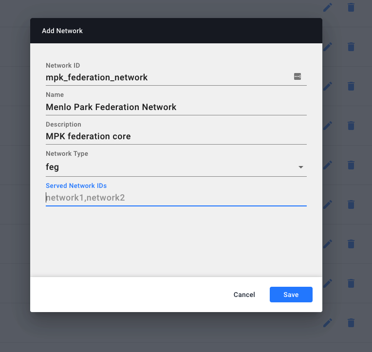
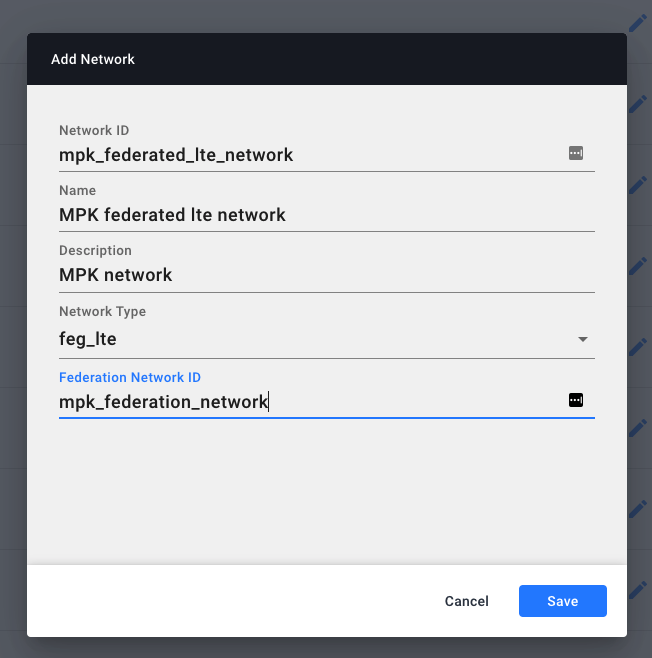
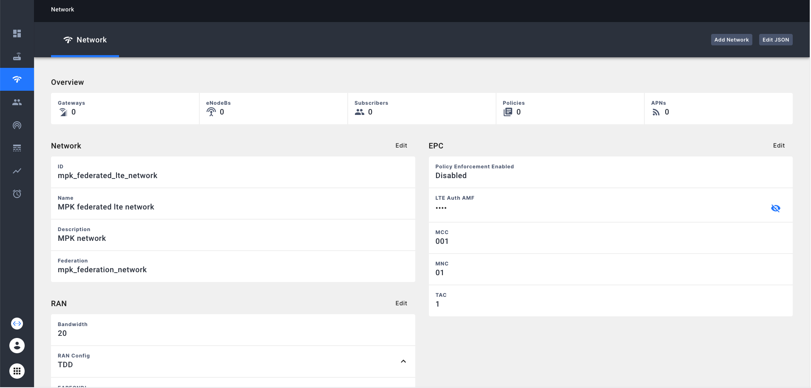
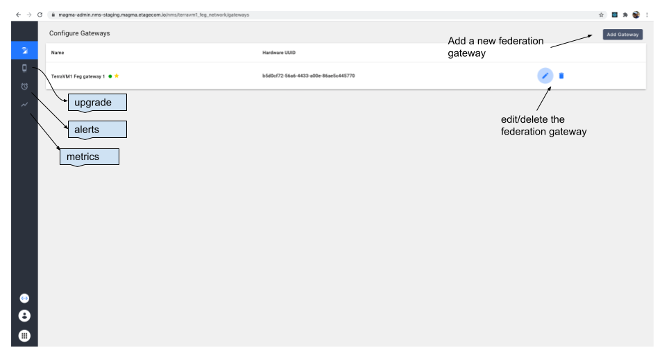
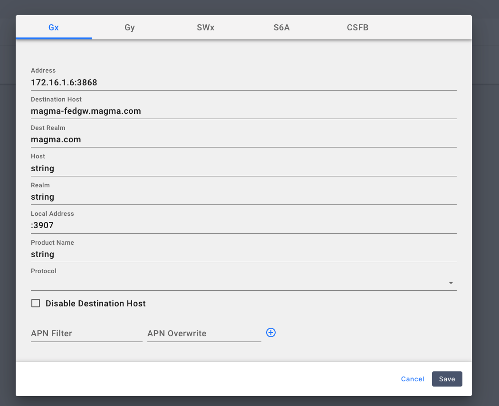
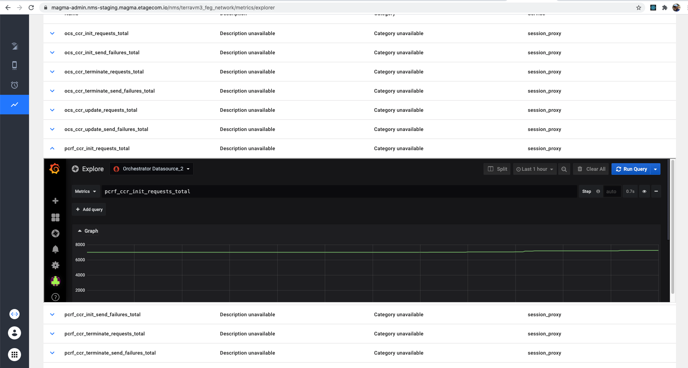
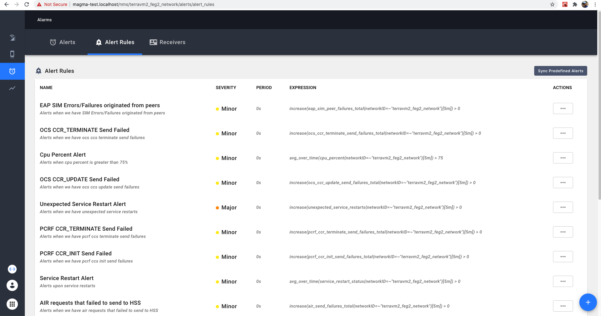

# Federated Networks

Magma implements a low-friction, single point of integration between an MNO's mobile core and access gateways through federation networks. NMS enables management of the federated networks and their gateways.

Magma has two important concepts on federation:

### **Federation Network/** Federation Gateway (FGW)

Federation network comprises of the federation gateways. The Federation Gateway integrates the Operators core network with using standard 3GPP interfaces (S6a, gx, gy, S8) to existing MNO components. It acts as a proxy between the Magma LTE Access Gateway and the operator’s network and facilitates core functions, such as authentication, data plans, policy enforcement, and charging.

### **Federated LTE Network**

Federated LTE network is the network containing LTE Access Gateways which are managed through the federated networks. When configuring an integration with LTE nodes, it is necessary to link these two entities as described in the following sections.

In the following sections, we will describe further on management of these federation network and federated LTE networks through NMS

### Creating a Federation Network

### Creating a Federated LTE Network

In the **Federated LTE** **Network**’s NMS page, the Federation config should contain the **Federation** **Network**’s network ID.

### Configuring Federation Network

Federation network can be managed like any other network in NMS. We can navigate to the newly created federation network by clicking on the appropriate network name in the network selector. Following image shows the top level view of a federation network. Here we display the currently configured federation gateways.

Federation Gateway configuration page enables the operator to configure the server addresses for Gx, Gy, Swx, and S6A as shown below.

### Configuring Omnipresent/Network-Wide Policies on Federated LTE network

Omnipresent rules or Network-Wide polices are policies that do not require a PCRF to install. On session creation, all network wide policies will be installed for the session along with any other policies configured by the PCRF.
In the policy configuration’s edit dialog, use the **Network Wide** check box to toggle the configuration.

### Metrics

Operator can explore federation network specific metrics through this component.

### Alarms

Operators can custom configure alerts or sync predefined alerts and receive alerts through this component.

