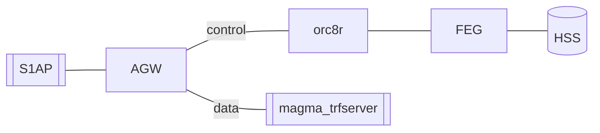

# S1AP Federated Integration Tests

S1AP Integration Test only run test on AGW. The objective of **S1AP
Federated Integration Test** is to provide a test platform
to run Magma with all its components. That means  an end-to-end test with all
components of magma: AGW, Orc8r and FEG.

Currently, this test is on experimental phase, so we only test connectivity of
AGW - Or8c - FEG, and we are able to run an attach/detach test using S1AP tester
and our mock HSS.

## Architecture

As the diagram indicates, this test spins up **AGW**, **FeG**, and **Orc8r**
and uses `S1aP` and `magma_trfserver` as an eNb and SGi emulator to run tests.



The services will run either on Vagrant VM or on Docker:

| Services          |  Vagrant VM       |  Docker   |
|-------------------|:-----------------:|:----------:|
| AGW               | magma             |           |
| FeG               |                   | &check;   |
| Orc8r             |                   | &check;   |
| Traffic server    | magma_trfserver   |           |
| S1AP tester       | magma_test        |           |
| HSS               |                   | &check;   |

## Running the tests

Below you have three different ways to run the tests. That will help you
in case you need to debug any intermediate step in case automation fails.

### Automated test run

The below fab script will do all for you. In case that fails try the other

This script will

- Build AGW, Orc8r and FEG,
- Start AGW, Orc8r and FEG
- Configure Orc8r with AGW and FEG
- Run connectivity tests between all 3 components
- Run a basic attach/detach test

```bash
cd magma/lte/gatewat
fab federated_integ_test
```

### Semiautomatic test run

#### Build environment

Using this way you will build the environment step by step but still using
certain automation. If you want to build this manually go to
[Manual build](#Manual-build)

*Note commands for AGW will have to be run inside the vagrant VM. That is
why all the actions include the `vagrant ssh magma` command first. To leave
from vagrant just type `exit`. FeG and Orc8r will need to be run in the
host itself (no vagrant involved)*

On your host machine execute this command to build, start and conigure AGW,
FEG and Orc8r and start them.

```bash
cd magma/lte/gateway/python/integ_tests/federated_tests
fab build_all_and_configure
```

After this is run you can check
if your gateways have been bootstrapped using magmad logs at AGW and FEG. The
command below will try to reach Orc8r From AGW And FeG and FeG from AGW

```bash
cd magma/lte/gateway/python/integ_tests/federated_tests
fab test_connectivity
```

Once it is built, start the magma_trfserver and magma_test VMs

```bash
cd magma/lte/gateway
vagrant up magma_test
vagrant up magma_trfserver
```

#### Run test manually

Once you have built all the VMs, you can try to run a test from
`magma_test` VM

```bash
cd magma/lte/gateway
vagrant ssh magma_test
# inside vagrant vm
cd magma/lte/gateway/python/integ_test
make integ_test TESTS=federated_tests/s1aptests/test_attach_detach.py

# Once the test is done you can exit Vagrant VM
exit
```

This will run a simple attach-detach test.

### Manual build

If you want to build the environment manually:

- AGW:

```bash
cd magma/lte/gateway
vagrant up magma
vagrant ssh magma

# inside vagrant vm
cd magma/lte/gateway
make run

# exit from Vagrant VM
exit
```

- FEG:

```bash
cd magma/lte/gateway/python/integ_tests/federated_tests/docker
docker-compose build
docker-compose up -d
```

- Orc8r:

```bash
cd magma/orc8r/cloud/docker
./build -a
./run
# return to agw folder
cd magma/lte/gateway
# register gateways
fab --fabfile=dev_tools.py register_federated_vm
fab --fabfile=dev_tools.py register_feg_gw
```

- Test vm:

```bash
cd magma/lte/gateway
vagrant up magma_test
vagrant ssh magma_test
# inside vagrant vm
cd magma/lte/gateway/python
make

# exit from vagrant vm
exit
```

- Traffic vm:

```bash
cd magma/lte/gateway
vagrant up magma_trfserver

# exit from vagrant vm
exit
```

You can then [Run test manually](#Run-test-manually)
