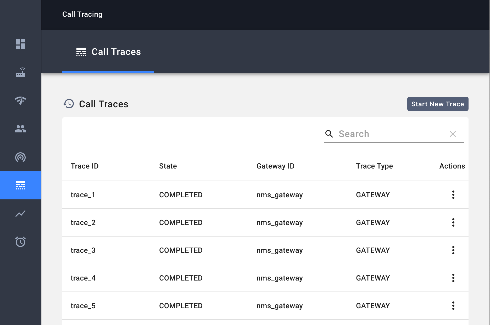
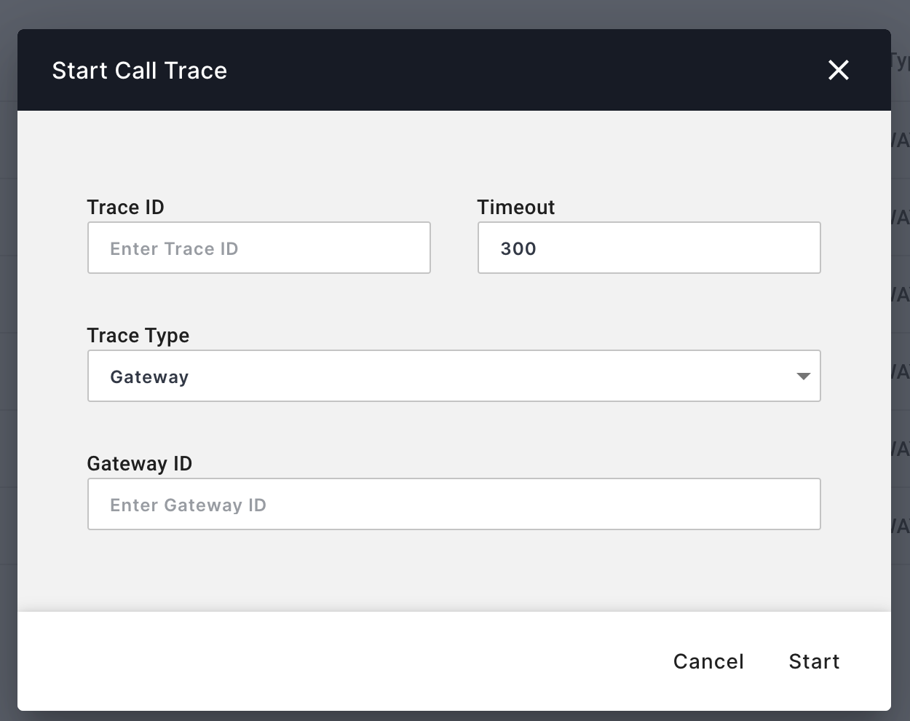
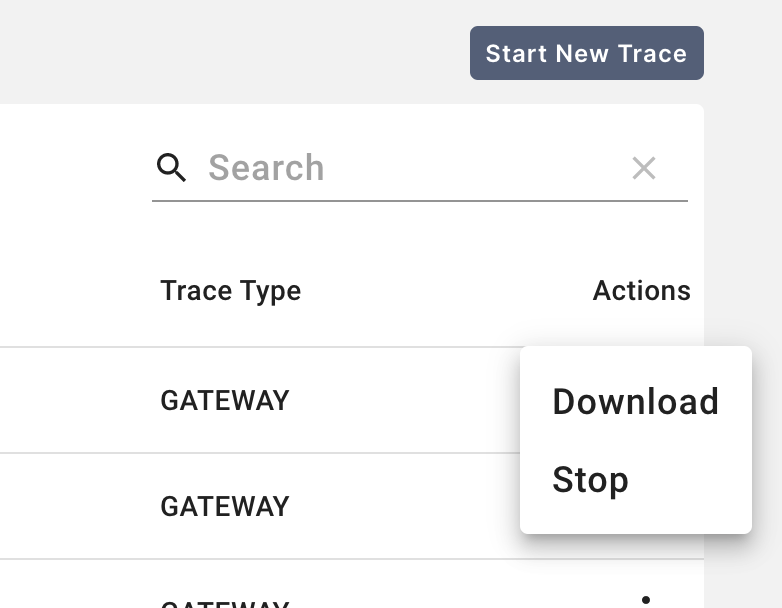

# Call Tracing

Magma supports basic traffic capture for troubleshooting purposes.
Monitoring of control messaging flow and other traffic between the Magma access
gateway and eNodeB devices is possible with this feature.

As of the time of writing, we are in the process of adding filtering for
specific protocols and allowing custom options through tshark.

Currently there is a 5MiB size limit for call traces.

## Requirements

Ensure you have the following:

- a functional orc8r
- a configured LTE network
- a configured LTE gateway with eNodeB
- subscribers that can attach to your LTE gateway
- network running in un-federated mode

## Initiating a Call Trace



The call tracing page can be accessed directly via the NMS sidebar.

Click `Start New Trace`



`trace_id` must be a unique value among all the call traces on your network.

You must specify a `gateway_id` to capture your call trace on. Call traces
capturing across multiple gateways simultaneously are not supported at this
time. If you wish to do so, start multiple call traces, one for each gateway.

Once the call trace is started, you can stop and/or download the call trace
on the same page. Under `Actions`, click the vertical ellipsis button for your
call trace to see these options.



## Viewing a Call Trace

It is suggested that Wireshark is used to analyze call trace captures.


## Additional Configuration

To do additional configuration for call traces, modify the `ctraced.yml` file
on the access gateway.

This allows you to configure the following options:

- network interfaces to capture traffic on
- where trace files are stored on the access gateway
- tools used for traffic capture: `tshark` or `tcpdump`

To specify the network interfaces to capture traffic on, add one line per
network interface for the property `trace_interfaces` in the `ctraced.yml` file
on the access gateway. Note that this modification must be done on each gateway
for which you wish to make this configuration.

To specify where trace files are stored on the access gateway, again modify
the `ctraced.yml` file, with the `trace_directory` property. It is recommended
that call trace files are not viewed directly from the access gateway, but
that they are downloaded through the NMS or API, and viewed through wireshark.

The last configuration option of note in `ctraced.yml` is the `trace_tool`
option. Two options are currently provided, for `tshark` or `tcpdump`. Most
call trace options are only available if `tshark` is used.

## API Guide

To view more detailed information on the API, see
`magma/orc8r/cloud/go/services/ctraced/obsidian/models/swagger.v1.yml`

It is recommended that call tracing is started, stopped, and downloaded through
the API, or use of the NMS which uses the API. We provide the following
endpoints:

### Get all call traces

```GET      /networks/{network_id}/tracing```

### Get info on a specific call trace

```GET      /networks/{network_id}/tracing/{trace_id}```

Example response payload:

```json
{
  "config": {
    "gateway_id": "lte_gateway_1",
    "timeout": 300,
    "trace_id": "example_call_trace",
    "trace_type": "GATEWAY"
  },
  "state": {
    "call_trace_available": false,
    "call_trace_ending": false
  }
}
```

### Start a new call trace

```POST     /networks/{network_id}/tracing/{trace_id}```

To start a new call trace, the payload must include the configuration of the
call trace.

Example payload:

```json
{
  "gateway_id": "lte_gateway_1",
  "timeout": 300,
  "trace_id": "example_call_trace",
  "trace_type": "GATEWAY"
}
```

There are four fields for a call trace configuration:

*trace_id*: The unique ID of the call trace.
*trace_type*: Currently only supported type is `GATEWAY`, but we will provide
support for interface and subscriber filtered call traces.
*gateway_id*: The gateway ID of the access gateway on which to capture the call
trace.
*timeout*: The time in seconds after which the call trace will automatically
stop.

### Stop a call trace

```PUT      /networks/{network_id}/tracing/{trace_id}```

This API endpoint is used for updating call traces, but currently the only
configurable option allows user control of ending a call trace.

An example request payload to stop a call trace:

```json
{
  "requested_end": true
}
```

No other fields can currently be specified for updating a call trace, so this
endpoint is only used for stopping call traces.

### Delete a call trace

```DELETE   /networks/{network_id}/tracing/{trace_id}```

### Download a call trace

```GET      /networks/{network_id}/tracing/{trace_id}/download```

## Basic Troubleshooting

If you cannot get call tracing to work with the NMS, the API can be used
directly.

Logs are available for the `ctraced` service on both the orc8r and access
gateway, to view any error logs.

Additional design details are available in `p005_call_tracing.md`.
