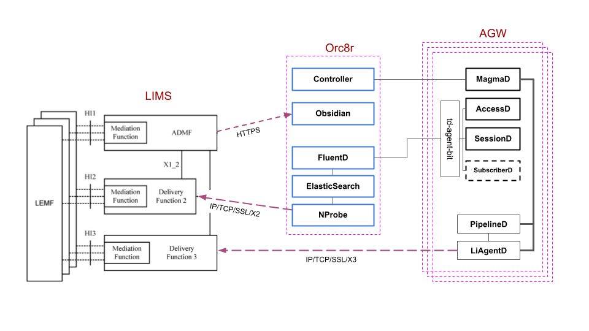

# Network Probe

## Overview

Network Probe allows a Magma operator to provide standardized lawful interception X2 and X3 interfaces as described in ETSI TS 103 221-2. This feature takes advantage of the rest API (swagger) to provide the X1 interface.

## Architecture

Current architecture leverages both AGW and Orc8r to deliver the magma LI feature. It aims at providing a 3GPP complaint solution and smooth integration with different Lawful Interception Management System (LIMS).

The high level design is described in the picture below,



The LI feature can be summarized as follow,

### X1 Interface

It relies on the Orc8r Swagger API to configure intercept tasks and destinations. This interface uses Json content and thus is not 3GPP complaint. An external solution (nprobe-proxy) can handle the translation 3GPP (XML based) <  > Orc8r Swagger When required.

Swagger nprobe endpoints allow the following,

#### 1. Tasks management

Network Probe Tasks represent an interception warrant and must be configured by LIMS. They provide the following information,

- TaskID : is UUID v4 representing an XiD identifier.
- TargetID : represents the subscriber identifier
- TargetType : represents the subscriber identifier type (IMSI, IMEI, MSISDN)
- DeliveryType : (events_only/all) states whether to deliver X2 or both X2 and X3 to the LIMS.
- Duration: specifies the lifetime of the task. If set to 0, the task will not expire until deleted through APIs.
- CorrelationID : allows to correlates X2 and X3 records. If not provided, Orc8r will generate a random value.

Each configured task in swagger will be then propagated to the appropriate service (nprobe, liagentd, pipelined)

#### 2. Destinations management

Network Probe Destinations represent the configuration of the remote server in charge of collecting the records.

- DeliveryAddress : provides the address of the remote server.
- DeliveryType : (events_only/all) states whether the server can receive X2 or both X2 and X3.

*Note that destination configuration is not currently taken in account. Only manual config is supported.*

### X2 Interface

It is provided by the nprobe service in Orc8r. This service collects all the relevant events for targeted subscriber through elastic search from fluentd. Then, it parses them to create X2 records (aka Intercept Related Information - IRI) as specified ETSI TS 103 221-2 before exporting them to a remote server over TLS.

### X3 Interface

It leverages AGW services to deliver X3 records as specified ETSI TS 103 221-2.
First, PipelineD mirrors all the data plane of the targeted subscriber to a dedicated network interface. Then, LiAgentD continuously listens on this port and process each packet as follow,

- For each new target, It interrogates MobilityD to retrieve the subscriber ID from IP address
- Create a new intercept state (currently stored locally)
- Create X3 record by encapsulating the mirrored packet (starting from IP layer) in X3 header.
- Exports records to a remote server over TLS.

## Prerequisites

Before starting to configure the LI feature, first you need to prepare the following,

- An orchestrator setup (Orc8r)
- An LTE Gateway (AGW)
- A remote TLS server to collect records and corresponding certificates.
- TLS Client certificates for X2 and X3 Interfaces

*Note that nprobe-proxy is provided outside magma project and will be described separately.*

## NetworkProbe Configuration

The following instructions use Orc8r Swagger API to configure Network Probe feature.
We will mainly use GET and POST methods to read and write from Swagger.
Below are the steps to enable this feature in your current setup:

### 1. Enable LI mirroring in PipelineD in AGW

Edit /etc/magma/pipelined.yml

- Enable li_mirror in static_services list
- Set the following items,
    - li_local_iface: eth2
    - li_mirror_all: false
    - li_dst_iface: li_port

### 2. Enable LiAgentD service in AGW

Edit /etc/magma/liagentd.yml

- Enable the service
- Copy nprobe.pem/.key to /var/opt/magma/certs/
- Set the following remote TLS server information
    - proxy_addr
    - proxy_port
    - cert_file
    - key_file

### 3. Configure the NProbe service in Orc8r

Similarly to the liagentd, you will need to configure orc8r with the appropriate details of
the remote server. This can be achieved automatically through terraform as follow,

- Go to your terraform deployment directory
- Copy client certificates to your certs directory
- Load nprobe.pem/.key in secrets manager using

```bash
terraform taint module.orc8r-app.null_resource.orc8r_seed_secrets
terraform apply -target=module.orc8r-app.null_resource.orc8r_seed_secrets
```

- Set the following variables in your main.tf
    - nprobe_operator_id
    - nprobe_delivery_server
    - nprobe_skip_verify_server

Then, run

```bash
terraform apply
```

### 4. Configure a NetworkProbe Task

Go to **Swagger API**:

- Go to `nprobe` POST method `Add a new NetworkProbeTask to the network` and set the content.
- Run the GET method again to see the applied changes.

```json
{
  "task_details": {
    "correlation_id": 605394647632969700,
    "delivery_type": "events_only",
    "domain_id": "string",
    "duration": 300,
    "target_id": "string",
    "target_type": "imsi",
    "timestamp": "2020-03-11T00:36:59.65Z"
  },
  "task_id": "29f28e1c-f230-486a-a860-f5a784ab9177"
}
```

*Note that timestamp, correlation ID, domain ID and duration are optional and can be skipped. Task ID must be a valid uuid v4.*

## Test and Troubleshooting

It is recommendable that before running the tests, you enable some extra logging capabilities in both Access Gateway.

For better details in Access Gateway logs:

- Enable `log_level: DEBUG` in `liagentd.yml`
- See the logs using `sudo journalctl -fu magma@liagentd`

Verify that the configured nprobe tasks through swagger were properly propagated to AGW services,

- Open /var/opt/magma/configs/gateway.mconfig
- Verify that pipelined config contains the targeted subscribers id.

```text
"liUes":{"imsis":["IMSI001010000000001"]}
```

- Verify that liagentd config contains the task information.

```text
"nprobeTasks":[{"taskId":"29f28e1c-f230-486a-a860-f5a784ab9177","targetId":"IMSI001010000000001","targetType":"imsi","deliveryType":"events_only","correlationId":"605394647632070000"}]
```

Verify that events are streamed from the AGW to Orc8r in the NMS

- Observe nprobe service logs in Orc8r with

```bash
# Local setup
docker logs orc8r_controller_1
```

```bash
# Remote Setup
kubectl -n orc8r logs nprobe-orc8r-...
```
