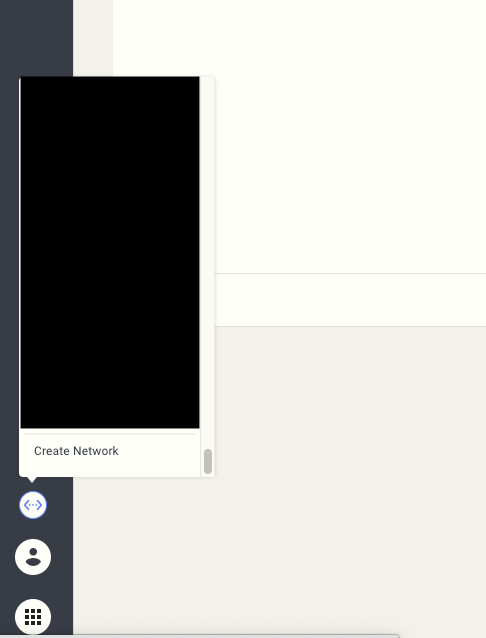

# Configure Access Gateway

## Prerequisites

Before beginning to configure your Magma Access Gateway, you will need to make
sure that it is running all services without crashing. You will also need a
working Orchestrator setup. Please follow the instructions in
"[Deploying Orchestrator](../orc8r/deploy_intro.md)" for a
successful Orchestrator installation.

You will need to set up a super-user in a valid NMS Organization in order to
use the NMS. See "[NMS Multitenancy](../nms/deploy_setup.md)"
to complete this step.

You also should have completed all the steps in "[Install Access Gateway (On Bare Metal)](deploy_install.md)".
For this part, we strongly recommend that you SSH into the AGW box from a host
machine instead of using the AGW directly.

In this latest version, Magma Access Gateway no longer has a hardwired default Access Point Name (APN). Therefore, each UE must have a subscription profile that includes at least one APN to be able to attach to the network. Please follow the instructions in "[APN Configuration](deploy_config_apn.md)".

## Access Gateway Configuration

First, copy the root CA for your Orchestrator deployment into your AGW:

```bash
HOST$ scp rootCA.pem magma@10.0.2.1:~
HOST$ ssh magma@10.0.2.1

AGW$ sudo mkdir -p /var/opt/magma/tmp/certs/
AGW$ sudo mv rootCA.pem /var/opt/magma/tmp/certs/rootCA.pem
```

Then, point your AGW to your Orchestrator:

```bash
AGW$ sudo mkdir -p /var/opt/magma/configs
AGW$ cd /var/opt/magma/configs
AGW$ sudo vi control_proxy.yml
```

Put the following contents into the file:

```yaml
cloud_address: controller.yourdomain.com
cloud_port: 443
bootstrap_address: bootstrapper-controller.yourdomain.com
bootstrap_port: 443
fluentd_address: fluentd.yourdomain.com
fluentd_port: 24224

rootca_cert: /var/opt/magma/tmp/certs/rootCA.pem
```

Then restart your services to pick up the config changes:

```bash
AGW$ sudo service magma@* stop
AGW$ sudo service magma@magmad restart
```

## Creating and Configuring Your Network

Navigate to your NMS instance, https://your-org.nms.yourdomain.com, and log in
with the superuser credentials you provisioned for this organization. If this
is a fresh Orchestrator install, you will be prompted to create your first
network. Otherwise, select "Create Network" from the network selection icon
at the bottom of the left sidebar.



Fill out the network creation modal with the parameters that you want. There
are 3 steps in the modal window, but the network will be created after you hit
"Save and Continue" on the first screen, so you can exit the modal and
reconfigure the network later after that.

## Registering and Configuring Your Access Gateway

You need to grab the hardware secrets off your AGW:

```bash
AGW$ show_gateway_info.py
Hardware ID:
------------
1576b8e7-91a0-4e8d-b19f-d06421ad72b4

Challenge Key:
-----------
MHYwEAYHKoZIzj0CAQYFK4EEACIDYgAECMB9zEbAlLDQLq1K8tgCLO8Kie5IloU4QuAXEjtR19jt0KTkRzTYcBK1XwA+C6ALVKFWtlxQfrPpwOwLE7GFkZv1i7Lzc6dpqLnufSlvE/Xlq4n5K877tIuNac3U/8un
```

Navigate to "Equipment" on the NMS via the left navigation bar, hit
"Add Gateway" on the upper right, and fill out the multi-step modal form.
Use the secrets from above for the "Hardware UUID" and "Challenge Key" fields.

For now, you won't have any eNodeB's to select in the eNodeB dropdown under the
"Ran" tab. This is OK, we'll get back to this in a later step.

At this point, you can validate the connection between your AGW and
Orchestrator:

```bash
AGW$ journalctl -u magma@magmad -f
# Look for the following logs
# INFO:root:Checkin Successful!
# INFO:root:[SyncRPC] Got heartBeat from cloud
# INFO:root:Processing config update gateway_id
```

If everything looks OK, you can move on to configuring your eNodeB.
