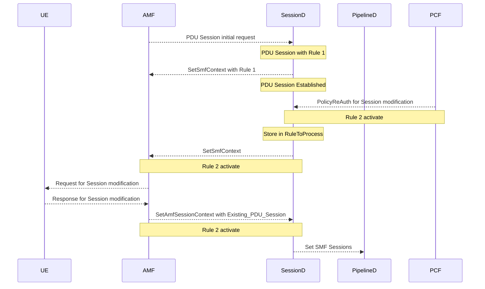

# Extended Features of 5G SA FWA

This document gives an overview of the Extended features added on top of the [integrated 5G SA FWA](integrated_5g_sa) (5G Standalone Architecture Fixed Wireless Access) such as

- [5G QoS](extended_5g_sa_features#5g-qos)
- [IPv6 & Dual IPv4v6 support](extended_5g_sa_features#ipv6--dual-ipv4v6-support)
- [Network initiated Session Modification](extended_5g_sa_features#network-initiated-session-modification)
- [SUCI Extensions](extended_5g_sa_features#suci-extensions)
- [Stateless feature](extended_5g_sa_features#stateless-feature)
- [GTP extension header support](extended_5g_sa_features#gtp-extension-header-support).

## 5G QoS

The QoS (Quality of service) is the mechanism that works on a network to control traffic and ensure the performance of critical applications with limited network capacity. By giving particular high-performance applications priority, it enables the businesses to modify their overall network traffic.

The QoS flow is the lowest level granularity within the 5G system and is where policy and charging are enforced.

With the current infrastructure, AGW supports the static QoS flow attached to the subscribers in this release.

The Static QoS flow descriptors attached to subscriber.


## IPv6 & Dual IPv4v6 support

With the current infrastructure, AGW supports IPv6 & Dual IPv4v6.

Getting IPv6 address allocated in PDU Session accept message.


Getting IPv4v6 address allocated in PDU Session accept message.


Router Advertisement in fast path.


## Network initiated Session Modification

Network Initiated PDU (Protocol Data Unit) Session Modification provides mechanism to add and delete the QoS policies dynamically (Dedicated QoS Flows). It will allow applications to tune QoS on exisiting PDU Sessions based on the use case.

Basic Network Initiated Session modification call flow for addition of new QoS policy.



Here, Rule 1 is the default QoS policy and Rule 2 is the QoS policy configured as part of Session Modification. Same sequence diagram is applicable for Deletion of QoS policy.

### Limitations

1. Currently only CLI based Session modification configuration is supported.
2. As part of the current release, feature is not tested end to end with PCF (Policy Control Function).

## SUCI Extensions

In compliance with 5G standards and to provide enhanced security, SUCI based registration has been introduced in the current release supporting both Profile-A and Profile-B configuration using ECIES-based protection scheme. With this feature end devices (UE/CPE) can encrypt the identifiers (IMSI) during the registration request using the pre-shared keys which will be then decrypted and processed by AMF.

In this release AGW supports two different profiles of [SUCI Extensions](suci_extensions).

## Stateless feature

Stateless feature provides failure recovery mechanism by storing the context information (PDU Information, Registration information) in a persistent storage. On occurrence of a failure, AGW will retrieve the context information from the persistent storage with almost no or minimal impact to the existing users. This is based on the existing Magma philosophy.


## GTP extension header support

As part of the current release, GTPU extension header processing functionality has been introduced in openvswtich to identify & map the data traffic and provide QoS feature support based on the configured policies. Each packet is classified and forwarded based on the QoS Rules which is configured by sessiond, based on the control plane information exchange with UE/CPE and GNB. GNB will then mark the packet with the appropriate QFI value in GTPUs extension header which will then be procsess by openvswitch module in fastpath.

## Additional AGW Configurations

### Network initiated Session Modification

Stub CLI used to add the QoS policy in Network initiated session modification.

```text
session_manager_cli.py policy_rar IMSI001019976545660 IMSI001019976545660-112383 INTERNET ADD 10 6 "UL,6,192.168.128.12,0,192.168.200.1,12345;DL,1,8.8.8.8,0,192.168.128.12,0" "1000000,2000000,1000000,2000000,15,1,0"
```

Stub CLI used to delete the QoS policy in Network initiated session modification.

```text
session_manager_cli.py policy_rar IMSI001019976545660 IMSI001019976545660-112383 INTERNET DEL 10 6 "UL,6,192.168.128.12,0,192.168.200.1,12345;DL,1,8.8.8.8,0,192.168.128.12,0" "1000000,2000000,1000000,2000000,15,1,0"
```

Here are the details of the [Stub CLI command](assets/lte/Session_modification_stub_cli_commands "Stub CLI Command") for add or delete the QoS policy in Network initiated session modification.

### Stateless feature

Config stateless flag should be enabled in order to implement stateless functionality.

```text
magmad_cli.py config_stateless enable	
```

To check the status of config_stateless flag.

```text
magmad_cli.py config_stateless check_stateless
```

The above command should give `AGW Mode: STATELESS`.

## Common Issues and Troubleshooting

- Traffic related Issues in [common path](https://github.com/magma/magma/blob/master/docs/readmes/howtos/troubleshooting/datapath_connectivity.md).

- Ping traffic not working: with QFI support in GTP-U extension header this parameter needs to be present in all traffic cases otherwise the default rule is to drop the packet.

- IPv6 feature is supported only on Non-NAT mode.
