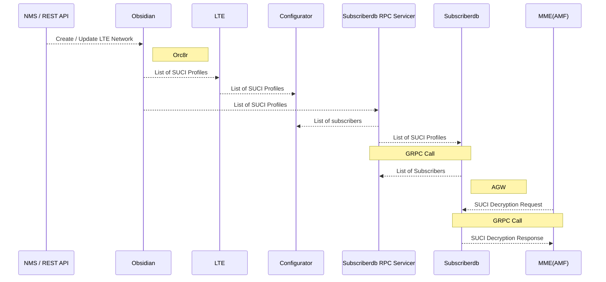
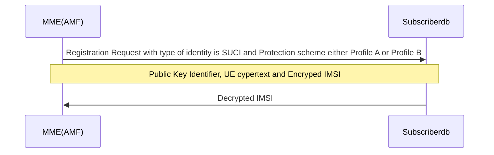

# SUCI Extensions

SUCI (Subscription Concealed Identifier) is a privacy-preserving identifier containing the concealed SUPI (Subscription Permanent Identifier). The home network public key identifier encrypts the SUPI and allows the UE (User Equipment) to authenticate with the network. The SUCI format is shown below.


The home network public key identifier(s) for the private/public key pairs used for subscriber privacy shall be stored in the subscriberdb of the AGW (Access Gateway). Subscriberdb should include a SIDF (Subscription Identification De-concealing Function), which contains an algorithm for decrypting SUCI using the home network private key.

This document gives an overview of the SUCI Extensions functionality present in Magma, its architecture, configuration and feature matrix.

## Use Case

The UE generates and transmits the SUCI using a protection scheme, i.e., as one of the ECIES (Elliptic Curve Integrated Encryption Scheme) profiles, and the public key that was securely provisioned in the home network's control.

The encryption and decryption mechanism specified in [3GPP TS 33.501](https://www.etsi.org/deliver/etsi_ts/133500_133599/133501/15.02.00_60/ts_133501v150200p.pdf) as shown below.

- According to 3GPP TS 33.501, the UE generates SUCI with the public key of the home network using an ECIES-based protection scheme.
- According to [3GPP TS 33.501 clause C.3.2](https://www.etsi.org/deliver/etsi_ts/133500_133599/133501/15.02.00_60/ts_133501v150200p.pdf#page=155) (Processing on the UE side), the UE shall use the home network's provisioned public key and construct a new ECC (Elliptic Curve Cryptography) ephemeral public/private key pair based on the ECIES parameters provisioned by the home network.
- According to [3GPP TS 33.501 clause C.3.3](https://www.etsi.org/deliver/etsi_ts/133500_133599/133501/15.02.00_60/ts_133501v150200p.pdf#page=155) (Processing on the home network side), the home network must use the UE's received ECC ephemeral public key and the home network's private key to de-conceal an SUCI.

## Architecture

The Subscriberdb of the AGW shall periodically fetch the list of SUCI profiles from the Orc8r (Orchestrator). Based on the home network public key identifier received in the authentication request, corresponding private key is retrieved and used to de-conceal the SUCI in the authentication request. Each public/private key pair is not subscriber specific, and can be shared among multiple subscribers.

Assuming public/private key pair generation of HPLMN (Home Public Land Mobile Network) is not part of magma, operator shall configure list of SUCI profiles in the AGW which comprises of

- Home Network Public Key Identifier
- Public/Private Key pair
- Protection scheme

Operator is responsible for provisioning the UE with home network public key identifier, home network public key, protection scheme.

## Detailed Design



This flow diagram represents the network create/update flow and the modules involved in processing the NMS request. Also represents how the SUCI profiles are fetched from the Orc8r.

### Orc8r

- The LTE (Long Term Evolution) Network data model will accept the list of SUCI profiles and obsidian handlers to support the REST API modifications
- The AGW sends a gRPC request to the subscriberdb RPC servicer in the Orc8r, which populates the list of SUCI profiles per network.

### AGW

- The AMF to invoke the SIDF Module of subscriberdb for SUCI decryption.  In initial registration NAS (Network-Attached Storage) message, if type of identity is SUCI and protection scheme ID is either ECIES scheme profile A or ECIES scheme profile B, then the AMF initiates a gRPC call to the subscriberdb with parameters such as home network public key identifier, UE ciphertext and encrypted IMSI.
- The subscriberdb periodically fetches the list of SUCI profiles from the Orc8r and stores it as in-memory data.
- The subscriberdb has the SIDF functionality, that performs an in-memory data lookup to extract the private key associated with the home network public key identifier and protection scheme that we obtained from the initial registration NAS message. The SIDF has an algorithm that uses the private key to decode the SUCI.

## Prerequisites

Prior to configuring the SUCI extensions, you must first support [integrated 5G SA FWA](https://magma.github.io/magma/docs/lte/integrated_5g_sa) (5G Standalone Architecture Fixed Wireless Access).

## High Level Call Flow

The call flow between the AMF and the Subscriberdb in magma for SUCI extensions is shown in the figure below.



## Configuration SUCI Extensions

- While creating the LTE network, SUCI Profiles can be established using the below swagger API.

  ```text
  POST - /lte
  {
    "ngc": {
      "suci_profiles": [
        {
          "home_network_private_key": "2S2YxQinTRiAYmkL+i3WW0TpJ+RHf83HC1JqWE1bxzs=",
          "home_network_public_key": "YHkGb8+c4KQYsWtz5pevQinvdHQyz1jkgq8vg1vMp08=",
          "home_network_public_key_identifier": 2,
          "protection_scheme": "ProfileA"    
        }
      ]
    }
  }
  ```

  The sample configuration is shown in the below figure

  

- If we want to add a SUCI Profile to an existing LTE network, we may do it with the swagger API listed below.

  ```text
  PUT - /lte/{network_id}/cellular/ngc
  {
    "suci_profiles": [
      {
        "home_network_private_key": "2S2YxQinTRiAYmkL+i3WW0TpJ+RHf83HC1JqWE1bxzs=",
        "home_network_public_key": "YHkGb8+c4KQYsWtz5pevQinvdHQyz1jkgq8vg1vMp08=",
        "home_network_public_key_identifier": 2,
        "protection_scheme": "ProfileA"    
      }
    ]
  }
  ```

  The sample configuration is shown in the below figure

  

## 3GPP References

- [3GPP TS 23.003 version 15.4.0 Release 15](https://www.etsi.org/deliver/etsi_ts/123000_123099/123003/15.04.00_60/ts_123003v150400p.pdf) - Digital cellular telecommunications system (Phase 2+) (GSM); Universal Mobile Telecommunications System (UMTS); Numbering, addressing and identification.
- [3GPP TS 33.501 version 15.2.0 Release 15](https://www.etsi.org/deliver/etsi_ts/133500_133599/133501/15.02.00_60/ts_133501v150200p.pdf) - 5G; Security architecture and procedures for 5G System.
