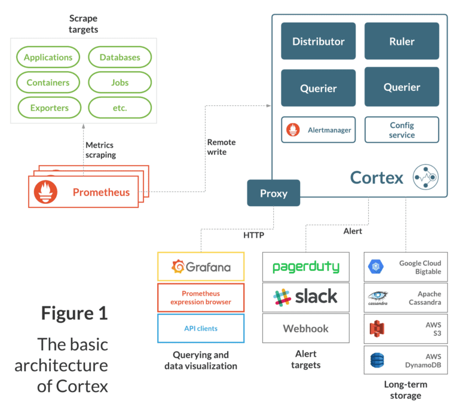

# Scaled Prometheus Pipeline

**Author: Scott Smith**

**Feature Owner: Scott Smith**

**Requires Feedback From: Jacky Tian**

Details:
* I use the term pushgateway to reference [prometheus-edge-hub](https://github.com/facebookincubator/prometheus-edge-hub)
* "Prod" and "Staging" refer to FB-hosted deployments of Orchestrator which are currently our largest deployments and our source of performance data.

### Goal: Improve metrics query speed on large deployments

The current magma metrics deployment involves only a single Prometheus server, with no option for scaling. While this is sufficient for writing, the query side is already seeing some performance issues. For example, loading grafana on prod takes more than 5 seconds. This is due to the queries grafana has to make to populate the list of networkIDs and gatewayIDs being slow. While the production deployment is currently the largest that exists, we don’t want to have partners run into serious metrics performance issues as they build large networks. We need to scale prometheus to improve query performance.

## Data

### Prometheus

On prod we currently have ~347 active gateways, and ~105k metric series

Query times for PromQL query `count({__name__=~".+"})` 

|Time Range	|Query Time	|
|---	|---	|
|1m	|3141ms	|
|5m	|7801ms	|
|15m	|6966ms	|
|30m	|6025ms	|
|1h	|6153ms	|
|2h	|8186ms	|
|6h	|11957ms	|
|12h	|17983ms	|
|1d	|TIMEOUT	|

Even the smallest query range takes over 3 seconds, and over any significant period of time the query times out. This is definitely not “snappy” and will not provide a good user experience with a large network. This data fits in with prometheus recommendations that queries should not have more than ~100k series.

### Grafana

The main problem with long query times is less responsive dashboards.

Time to load grafana dashboard on prod NMS: **>15s **from click until all graphs are populated. Most of this time is spent looking at all series in order to determine the set of available `networkID`s and `gatewayID`s. 

## Options

Several scaling solutions exist for prometheus, as this is a well-known limitation and prometheus itself does not have any built in way of horizontal scaling.

### Thanos

[Thanos](https://improbable.io/blog/thanos-prometheus-at-scale) is a very popular project which allows for easy and customizable scaling of prometheus monitoring pipelines. From the start, I believe this will be the easiest and most powerful solution to the problem. Thanos consists of several components, all of which can be used independently. The most relevant to us is the `Querier` which allows for the querying of data across multiple prometheus servers. A simple architecture diagram from Thanos shows how this works in a typical deployment:
Here we see multiple prometheus servers with the Thanos `sidecar` attached. This allows for the rest of the thanos components to work together. Then, the `Querier` components are able to accept PromQL queries and retrieve data from any set of the prometheus servers.

With this setup, we only need to deploy the Thanos `sidecar` and multiple `Querier` components, along with Object storage to achieve faster queries.

### Cortex

Another option for scaling prometheus is [Cortex](https://cortexmetrics.io/). Similar to Thanos, but more complicated. In a Cortex deployment, we would deploy multiple prometheus servers and configure them to write to Cortex, and deploy the Cortex querier. 

While cortex offers similar options for scaling as Thanos, it appears that Thanos will be easier to deploy and work with our existing architecture, while also providing more options for scaling out in different ways in the future.

## A note on multi-tenancy

Both of these projects support some form of multi-tenancy, however I don’t believe they are useful for our situation since they tie the tenancy to a specific prometheus server. This means we would have to have a 1:1 mapping from servers to tenants, which may not match up with our scaling needs. For example there could be a deployment with one massive network, and several smaller ones. Queries on the big network would not be improved this way.

## Configmanager and multiple prometheus servers

One problem that arises with multiple prometheus servers is handling alerting configurations. Alerting rules are used by the prometheus server to evaluate rules against incoming metrics, but in a model with multiple servers this requires a lot of careful planning and tradeoffs due to metrics being split across servers, but rules only applying to a single server at a time.

Thanos provides a solution to this problem in the [Ruler](https://thanos.io/components/rule.md/) component. It accepts rules files in the same format as prometheus, and evaluates the rules using a Thanos Querier which has access to all servers. Feature parity not documented (POST request to reload configuration files) validated by investigating [source code](https://github.com/thanos-io/thanos/blob/master/cmd/thanos/rule.go#L567).

There are several [community helm charts](https://hub.helm.sh/charts?q=thanos) available for deploying Thanos, and they show that the Ruler component is easily deployed with an existing PVC, meaning it will be essentially "plug and play" for configmanager with no additional work required.

To keep our alerting system all we have to do is configure the Thanos Ruler to use the alerting rules files managed by prometheus-configmanager, and remove the rules files from the individual prometheus servers.

Note: Alertmanager is not affected by the switch to Thanos, and there will still only be a single alertmanager instance.

## Deploying Thanos in Orchestrator

### Improving query times with Object Storage

All metrics go through the controller (which is already scalable and placed behind a load balancer), where they are pushed to the `prometheus-edge-hub` (or pushgateway). The single prometheus server then scrapes from this pushgateway. 
Current metrics pipeline diagram:

All metrics are stored for 30 days in the Prometheus TSDB storage. This means that all queries have to go through the prometheus server itself, which is the main cause of slow queries.

Object storage will allow us to only store a few hours of metrics on the server itself (potentially keeping everything in-memory) and then exporting older metrics to object storage elsewhere. For example on an AWS deployment metrics would be stored in S3.

We will then deploy multiple Querier components behind a load balancer which are configured to talk to both the prometheus server and the Object storage. This will distribute the compute and I/O load away from the prometheus server to the stateless querier components which can be trivially scaled horizontally to handle increase query loads.

### Configuration

We should make this as easy to configure as possible. Some goals include:

* Make this entire setup optional. The single prometheus server works well for small to medium deployments.
* Configuring thanos to run in Orc8r should require no more than a few values in the helm chart. (e.g. `create_thanos` and `prometheus_servers_count)`

* Since we are moving the prometheus-configmanager to act on the Thanos Ruler component, we can manage prometheus server configuration with Kubernetes and ConfigMaps. This will be used to correctly set scrape targets for the servers with respect to the multiple pushgateways.

### Improving prometheus-edge-hub performance

With the goal of handling 10 million datapoints per minute, the [prometheus-edge-hub](github.com/facebookincubator/prometheus-edge-hub) will probably need some improvements to handle that load. First we'll do benchmark tests on specific AWS hardware options. Then, profile the code to find the bottlenecks and improve them. It's not clear what exactly needs to be done, but I'm confident we can find significant improvements as this component hasn't gone through much optimization yet.

In the end if we can't get enough performance out of a single edge-hub, we will have to investigate scaling this horizontally.

## Development Plan

|Step	|Est. Time	|
|---	|---	|
|Deploy Thanos locally and experiment with loads to validate query time improvements	|2 wk	|
|Deploy Thanos with a single prometheus server in Orchestrator to test that the Querier and sidecar don’t cause any unexpected side effects.	|1 wk	|
|Integrate configmanager with Thanos and validate alerting/configuration	|1 wk	|
|Add Object storage |2 wk	|
|Investigate performance improvements in prometheus-edge-hub | 2 wk |
|Configure helm chart |2 wk	|
|Deploy to staging/prod	|1 wk	|
