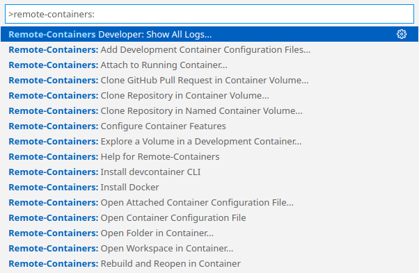

# Develop Magma With VSCode

This document walks a new developer through the process of setting up VSCode. The primary focus of this guide is for AGW development.

There are two types of workspaces supported by the Magma team

- Remote SSH workspace with Magma VM: A workspace for working with files in the Magma VM from your local machine. [Jump to Setup Remote SSH workspace with Magma VM](#setup-remote-ssh-workspace-with-magma-vm)
- Devcontainer workspace: A Docker based development flow that is best suited for changes that only require unit testing. It is natively supported with GitHub Codespaces. However, it is currently only supported for AGW C/C++ code. [Setup Devcontainer workspace with GitHub Codespaces](#setup-devcontainer-workspace-with-github-codespaces)

Visual Studio Code is available for downloads at [their official website](https://code.visualstudio.com).

## Opening up a VSCode workspace

### Setup Remote SSH workspace with Magma VM

The steps below need to only be done once. After your workspace is setup once, it is easily accessible via **File->Open Recent**.

#### Setup default extensions for SSH workspace

Open VSCode and use **Command+Shift+P** to open the editor preferences and select **Preferences: Open Settings (JSON)**. This will open the user settings file for VSCode. Insert the following into the file. This configuration will take effect the next time VSCode connects to a remote host.

```json
    "remote.SSH.defaultExtensions": [
        "llvm-vs-code-extensions.vscode-clangd",
        "stackbuild.bazel-stack-vscode",
        "coolchyni.beyond-debug",
        "stackbuild.bazel-stack-vscode-cc",
        "augustocdias.tasks-shell-input",
        "ryuta46.multi-command",
        "ms-python.python",
        "njpwerner.autodocstring",
        "ms-python.vscode-pylance",
    ],
```

Unlike with Devcontainer settings, there is no way to configure default extensions ouside of user settings. It may be good to periodically check this section for any updated extensions that should be installed.

#### Add the VM SSH config to ~/.ssh/config

**Prerequisite**: Have the Magma VM running.

Go to `$MAGMA_ROOT/lte/gateway` and run `vagrant ssh-config`. Copy the output into `~/.ssh/config`.
You SSH config should now look like this:

```text
...

Host magma
  HostName 127.0.0.1
  User vagrant
  Port 2222
  UserKnownHostsFile /dev/null
  StrictHostKeyChecking no
  PasswordAuthentication no
  IdentityFile /Users/<user_name>/.vagrant.d/insecure_private_key
  IdentitiesOnly yes
  LogLevel FATAL
  ForwardAgent yes
```

#### Create a remote SSH workspace

A more detailed documentation is available on [the official VSCode doc on remote SSH](https://code.visualstudio.com/docs/remote/ssh).

Use **Command+Shift+X** to open the extensions tab and install the **[Remote SSH](https://marketplace.visualstudio.com/items?itemName=ms-vscode-remote.remote-ssh)** extension. Once installed, open the command palette with **Command+Shift+P** and select **Remote-SSH: Connect to Host**. Select *magma* to start a remote SSH workspace.

Inside the newly created VSCode window, go to **File → Open Workspace** and select  `/home/vagrant/magma/vscode-workspaces/workspace.magma-vm-workspace.code-workspace`.

## Using DevContainer for development

### Using DevContainer with Github Codespaces

**Prerequisites**:

- Membership of Magma organization in order to use [GitHub Codespaces](https://github.com/features/codespaces)

To open a GitHub codespace from any branch or pull request, you can use the `<Code>`-button usually situated somewhere on the top right of the page (depending on the view). The currently selected git reference will automatically be opened in the configured DevContainer.

If you intend to make changes and submit a pull request, always select your fork of Magma.

Any changes made inside the DevContainer will be wiped when it is upgraded. This should not happen often and you will always be given a prompt before the DevContainer upgrades. To have persisting personal configs, refer to the GitHub's documentation on [Personalizing Codespaces for your account](https://docs.github.com/en/codespaces/customizing-your-codespace/personalizing-codespaces-for-your-account).

### Using DevContainer with VSCode locally

**Prerequisites**:

- Docker installed
- VS code installed
- VS Code [Remote - Containers](https://marketplace.visualstudio.com/items?itemName=ms-vscode-remote.remote-containers) extension installed
- VS Code [Docker](https://marketplace.visualstudio.com/items?itemName=ms-azuretools.vscode-docker) extension installed

Using the DevContainer with VS Code, you have two options:

1. Checkout the repository inside the running container.
2. Mounting a local copy of the repository inside the running container.

With option 1 the state of your work would always be deleted when you terminate the DevContainer. In addition, it will increase the resource requirements for your running container. While such an ephemeral setup can be desirable at times, it is safer to use option 2.
With option 2 you use a previously cloned version of the repository already cloned on your hard-drive. This copy will than be reopened (i.e. mounted) to your running DevContainer. Changes to the code made outside the DevContainer will also be available inside, and vice versa. Be aware that the IDE might need some time or refresh to become aware of changes. With option 2 it is in principle possible to use other IDEs to code (e.g. IntelliJ), while still using DevContainer to build and test changes.

To start a remote container in VS Code, press `F1` and search for `Remote - Containers`. An overview of options will be presented.


To follow the above-mentioned option 1, choose `Clone {Repository|Github Pull Request} in Container Volume...`.
To follow the above-mentioned option 2 (recommended), choose `Rebuild and Reopen in Container`.

Your VS Code title bar should than include `[Dev Container]` and the terminal (Menu Terminal - New Terminal) prompt similar to

```raw
vscode ➜ /workspaces/magma (your/branch ✗) $
```

also shows that you are inside the container.

You can than proceed with your build of the component as usual.

#### MacOS specific settings

In some operating systems (e.g. MAC) docker runs in a VM and you must allocate system resources (e.g. memory, CPU).
Detailed explanation on how to change the system resources can be found in the [Getting Started guide](../basics/prerequisites.md).
Different build targets in Magma require different resources, e.g.

- 7 GB RAM are required for `make test_oai` and `make build_oai` within `lte/gateway/`, while
- 12 GB RAM are required from `make test_connection_manager` within `lte/gateway/`.

#### Troubleshooting

- Running out of disk space
  Docker uses a lot of disc space. You can prune unused images with [`docker image prune`](https://docs.docker.com/engine/reference/commandline/image_prune/). Use the `--all` option, if you want to get rid of everything.
- `apt-get` or `apt` failure seemingly without reason
  This can also happen, when you run out of disk space. Check the point above.

### Developing DevContainer

Documentation on how to develop the DevContainer itself, including local build option, can be found within the respective [ReadMe](https://github.com/magma/magma/blob/master/.devcontainer/README.md).

## Language and tool specific feature guide

We've enabled several extensions and custom configurations to improve developer experience, refer to the sections below for language and tool specific commands and features.

### C / C++ code completion and navigation

> Supported in both Remote SSH + Magma VM and Devcontainer

We utilize [clangd](https://clangd.llvm.org) to enable smart code insights. Clangd looks at `$MAGMA_ROOT/compile_commands.json` to figure out file dependencies for code navigation. Most often, clangd will need to be restarted when the compile_commands.json is modified.

The compilation database can be gernated with both CMake and Bazel. The Bazel method will be described more in detail below. With CMake, it is not possible to generate a single compilation database for all C/C++ targets, so you will have generate one at a time and restart clangd.

To generate the compilation database with CMake, run `make build_oai` or the equivalent command for another target. This will generate a `compile_commands.json` file which contains compilation commands for every file in the target. Due to a quirk in our CMake configurations, you may need to run the build command twice to get a `compile_commands.json` file that contains all instructions.

We can then symlink `$MAGMA_ROOT/compile_commands.json` to the generated file with the following steps

  1. Open the command palette (**Command+Shift+P**)
  2. Select **Tasks: Run Task** and choose **Set compile_commands.json for IntelliSense**
  3. Select a `compile_commands.json`
  4. After the task completes, restart clangd by running opening the command palette again and running **clangd: Restart language server** (If you see errors relating to clangd at this point, refer to [Dealing with clangd extension errors](#dealing-with-clangd-extension-errors))

Once clangd is retarted, you should see some note about indexing in the bottom of your editor. Code completion and navigation should work after the indexing completes.

#### Dealing with clangd extension errors

If you see errors about clangd, try the following:

  1. For errors about `clangd` not being found, try running **clangd: Download language server** from the command palette. Reload the window after clangd is installed.
  2. For errors about the extension commands not being found, try running **clangd: Manually activate extension** to start the extension

### Python code completion and navigation

> Supported only in Remote SSH + Magma VM

First SSH into your VM and run `magitvate`. This will setup a virtual Python environment we will need.

Follow the following steps to enable code completion and navigation

  1. Open the command palette (**Command+Shift+P**)
  2. Select **Python: Select interpreter** and choose `magma` and the default Python interpreter (`~/build/python/bin/python`)
  3. Run **Python: Build Workplace Symbols** via the command palette

Additional features such as formatting on save is enabled for the Python source files.

### Building and testing with Bazel

> Supported in both Remote SSH + Magma VM and Devcontainer

#### Build specific targets and unit tests via codelens

The **bazel-stack-vscode** extension adds [codelens](https://code.visualstudio.com/blogs/2017/02/12/code-lens-roundup) directly into `BUILD.bazel` files. Utilizing this makes building and testing as easy as clicking a button.

For example, to run a single unit test for SessionD, open `lte/gateway/c/session_manager/test/BUILD.bazel` and click the `test` codelens. Similarly, click the `build` codelens to build only. If the codelens does not show up, try opening up a different `BUILD.bazel` file, or reloading the file (**Command+Shift+P** then **File: Revert File**).


At the top of each `BUILD.bazel` file, there is a codelens to build and test all targets in the file.

#### Generate compilation database with Bazel

To generate the compilation database with Bazel, run **Command+Shift+P** to open the command palette and select **Multi command: Execute multi command**. Select the command **generateCcWithBazelAndRestartClangderror**. This is a wrapper command that runs two extension commands: `bsv.cc.compdb.generate` (**Bzl: Bazel/C++: Generate Compilation Database**) and then `clangd.restart` (**clangd: Restart language server**).

This compilation database will contain necessary information for all C / C++ targets available to be built with Bazel.

Refer to [Dealing with clangd extension errors](#dealing-with-clangd-extension-errors) for debugging extension issues.

#### Run unit tests with GDB

> Currently only available for SessionD unit tests under `lte/gateway/c/session_manager/tests`, but it is easy to add configurations to enable it for any `cc_test`. Run `bazel query 'kind(cc_test,//...)'` in the terminal to get the full list of available targets. Modify `.vscode/tasks.json` and `.vscode/launch.json` to enable GDB debugging for other targets.

First, build the test target that you wish to test. You can do this in the terminal by running Bazel directly, or through the codelens UI in the corresponding `BUILD.bazel` file.

Run **Command+Shift+D** to open the debug tab. In the drop down menu at the top of the tab, select **(Remote SSH) Run SessionD test with GDB** and press the gree arrow. This will open up a new drop down menu with all SessionD unit test targets. Once a test is selected, VSCode will launch the test with GDB.

The test output will be printed out in the terminal tab, and the debug console tab will contain a GDB interface.


Once the task is launched, the test will start execution immeditately. It is recommended to add a breakpoint before triggering the debugger to halt the execution.

To add a breakpoint, simply click on the left most edge of the code to add a red circle.


With a breakpoint added, the debug console will show when the breakpoint is hit. Finally, use the debug console like a normal GDB console to aid your testing!


