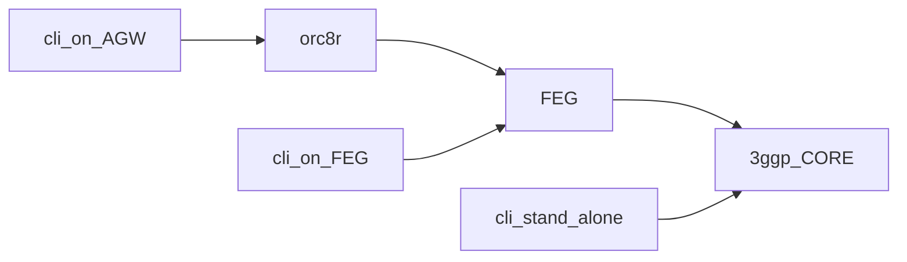

# FeG CLI

Some Go services on FeG include a cli to run commands against the
3GPP core. The different clients source code can be seen at
[here](https://github.com/magma/magma/tree/master/feg/gateway/tools)

## CLI binaries

The binaries of the CLI can be found on all pods running in FeG under
`/var/opt/magma/bin/`.

You have different options to obtain and run the CLI:
- Using `docker-compose` from the host:
```
cd /var/opt/magma/docker
sudo docker-compose exec s6a_proxy /var/opt/magma/bin/s8_cli cs -server 192.168.32.118:2123 -delete 3
```

- Using the binary from inside the pod:
```
cd /var/opt/magma/docker
docker-compose exec s6a_proxy bash
#inside pod
cd /var/opt/magma/bin/
./s8_cli cs -server 192.168.32.118:2123 -delete 3
```

- Copying the binary outside the pod and running it from the host
```
cd /var/opt/magma/docker
sudo docker cp s8_proxy:/var/opt/magma/bin/s8_cli .
# you can move the binary to AGW
chmod +x s8_cli
./s8_cli cs -server 192.168.32.118:2123 -delete 3
```

- Building it from source
```
#after cloning magma from github
cd ~/magma/feg/gateway/docker
docker-compose up -d test
docker-compose exec test bash
#inside pod
cd /tools/s6a_cli
go build
```

## Where to run CLI

Some of those CLI tools can be run in three different modes:

- cli stand alone (builtin): this is the default mode all and runs the client
  against the Core service. It will use
  `/var/opt/magma/confg/gateway.moconfig`, local env vars, or flags to set up
  its port configuration.
- cli on feg: some CLI tools have the flag `useMconfig` or `use_builtincli`.
  When set to false, the CLI will use the current running FEG process to reach
  the Core service
- cli on agw: some CLI can be run on the AGW using the flag `remote_s6a`. Note
  you will need a fully configured AGW. The CLI will use AGW Control Proxy to
  reach the FeG.



## CLI example commands

- s6a_cli Authentication Information Request (AIR).
```
# from AGW
./s6a_cli air -remote_s6a 001002000000810
# from FEG
./s6a_cli air 001002000000810
# using builtin client
./s6a_cli air -use_mconfig 001002000000810
```

- s6a_cli AIR with 10 UEs starting from IMSI 001002000000810 with a rate of
2 UE per second.
```
./s6a_cli air -remote_s6a -range 10 -rate 2 001002000000810
```

- s8_cli Create Bearer Request (CB) from AGW, using PGW `192.168.32.118:2123`
with APN `inet`, with user plane TEID `2`, control plane TEID `4` (TEIDS are
optional values). This command will send Delete Bearer Request 3 seconds
later.
```
s8_cli cs -server 192.168.32.118:2123 -delete 3 -apn inet -remote_s8 -uteid 2 -cteid 4 001002000000810
```
