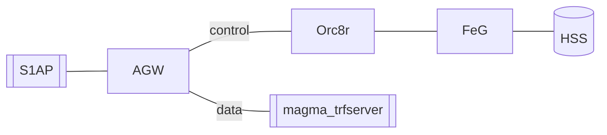

# S1AP Federated Integration Tests

The S1AP Integration Test only tests the AGW. The objective of the **S1AP
Federated Integration Tests** is to provide a test platform
to run Magma with all of its components. That is, end-to-end tests with all
components of Magma: AGW, Orc8r and FeG.

Currently, these tests are in an experimental phase, so we are only testing the connectivity of
AGW - Orc8r - FeG, and we are able to run the basic authentication related tests using the S1AP tester
and our mock HSS.

## Architecture

As the diagram indicates, these tests spin up **AGW**, **FeG**, and **Orc8r**
and use `S1AP` and `magma_trfserver` as an eNb and SGi emulator to run tests.



The services will run either on Vagrant VMs or on Docker:

| Services          |   Vagrant VM    |  Docker   |
|-------------------|:---------------:|:---------:|
| AGW               |      magma      |           |
| FeG               |     &check;     |  &check;  |
| Orc8r             |                 |  &check;  |
| Traffic server    | magma_trfserver |           |
| S1AP tester       |   magma_test    |           |
| HSS               |                 |  &check;  |

*Note that FeG runs on Docker inside the Magma VM. The reason is to guarantee
Docker host mode is supported by the host (not supported on Mac).*

## Running the tests

Below there are three different ways to run the tests. These will help you
debug any intermediate step should the automation fail.

### Automated test run

The fab script mentioned below will do everything for you. In case it fails, try one of the other two methods:
[semiautomatic](#semiautomatic-test-run) or [manual](#manual-build).

This script will

- Build AGW, Orc8r and FeG
- Start AGW, Orc8r and FeG
- Configure Orc8r with AGW and FeG
- Run connectivity tests between all three components
- Run a basic attach/detach test
- Run an attach/detach test with multiple UEs (for 32 UEs)

To execute the script, run:

```bash
cd magma/lte/gateway
fab federated-integ-test --build-all

# to run it again, you can skip the build_all
# however, if you change code in Magma, you will need to build_all again
fab federated-integ-test
```

You can access Orc8r adding to your keychain the `admin_operator.pfx` cert
you will find at `/magma/.cache/test_certs`. Then you can check your
provisioned gateways using
[swagger interface](https://localhost:9443/apidocs/v1/?docExpansion=none)
that will be running on your Orc8r

Please, for more detail, check the following sections which provide more
insight about this process.

### Semiautomatic test run

#### Build environment

Using this method, you will build the environment step by step but still using
certain automation. If you want to build the environment manually instead, go to
[Manual build](#manual-build).

On your host machine, execute these commands to build, start and configure the AGW,
FeG and Orc8r:

```bash
cd magma/lte/gateway/python/integ_tests/federated_tests
fab build-all-and-configure
```

After this has run, you can check
whether your gateways have been bootstrapped using the magmad logs on the AGW and FeG. The
command below will try to reach Orc8r from AGW and FeG, and FeG from AGW:

```bash
cd magma/lte/gateway/python/integ_tests/federated_tests
fab test-connectivity
```

Once it has been built, start the `magma_trfserver` and `magma_test` VMs:

```bash
cd magma/lte/gateway
vagrant up magma_test
vagrant up magma_trfserver
```

You can then [run the tests manually](#run-tests-manually).

### Manual build

If you want to build the environment manually, you can carry out the following steps.

*Note that commands for the AGW and FeG have to be run inside the Vagrant VM. For this reason,
all such commands include the `vagrant ssh magma` command first. To leave
Vagrant, just type `exit`. Orc8r will need to be run on the
host itself (no Vagrant involved).*

- AGW:

```bash
cd magma/lte/gateway
vagrant up magma
vagrant ssh magma

# inside vagrant vm
cd magma/lte/gateway
make run

# exit from vagrant vm
exit
```

- FeG:

```bash
cd magma/lte/gateway
vagrant up magma
vagrant ssh magma

# inside vagrant vm
cd magma/lte/gateway/python/integ_tests/federated_tests/docker
docker compose --compatibility build
./run.py
```

- Orc8r:

```bash
cd magma/orc8r/cloud/docker
./build.py -a
./run.py

# return to agw folder
cd magma/lte/gateway
# register gateways
fab register-federated-vm
fab register-feg-gw
```

- Test VM:

```bash
cd magma/lte/gateway
vagrant up magma_test
```

- Traffic VM:

```bash
cd magma/lte/gateway
vagrant up magma_trfserver
```

#### Run tests manually

Once you have built all of the VMs, you can try to run the tests from the
`magma_test` VM.

**Note**: Currently only [s6a related LTE Integ tests](https://github.com/magma/magma/blob/master/lte/gateway/python/integ_tests/defs.mk#L288) can be run in federated mode.

```bash
cd magma/lte/gateway
vagrant ssh magma_test

# inside vagrant vm
cd magma/lte/gateway/python/integ_tests
## Individual test(s), e.g.:
make prepare_federation selected_tests TESTS="<test(s)_to_run_space_separated>"

## All tests
make federated_integ_test

# once the tests are done, you can exit the vagrant vm
exit
```
