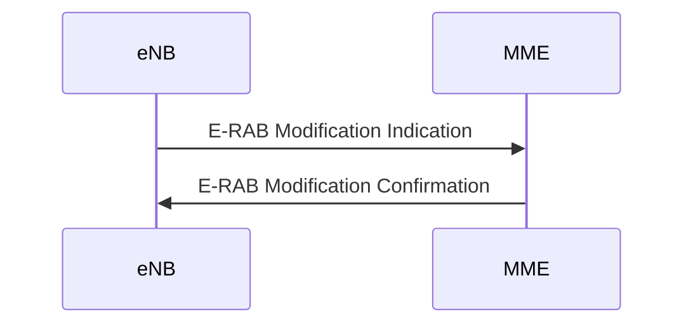

# 5G NSA Support

Under 5G NSA Support, we aim to bridge the connectivity gap between a 5G compatible UE and the full stack MAGMA core. This feature does not require any additional configuration and is enabled in the existing codebase by default. In order to achieve NSA support in the existing MAGMA codebase, we have added/updated supplementary messages, IEs over different interfaces, layers and services which are described as follows:

## Message Addition

The E-RAB Modification Indication and E-RAB Modification Confirmation messages were added to the MAGMA code-base in v1.5. Functioning of these messages are explained as below:

### E-RAB Modification Indication

This message is used by the eNB to request for the modification of existing established E-RABS for a UE.

### E-RAB Modification Confirmation

In response to the E-RAB Modification indication message, MME responds with E-RAB Modification Confirmation message which contains the list of all the E-RABS requested to be modified in E-RAB To Be Modified Item IEs IE in E-RAB Modification indication message.

## ASN.1C Upgrade

In order to have NSA support over S1-AP interface, We have upgraded the existing ASN.1C stack to Release-15 compatible ASN.1C stack. This includes addition of new IEs and modification of existing IEs over S1-AP interface between eNB and MME.

## Information Elements (IEs) Addition

- UE capable of 5G communication sets the DCNR bit as “1” in the UE NETWORK CAPABILITY IE in the Attach Request message over NAS.

- MME decodes the attach request message and adds NR as secondary RAT in Feature-List AVP and Dual-Registration-5G-Indicator in ULR flags in Update Location Request message to HSS.

- HSS in response adds Extended Max-Requested-BW-UL and Extended Max-Requested-BW-DL AVP in Update Location Answer message to the MME.

- In the Initial Context Setup Request message sent by MME to the eNB over S1AP, MME adds Extended UE-AMBR UL and Extended UE-AMBR DL values in order to accommodate AMBR values larger than 10Gb/s in the uplink and downlink direction respectively. This feature is currently under development and will be added in the next release.

## 3GPP References

- NAS interface additions are based on 3GPP 24.301 version 15.4.0 Release 15.
- S6A interface additions are based on 3GPP 29.272 version 15.10.0 Release 15.
- S1AP interface additions are based on 3GPP 36.413 version 15.3.0 Release 15.
