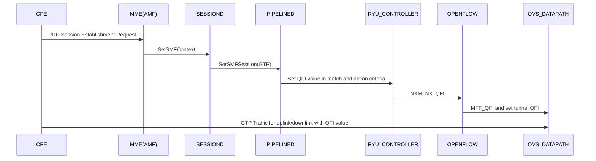

# GTP Extensions

## Overview

Magma Gateway uses the Linux networking stack and OVS to program the packet pipeline on the gateway. The GTP-U protocol entity provides packet transmission and reception services to user plane entities in the RNC, eNodeB, SGW, PGW and TWAN. The GTP-U protocol entity receives traffic from a number of
GTP-U tunnel endpoints and transmits traffic to a number of GTP-U tunnel endpoints.

The GTP-U header is a variable length header whose minimum length is 8 bytes. There are three flags that are used to signal the presence of additional optional fields: the PN flag, the S flag and the E flag. The PN flag is used to signal the presence of N-PDU Numbers. The S flag is used to signal the presence of the GTP Sequence Number field. The E flag is used to signal the presence of the Extension Header field.

Extension Header flag (E): This flag indicates the presence of the Next Extension Header field. When it is set to '0', the Next Extension Header field is not present. When it is set to '1', the Next Extension Header field is present.

## GTP-U Extension Header

The Extension Header Length field specifies the length of the particular Extension header in 4 octet units. The Next Extension Header Type field specifies the type of any Extension Header that may follow a particular Extension Header. If no such Header follows, then the value of the
Next Extension Header Type shall be 0.

	 0                   1                   2                   3
     0 1 2 3 4 5 6 7 8 9 0 1 2 3 4 5 6 7 8 9 0 1 2 3 4 5 6 7 8 9 0 1
     +-+-+-+-+-+-+-+-+-+-+-+-+-+-+-+-+-+-+-+-+-+-+-+-+-+-+-+-+-+-+-+-+
     | Ext-Hdr Length|                                               |
     +-+-+-+-+-+-+-+-+                                               |
     |                  Extension Header Content                     |
     .                                                               .
     .                                               +-+-+-+-+-+-+-+-+
     |                                               |  Next-Ext-Hdr |
     +-+-+-+-+-+-+-+-+-+-+-+-+-+-+-+-+-+-+-+-+-+-+-+-+-+-+-+-+-+-+-+-+

In 5G SA, each flow is forwarded based on the appropriate QoS rules. QoS rules are configured by SMF as QoS profiles to UP components and these components perform QoS controls to PDUs based on rules. In downlink, a pipelineD pushes QFI into an extension header, and transmits the PDU to RAN.  In uplink, each UE obtains the QoS rule from SMF, and transmits PDUs with QFI containing the QoS rules to the RAN.

### Transfer of PDU Session Information for Uplink Data Traffic

The Transfer of PDU Session Information for uplink data packets involves transfer of control information elements related to the PDU Session from NG-RAN to Pipelined.

The UL PDU SESSION INFORMATION frame includes a QoS Flow Identifier (QFI) field associated with the transferred packet.

The below Information Elements present in the PDU Session Information frame:

PDU Type: The PDU Type indicates the structure of the PDU session UP frame. The field takes the value of the PDU Type it identifies: "0" for PDU Type 0. Value range: {0= DL PDU SESSION INFORMATION, 1=UL PDU SESSION INFORMATION, 2-15=reserved for future PDU type extensions}.
Spare: The spare field is set to "0" by the sender and should not be interpreted by the receiver.
QoS Flow Identifier: When this IE is present, this parameter indicates the QoS Flow Identifier of the QoS flow to which the transferred packet belongs.
Padding: The padding is included at the end of the frame.

### Transfer of PDU Session Information for Downlink Data Traffic

The transfer of PDU Session Information for downlink data packets involves transfer of control information elements related to the PDU Session from Pipelined to NG-RAN.

The DL PDU SESSION INFORMATION frame includes a QoS Flow Identifier (QFI) field associated with the transferred packet. The NG-RAN uses the received QFI to determine the QoS flow and QoS profile which are associated with the received packet.

The DL PDU session information frame includes the Reflective QoS Indicator (RQI) field to indicate whether the user plane reflective QoS is to be activated or not. This is only applicable if reflective QoS is activated.

## High Level Design

The following functionality is supported for QFI set in GTP Extension header:

- QFI Configuration for uplink flow (Matching criteria)
- QFI Configuration for downlink flow (Action criteria)
- Uplink traffic match with uplink flow
- Downlink traffic takes action with action criteria values.

### Pipelined

Pipelined will extract QoS structure from uplink PDR which is coming from SMF. QFI value gets from QoS structure and sets it in uplink flow as a match criteria.
                       `match = MagmaMatch(tunnel_id=i_teid, qfi=<qfi_value>, in_port=gtp_portno)`

Pipelined will extract QoS structure from downlink PDR which is coming from SMF. QFI value gets from QoS structure and sets it in downlink flow as an action criteria.
                       `actions.append(parser.OFPActionSetField(qfi = <qfi_value>)`

### RYU Controller

Ryu is a Python library that provides an API wrapper for programming OVS.

There are two parts to taking care of QFI functionality support:

- Nicira Extension Actions Structures (NXAction)
- Nicira Extended Match Structures (OFPMatch)

### OVS Openflow

Using the OpenFlow protocol, the controller can add, update, and delete flow entries in flow tables, both reactively (in response to packets) and proactively. Each flow table in the switch contains a set of flow entries; each flow entry consists of match fields, counters, and a set of instructions to apply to matching packets.

### OVS Kernel

For Egress flow, one needs to build the extension header and set the QFI value. It needs to be passed down to kernel datapath for pushing it to GTP-U packets.
For Ingress flow, extract the QFI value from skb of GTP header and set to the tunnel key.

### OVS Command Line

Using below ovs-ofctl commands, will add/del the uplink and downlink flows with QFI parameter.

Uplink add flow:

```sudo ovs-ofctl add-flow gtp_br0 "table=0, priority=100,tun_id=0x7,qfi=6,in_port=gtp0 actions=set_field:02:00:00:00:00:01->eth_src,set_field:ff:ff:ff:ff:ff:ff->eth_dst,set_field:0->reg9,set_field:0x181c9->metadata,resubmit(,1)"```

Downlink add flow:

```sudo ovs-ofctl add-flow gtp_br0 "table=0, priority=65503,ip,in_port=4294967294,nw_dst=192.168.128.11 actions=set_field:0x2710->tun_id,set_field:192.168.60.16->tun_dst,set_field:0x8000->reg8,set_field:0x6->qfi,set_field:oam->tun_flags,set_field:0x181c9->metadata,resubmit(,1)"```

Uplink del flow:

```sudo ovs-ofctl del-flows gtp_br0 "table=0, tun_id=0x7,qfi=6,in_port=gtp0"```

Downlink del flow:

```sudo ovs-ofctl del-flows gtp_br0 "table=0, ip,in_port=4294967294,nw_dst=192.168.128.11"```

## High Level Call Flow

Call flow for QFI set in OVS.



## Common Issues and Troubleshooting

1. GTP kernel module is included as part of OVS module. So no need to insert gtp.ko.

2. To set up a development environment, run the following command on the magma-dev VM.
   ```sudo bash ~/magma/third_party/gtp_ovs/ovs-gtp-patches/2.15/dev.sh setup```

3. To run OVS GTP tests on OVS kernel datapath:
   ```sudo bash ~/magma/third_party/gtp_ovs/ovs-gtp-patches/2.15/dev.sh build_test```

4. OVS debug logging can be dynamically enabled by ```sudo ovs-appctl vlog/set dbg```.
   For a specific module,
   ```sudo ovs-appctl vlog/set netdev dbg```
   ```sudo ovs-appctl vlog/set ofproto dbg```
   ```sudo ovs-appctl vlog/set vswitchd dbg```
   ```sudo ovs-appctl vlog/set dpif dbg```

5. To debug the traffic issues in fastpath, enable the OVS debug logging and check the logs using ```sudo dmesg```.

6. Stop and start the `OVS Service` using below commands:
    ```sudo /usr/share/openvswitch/scripts/ovs-ctl stop```
    ```sudo /usr/share/openvswitch/scripts/ovs-ctl start```

For more details, please refer the ```docs/readmes/howtos/troubleshooting/datapath_connectivity.md```.
