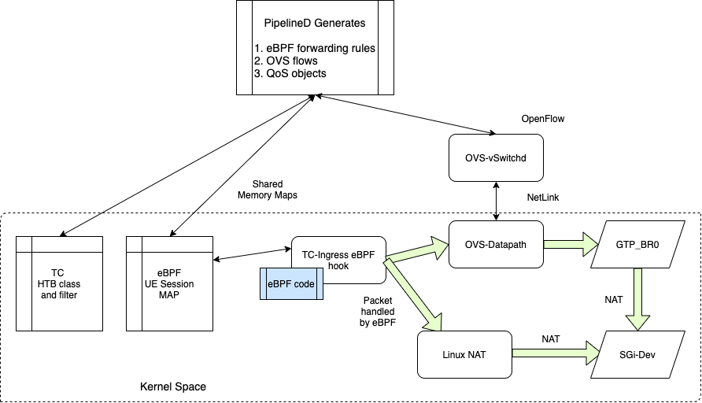

# Magma eBPF Datapath

## Overview

Current AGW is based on OVS datapath. OVS allows us to build datapath based on OpenFlow protocol. This has served us well so far. It gives clear separation of datapath and control-plain elements. This allows rapid feature development on the datapath.
To unlock the next level of performance and flexibility we need to explore newer datapath technologies. eBPF is one such technology.

### BPF

BPF is an efficient virtual machine-like construct in the Linux kernel allowing to execute bytecode at various hook points in a safe manner. It is used in a number of Linux kernel subsystems, most prominently networking, tracing and security. BPF allows you to run sandboxed programs in the Linux kernel without changing kernel source code or loading kernel modules on pre-defined hooks in the kernel. For more information refer to [1]

### Advantage of eBPF datapath over OVS

1. Cloud native alignment
    - eBPF is easier to integrate in containerized AGW.
    - FB already has a large presence in the eBPF community. It would be nice to collaborate with them for any enhancements that we need for the eBPF datapath.
    - No need to insert kernel module on AGW
2. Dataplane development: OVS and RYU controller skill sets are becoming scarce in the market.
    - it is harder to find engineer with expertise in OVS
    - There is not much development on RYU code base
3. Latency: Improved dataplane latency due to no userspace processing involved in fast path
4. Performance:
    - By directly accessing forwarding state over shared memory we can improve latency of certain control-plane operations, like
        - Activating or deactivating enforcement rules
        - Enforcement rule state collection
    - eBPF allows us to push kernel datapath changes without shipping kernel module that will give us additional flexibility
    - We can reduce control path code complexity by removing RYU, Openflow and OVS application layers from the datapath programming code path.
        - Today pipelineD depends on RYU openflow lib which is not well maintained, we are already patching python lib for handling RYU dependencies.
        - Same is true for libfluid lib that MME uses to connect to OVS.
    - Forwarding performance improvement using specialized parses for AGW
    - This would pave the way for XDP[1] based rule optimizations

### Disadvantage

1. We need to handle datapath flow management in our control plane
2. Complicated datapath can result in multiple table lookup in datapath causing performance issues

## Design goals

- Provide clean datapath abstraction:
    - There should be generic API for DL and UL sessions
    - Lower level networking details should be handled by pipelineD service.
- Avoid 3GPP terminology in BPF datapath
    - Provide general purpose data structures to map datapath state to 3GPP session
    - This would allow us to make improvements to datapath without changing 3GPP code
- Allow service chaining, Today AGW has support for following services
    - DPI
    - Mirroring
    - Header enrichment
    - NAT
    - Access control
    - Per TCP/UDP Connection stats
    - ARP controller
- Design generic and scalable stats collection.
    - Stats should be readable directly from eBPF map, we could provide an API to simplify parsing stats from eBPF map.
    - Stats collection should be on-demand.
- Visibility and Debuggability
    - There should be tooling around listing all eBPF hooks
    - There should be tool to list all map in eBPF datapath independent of pieplineD
- Better Performance
    - Dataplane performance should be good.
    - Control plane performance should be much better, since Adding and deleting UE sessions is a matter of Hash table manipulation.
    - Stats collection should also see significant improvement.

## Design Details

### Initialization

Today pipelined does initialization of OVS and default flow tables. In the case of eBPF, pipelineD would do initialization of eBPF hooks along with OVS.

### eBPF Datapath

Following Diagram shows packet flow for UL direction.

1. Each Device in datapath should have one ingress hook and one map associated with it.
2. Pipelined should initialize eBPF ingress hooks and map as per the AGW datapath configuration.
    - UL ingress hook for gtp-tunnel device.
    - DL ingress hook for SGi interface.
3. PipelineD would select right map for adding session entries

### Control path for eBPF

The Initial plan is to use eBPF for enforcement rules. PipelineD would determine whether to make use of eBPF datapath or not for an enforcement rule depending on the capability of eBPF datapath. In phase one we would support simple enforcement rules with QoS.

1. sessionD needs to send all required context to pipelineD so that it can build complete map entry
2. pipelineD would be the switch between OVS and eBPF
    - Interface will directly push map entries to eBPF
    - Or make openflow call for OVS programming
3. PipelineD would create QoS objects for UE sessions.
4. PipelineD would create eBPF Map entry that has following context :
    - Map key: 5 tuple, ingress-tunnel ID. For simplicity there could be two tables to manage these two types of sessions.
        - For Default bearer UE IP is succinct
        - For Dedicated Bearers you need 5 tuple match with priority.
    - Maps to
        - Active or Idle
        - Stats
            - Number of bytes
            - Number of packets
        - Action:
            - Egress to L2 interface id
            - Egress to tunnel interface id
            - Pass it up to stack (for NAT)
            - Non-NAT datapath
                - VLAN info if any
                - Dest mac address for
            - Mirror port for Idle mode device or LI
            - Skb mark which is used for QoS
        - Application specific data, e.g for LTE we would keep LTE related identifies which makes it easy to map the entry back to the LTE session.
            - TEIDs
            - Direction
            - IMSI, if needed
        - Debugging information:
            - Timestamp of create, last use, last updated
            - PID that created this entry
5. Stats collection: directly from eBPF map in SessionD. This would lead strong coupling between pipelineD and sessionD
6. Page-IN: UE idle mode handling.
    - MME can use pipelineD API to mark a session idle
    - This would set the ‘idle’ flag for UL traffic.
    - DL traffic flow would be updated to send traffic to special devices.
    - MME needs to listen on this device for page-in packets.

## Open items

- Explore a better option for a 5-tuple eBPF hash table. This is required for dedicated bearer support.
- How much wild-carding is required for enforcement rules (4G and 5G).
- How to make eBPF datapath scale on a higher number of CPUs. The global hash table would become a source of contention at some number of CPUs.
    - Per CPU data structures
- Efficient use of XDP

[1] <https://docs.cilium.io/en/v1.11/bpf/>
