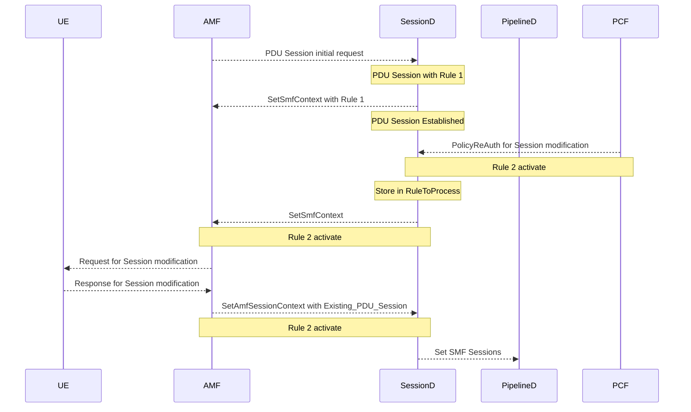

# Extended Features of 5G SA FWA

This document gives an overview of the Extended features added on top of the [integrated 5G SA FWA](https://docs.magmacore.org/docs/lte/integrated_5g_sa) (5G Standalone Architecture Fixed Wireless Access) such as

- [5G QoS](/docs/next/lte/extended_5G_sa_features#5g-qos)
- [IPv6 & Dual IPv4v6 support](/docs/next/lte/extended_5G_sa_features#ipv6--dual-ipv4v6-support)
- [Network initiated Session Modification](/docs/next/lte/extended_5G_sa_features#network-initiated-session-modification)
- [SUCI Extensions](/docs/next/lte/extended_5G_sa_features#suci-extensions)
- [Stateless feature](/docs/next/lte/extended_5G_sa_features#stateless-feature)
- [GTP extension header support](/docs/next/lte/extended_5G_sa_features#gtp-extension-header-support).

## 5G QoS

The QoS (Quality of service) is the mechanism that works on a network to control traffic and ensure the performance of critical applications with limited network capacity. By giving particular high-performance applications priority, it enables the businesses to modify their overall network traffic.

The QoS flow is the lowest level granularity within the 5G system and is where policy and charging are enforced.

With the current infrastructure, AGW supports the QoS in this release for both PDU (Protocol Data Unit) session accept and PDU session modification command messages.

The QoS flow in PDU session accept message.


The QoS flow in PDU session modification command message.


## IPv6 & Dual IPv4v6 support

With the current infrastructure, AGW supports IPv6 & Dual IPv4v6.

Getting IPv6 address allocated in PDU Session accept message.


Getting IPv4v6 address allocated in PDU Session accept message.


## Network initiated Session Modification

AGW supports one default PDU session. Network Initiated PDU Session Modification is one of the way to create Dedicated QoS Flows. If a new application function requires to access a specific QoS policy but the current QoS policy doesn't support services, it might be necessary to dynamically add a new QoS policy to an existing PDU session. In this case, PCF (Policy Control Function) will send the session modification request to sessiond.

Once the QoS policy is installed and it is no longer required then PCF will trigger the request to clear the existing QoS policy from sessiond using session modification.

Basic Network Initiated Session modification call flow for addition of new QoS policy.



Here, Rule 1 is the default QoS policy and Rule 2 is the QoS policy we are applying in Session Modification.

Same sequence diagram is applicable for Deletion of QoS policy.

### Limitations

1. Currently AGW is supporting serial operation only, which means addition of a QoS policy or deletion of a QoS policy in a Session modification request. A single request containing add and delete is currently not supported.
2. Right now this feature is still to be integrated with PCF. The tests used the stub CLI in sessiond.

## SUCI Extensions

5G standards mitigates the vulnerabilities caused due to IMSI catchers by introducing SUCI. SUCI is a privacy-preserving identifier containing the concealed SUPI.

In this release AGW supports two different profiles of [SUCI Extensions](https://docs.magmacore.org/docs/next/lte/suci_extensions).

## Stateless feature

The MME will store UE registrations/session management data in-memory. Any MME failure or restart will result in the loss of all data, including UE registration and Operator Account information, preventing UEs from accessing packet core services. As a result, UEs will need to reconnect and re-register.

Stateless feature provides failure recovery mechanism by storing user data in a persistent storage.
On occurrence of a failure, AGW will retrieve the UE data from the persistent storage. A partial service interruption may occur. However, once the AGW has been respawned, registered users can access the service without having a fresh registration.

The MME will sync UE registration and session management data into persistent storage (Redis Database) for pre-defined trigger points. In case of any MME failure/restart, MME will fetch UE specific data from Redis Database.


## GTP extension header support

The Extension Header Length field specifies the length of the particular Extension header in 4 octet units. The Next Extension Header Type field specifies the type of any Extension Header that may follow a particular Extension Header. If no such Header follows, then the value of the next Extension Header Type should be 0.

```text
	 0                   1                   2                   3
     0 1 2 3 4 5 6 7 8 9 0 1 2 3 4 5 6 7 8 9 0 1 2 3 4 5 6 7 8 9 0 1
     +-+-+-+-+-+-+-+-+-+-+-+-+-+-+-+-+-+-+-+-+-+-+-+-+-+-+-+-+-+-+-+-+
     | Ext-Hdr Length|                                               |
     +-+-+-+-+-+-+-+-+                                               |
     |                  Extension Header Content                     |
     .                                                               .
     .                                               +-+-+-+-+-+-+-+-+
     |                                               |  Next-Ext-Hdr |
     +-+-+-+-+-+-+-+-+-+-+-+-+-+-+-+-+-+-+-+-+-+-+-+-+-+-+-+-+-+-+-+-+
```

In 5G SA FWA, each flow is forwarded based on the appropriate QoS rules. QoS rules are configured by SMF as QoS profiles to UP components and these components perform QoS controls to PDUs based on rules. In downlink, a pipelineD pushes QFI into an extension header, and transmits the PDU to RAN. In uplink, each UE obtains the QoS rule from SMF, and transmits PDUs with QFI containing the QoS rules to the RAN.

## Additional AGW Configurations

### Network initiated Session Modification

Stub CLI used to add the QoS policy in Network initiated session modification.

```text
session_manager_cli.py policy_rar IMSI001019976545660 IMSI001019976545660-112383 INTERNET ADD 10 6 "UL,6,192.168.128.12,0,192.168.200.1,12345;DL,1,8.8.8.8,0,192.168.128.12,0" "1000000,2000000,1000000,2000000,15,1,0"
```

Stub CLI used to delete the QoS policy in Network initiated session modification.

```text
session_manager_cli.py policy_rar IMSI001019976545660 IMSI001019976545660-112383 INTERNET DEL 10 6 "UL,6,192.168.128.12,0,192.168.200.1,12345;DL,1,8.8.8.8,0,192.168.128.12,0" "1000000,2000000,1000000,2000000,15,1,0"
```

Here are the details of the [Stub CLI command](assets/lte/Session_modification_stub_cli_commands "Stub CLI Command") for add or delete the QoS policy in Network initiated session modification.

### Stateless feature

Config stateless flag should be enabled in order to implement stateless functionality.

```text
magmad_cli.py config_stateless enable	
```

To check the status of config_stateless flag.

```text
magmad_cli.py config_stateless check_stateless
```

The above command should give `AGW Mode: STATELESS`.

## Common Issues and Troubleshooting

- Description: GTP tunnel could not be added to the OVS table.

- Solution: This issue is due to the following parameters missing in `/etc/magma/pipelined.yml` file.

```text
  # Internal port for processing internal sampling packets
  ovs_internal_sampling_port_number: 15578
  # Table to forward packets from the internal sampling port
  ovs_internal_sampling_fwd_tbl_number: 201
  # Make as a True when gnb ip will support for uplink
  ovs_multi_tunnel: False
  # Paging timeout value for idle mode
  paging_timeout: 30
  # ID used for RYU controller identification
  classifier_controller_id: 5
  # UPF node ID
  upf_node_identifier: 192.168.200.1
```
