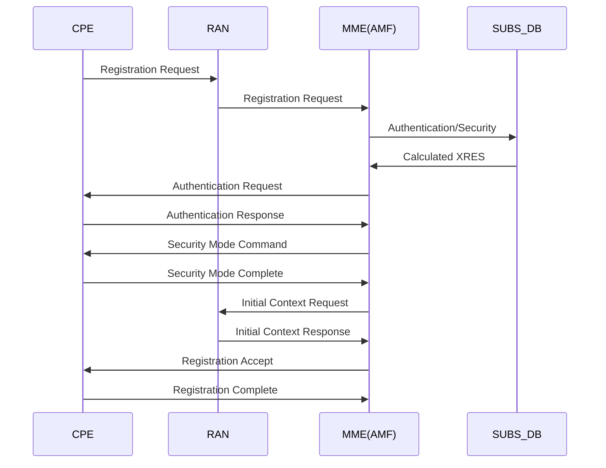
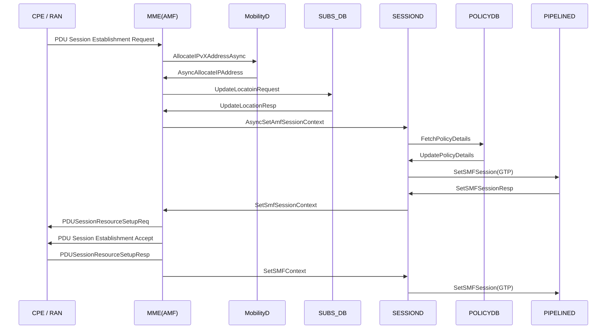
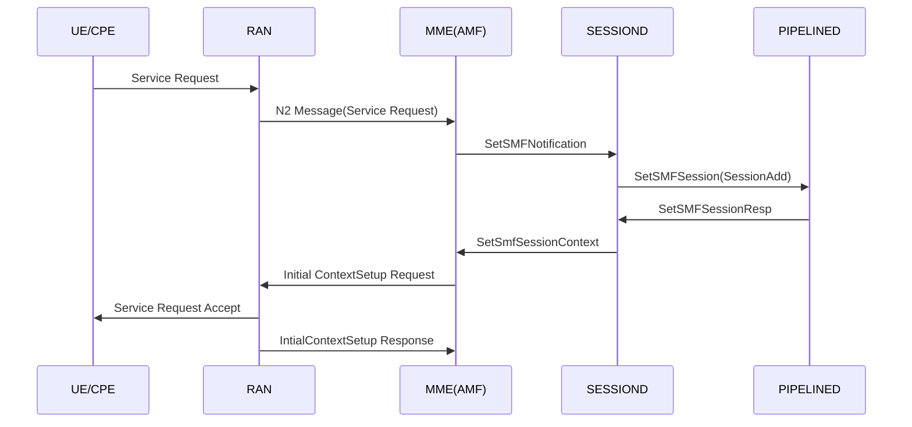
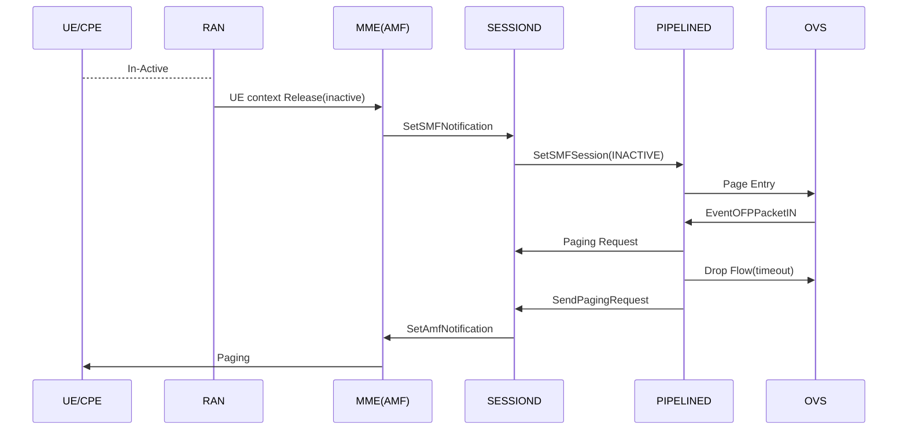

# Integrated 5G SA FWA

Magma 5G SA feature enables operators to provide enhanced Mobile BroadBand services and opens up new oppurtunites for business.

This document gives an overview of the 5G SA functionality present in Magma, its architecture, configuration, feature matrix
and general debugging techniques.

## Architecture

Currently, fixed wireless access deployment is targeted as the first milestone for 5G SA.

AMF included in current MME module and will serve as entry point for all the N1 and N2 messages coming from CPE and GNB.
Post processing of these messages AMF will connect with existing subscriberdb, mobilityd and sessiond module for realizing the end to end call flow.

Following diagram gives an overview of the 5G SA components.


## Prerequisites

Before starting to configure 5G SA setup, first you need to bring up a setup to handle your own/local subscribers. So before configuring Inbound Roaming you need:

- Install [Or8cr](https://magma.github.io/magma/docs/orc8r/architecture_overview),
- Install [Federatetion Gateway](https://magma.github.io/magma/docs/feg/deploy_intro) and,
- Install [Access Gateway](https://magma.github.io/magma/docs/lte/setup_deb).
- Make sure your setup is able to serve calls with your local subscribers

Once you are done you need to enable the 5G feature set from the orchestrator. Also need to ensure that this AGW serves the mapped PLMN.Once done we can connect Magma AGW with GNB and the 5G supported UE.

## High Level Call Flow

Following figure describes the high level call flow in Magma for 5G.

UE/CPE basic registration Flow



Basic PDU session establishment call flow



Service Request Procedure (from UE/CPE) call flow



Paging procedure call flow



## Features supported by 5G SA

Following are the feature set which are available as part of current release

- Mobile Management Services (Registration, Deregistration, Authentication etc procedures)
- Session Management Services (PDU Session Establishment, Accept etc)
- Service Related procedures via CPE
- Idle Mode and Paging support
- Basic traffic flow

## Configuration 5G SA feature

### Enabling / Disabling the 5G Feature set

   5G feature can be disabled or enabled using swagger API for an LTE Network under Cellular section
   Swagger API : PUT - /lte/{network_id}/cellular/epc
   Below is the payload

   

After a successful configuration gateway.mconfig should looks something like :

```text
  "mme": {
    "@type": "type.googleapis.com/magma.mconfig.MME",
    "amfDefaultSliceDifferentiator": "ffffff",
    "amfDefaultSliceServiceType": 1,
    "amfName": "MAGMAAMF1",
    "amfPointer": "0",
    "amfRegionId": "1",
    "amfSetId": "1",
  ...
  ...
  "enable5gFeatures": true,
  ...
  }
  "pipelined": {
    "@type": "type.googleapis.com/magma.mconfig.PipelineD",
    "allowedGrePeers": [],
    "apps": [],
    "enable5gFeatures": true,
    ...
    "upfNodeIdentifier": "192.168.60.142"
  },
  "sessiond": {
    "@type": "type.googleapis.com/magma.mconfig.SessionD",
    "enable5gFeatures": true,
    "gxGyRelayEnabled": false,
    "logLevel": "INFO",
    "relayEnabled": false
  },
  "subscriberdb": {
    "@type": "type.googleapis.com/magma.mconfig.SubscriberDB",
    "enable5gFeatures": true,
    ...
    ...
  }
```

### Subscriberdb Extension

The basic subscriber configuration remains unchanged and can be added following the [link](https://github.com/magma/magma/issues/10943?). However a small extension was introduced, called core network type restriction in order to give permission flexbility to operators to disable 5G or 4G features for a particular subscriber.

The sample configuration is shown in the below figure


### Additional AMF Specific Configurations

AMF Specific Configuration

The parameters related to AMF like slice configuration, setid, regionid etc can be configured using swagger APIs. Following shows the mechanism to configure it using the swagger APIs

```text
  PUT/GET - /lte/{network_id}/gateways/{gateway_id}/cellular/ngc (Gateway NGC Configuration)\
  {
    "amf_name" : "amf.example.org",
    "amf_set_id" : "2A1",
    "amf_pointer" : "1F",
    "amf_region_id" : "C1",
    "amf_default_slice_service_type" : 2
    "amf_default_slice_descriptor" : "AFAF"
  }
```

If not configured these parameters have their own default values.

## Test and troubleshooting

### Additional Logging

It is recommendable that before running the tests, enable some extra logging capabilities in Access Gateway to trace the call.
For better details in Access Gateway logs:

- Enable `log_level: DEBUG` in `mme.yml`, `sessiond.yml`  and `subscriberdb.yml`
- Enable `print_grpc_payload: True` on `subscriberdb.yml`, `sessiond.yml` & `pipelined.yml`
- Restart magma, so the changes are taken
- See the logs using `sudo journalctl -fu magma@mme` or sudo `journalctl -fu
  magma@subscriberdb` or `sudo journalctl -fu magma@sessiond`

Restart magma, so the changes are taken
See the logs using sudo journalctl -fu magma@mme or sudo journalctl -fu magma@subscriberdb or sudo journalctl -fu magma@sessiond

### Common Issues and Troubleshooting

SCTP Connection Failure

- Description :-
  NG Setup failure due to SCTP connection (like connection not established)

- Cause / Solution :-
  One of the common cause for this the 5G Feature is not enabled properly from the swagger
  For checking the same

```text
   vagrant@magma-dev-focal:~/magma/lte/gateway$ cat /proc/net/sctp/eps
     ENDPT     SOCK   STY SST HBKT LPORT   UID INODE LADDRS
         0        0 2   10  9    36412     0 465001933 192.168.60.142
         0        0 2   10  25   38412     0 465001935 192.168.60.142
```

  Entry of port 38412, ensures that the 5G feature is up and related applications are launched.

NG Setup Failure

- Description :-
  NG setup connections are failing within the network, which means that the gNodeb’s are not able to get provisioned
  with this network.

- Causes / Solution :-
  Common causes are plmn mismatch and nssai mismatch. Please check the mme.log (/var/log/mme.log) to get the exact cause.

UE Attach Failure

- Description :-
  Ue is unable to attach to the network.

- Causes / Solution :-
  Common causes for this failure is authentication failure. Please check the mme.log (/var/log/mme.log) to get the exact
  cause. In case of authentication failure, please verify that authentication parameters (such as key and opc) are the
  same in ue and subscriberdb.

## Enable the feature in Headless features

In case if the Magma is installed in a headless mode the following variable needs to be set to true in the files mme.yml, pipelined.yml, sessiond.yml, subscriberdb.yml

enable5g_features: true

## 3GPP References

- N1 Interface is based on 3GPP TS 38.413 version 16.2.0 Release 16
- N2 Interface is based on 3GPP TS 24.501 version 15.3.0 Release 15
- Procedures fo 5G Systems 3GPP TS 24.501 version 15.4.1 Release 15
- N3 Interface is based on 3GPP TS 29.281 version 15.7.0 Release 15
- Security Procedures like key generations based on 3GPP TS 33.501 version 15.4.0 Release 15
