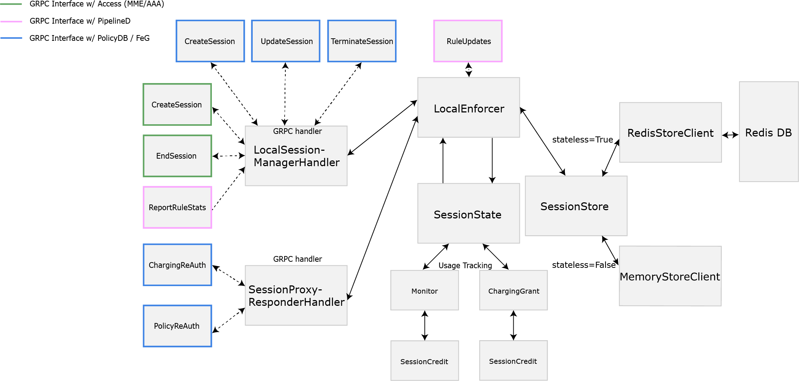

# Session Management in Magma

## Overview of SessionD
SessionD is the main service responsible for managing and enforcing session 
configurations. 

### Interfaces
SessionD interfaces with three distinct external components. 
1. Access (MME, AAA)  
 This component receives all connection and session related information from 
 the UE. It also handles mobility management. But from SessionD's point of view,
 it notifies SessionD whenever a UE is attached or detached. This notification 
 will include any context that SessionD needs for enforcement.
2. Policy (PolicyDB, FeG+PCRF/OCS)  
 This component is responsible for propagating any session or policy 
 configuration that SessionD must enforce. Whenever a new UE is introduced, 
 SessionD will reach out to this component to fetch any configuration. Depending
 on the configuration, SessionD maybe reach out to this component for updates. 
3. User Plane (PipelineD)  
 This component is responsible for policy and QoS enforcement. It receives 
 any relevant policy and QoS configuration from SessionD and periodically 
 reports usage accordingly.
 
### Internal Architecture 

## Configurations (Not Exhaustive)
- FeG Relay  
  A federation gateway, FeG, is an entity responsible for hosting a centralized 
  control plane interface towards an operator core. In terms of session 
  management, the SessionProxy service on a FeG will relay all session related 
  interactions.  
  This feature can be enabled on the Orc8r with a network wide
  `gx_gy_relay_enabled` flag. When it is disabled, a local PolicyDB service
  is used in place. This service will directly fetch session configurations
  from the Orc8r.  
  The feature is disabled by default.
- Omnipresent Rules  
  *This feature is currently only relevant for the federated case.*  
  Omnipresent rules are policies that are applied to all subscribers in a 
  network. The list of such policies are configured on the Orc8r as a network 
  configuration and are streamed down to all gateways in the network.
  These policies are added onto the list of policies configured by the PCRF. 
- Zero Wallet Detections  
  *This feature is currently only relevant for the CWF case.*  
  This configures a way for SessionD to detect when a subscriber is out of valid
  wallet. When an empty wallet is detected, the empty status is propagated to 
  PipelineD, which hosts a flask server that indicates the state. After a 
  configured number of seconds, the session will be terminated and the user will
  be kicked out.
  The configuration is done in Orc8r, but it is not currently exposed by an API.
  This timeout is configured in `sessiond.yml` with 
  `cwf_quota_exhaustion_termination_on_init_ms`.
   
  The detection methods are described below:  
  - GxTrackedRules: Wallet is empty if there are no active PCRF tracked policy.
    PCRF tracked policies are policies with tracking type `PCRF_ONLY` or 
    `PCRF_AND_OCS`. 
- `magma/lte/gateway/configs/sessiond.yml` has more configurations that are 
   managed on each gateway.
   
## Stateless Operation
A stateless SessionD service can be enabled by the `support_stateless` flag in 
`sessiond.yml`. This feature allows SessionD to be restarted without requiring 
previously existing sessions to be re-authenticated.

With this feature, SessionD stores all session state updates into Redis for 
persistent storage. When a session states needs to be modified, the state is
loaded from storage and modified in memory. When the modification is complete,
the updates are written back into Redis. When the feature is disabled, all 
states are kept in memory.

`SessionStore` is the interface to storage that makes the decision of where the 
states are kept based on the `support_stateless` flag.
Updates to stored session state are done with the `UpdateCriteria` structures 
passed into `SessionStore`.

To ensure that SessionD can always be restarted properly, session state 
should always be consistent with services with which it interacts. 
On SessionD restart, session state will be synced to MME service, which 
it will use as the source of truth for active sessions. 
Based on the active sessions, PipelineD will be instructed to 
allow/disallow traffic.

## Enforcement algorithm 
Sessiond can report credit to PCRF (Gx) and OCS (Gy). In both cases it is up to 
PCRF or OCS to determine when the user is out of quota. Sessiond will only receive, 
count, report and execute actions from the core. The algorithms here described 
are mainly related how to interpret the orders received by PCRF and OCS and how
in advance we will report to the core to prevent to hit the exhaustion prematurely.
Sessiond will not execute any action unless receiving an explicit order from 
PCRF and OCS.

Gx reporting will be identified with monitoring key, while Gy reporting will be 
identified by charging key. 

Both Gx and Gy reporting have some commonalities on its algorithm:
1. PCRF/OCS will send an initial grant with allowed credit to be reported. 
2. Sessiond will count the credits used but it will not report back anything yet
3. When a specific percentage of that grant is reached, Sessiond will send a 
report to OCS or PCRF with used units (by default 80% and can be changed at 
`sessiond.yml` using parameter `sessiond_readme_quota_exhaustion`). In case of
overusage, this will be reported too. So it is up to PCRF/OCS to take that 
overusage into consideration
4. PCRF/OCS will then send back another grant, which will be added to the still
remaining grant. 
5. PCRF/OCS can also include an indication to let SessionD know that there is 
no more quota available for that user. So SessionD will only have a small 
percentage left (around 20%) until is exhausted and execute an specific
action

See that PCRF or OCS can request to track the credit using Tx only, Rx only, Tx and Rx,
TX, RX and Total. The tracking type will be determined by the very first grant received
and will remain the same for the entire session for that specific monitor key (Gx reporting)
or charging key (Gy reporting)

To better understand the exhaustion algorithm refer to `SessionCredit::is_quota_exhausted`

Below you have some differences on how SessionD deals with GX and Gy reporting 

### PCRF (Gx reporting) 
Gx reporting will not cause a session termination. Gx reporting will report credit
back to PCRF until quota is exhausted. Once quota is exhausted, the monitor will be
deleted from SessionD (stop reporting) but the session or the policy related with 
that monitoring key will not be removed.

Monitor removal will be triggered by PCRF sending a grant with one of its components
(tx, rx or total) set to 0 (or not set). Note that this component (tx, rx or total) 
must be one of the tracked types. So if we are tracking TX and RX, the deletion of
the monitor will be triggered if we receive either a 0 on Tx or Rx 
(total component will be ignored).

When SessionD receives a 0 on one of its tracked components of the last received
grant, the monitor will not be deleted immediately. Sessiond will exhaust the remaining 
credit still left (remember we still have around 20% left of the previous grant), and 
then stop reporting removing the monitoring key.

### OCS (Gy reporting) 
Gy reporting will cause session termination, redirection or restriction. Gy reporting will 
report credit back to OCS until quota is exhausted. Then, and depending on 
Final Unit Action, the session may be terminated, redirected or restricted.
In all cases, this will have impact on the whole session, not on a specific policy of 
that session

Session action will be triggered by OCS sending a grant which must include AVP 
Final Action Indication. If this AVP is not included, SessionD will keep tracking
and reporting to OCS, even if quota is exhausted, but it will not take any action. 
The reason for that is that we don't want to trigger an early termination of the 
session due to OCS being too slow to provide a grant. Also, Per 3gpp 
Final Unit Indication AVP is needed to trigger any action by SessionD.

Note when SessionD receives a grant which includes Final Unit Indicaton, it 
will continue tracking this charging key until any of its quotas is exhausted. 
Once it is exhausted, Final Unit Action (termnate, redirect, restrict) 
will be executed.

#### Enabling Restriction
In addition to Final Unit Action AVP, OCS must include a list of Filter-ID AVP in the
final grant. These filters reference static policy rule identifiers that are pre-provisioned
in PCRF and should contain an explicit DENY rule for non allowed traffic.

Note that static rules referenced in Filter-ID must not be activated by Gx Interface due to a
limitation in pipelined.

#### Enabling Redirection
In addition to Final Unit Action AVP, OCS must include a Redirect-Information AVP which
includes the redirect server address and the address type (URL/IPV4) in the final grant.

Note that SIP_URI and IPV6 are not supported.
