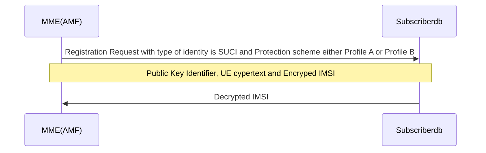

# SUCI Extensions

SUCI (Subscription Concealed Identifier) is a privacy-preserving identifier containing the concealed SUPI (Subscription Permanent Identifier). The home network public key identifier encrypts SUPI and allows UE to authenticate with the network. The SUCI format is shown below.

The home network public key identifier(s) for the private/public key pairs used for subscriber privacy shall be stored in the subscriberdb of the Access Gateway (AGW). Subscriberdb should include a Subscription Identification De-concealing Function (SIDF), which contains an algorithm for decrypting SUCI using the home network private key.

This document gives an overview of the SUCI Extensions functionality present in Magma, its architecture, configuration, feature matrix.

## Use Case

The UE generates and transmits the SUCI using a protection scheme, i.e., as one of the Elliptic Curve Integrated Encryption Scheme (ECIES) profiles, and the public key that was securely provisioned in the home network's control.

The encryption and decryption mechanism specified in TS 33.501 is shown below.

- According to 3GPP TS 33.501, the UE generates SUCI with the public key of the home network using an ECIES-based protection scheme.
- According to 3GPP TS 33.501 clause C.3.2 (Processing on the UE side), the UE shall use the home network's provisioned public key and construct a new ECC (Elliptic Curve Cryptography) ephemeral public/private key pair based on the ECIES parameters provisioned by the home network.
- According to 3GPP TS 33.501 clause C.3.3 (Processing on the home network side), the home network must use the UE's received ECC ephemeral public key and the home network's private key to de-conceal an SUCI.

## Architecture

Subscriberdb of AGW shall periodically fetch the list of SuciProfiles from Orc8r. Based on the home network public key identifier received in the authentication request, corresponding private key is retrieved and used to de-conceal the SUCI in the authentication request. Each public/private key pair is not subscriber specific, and can be shared among multiple subscribers.

Assuming public/private key pair generation of HPLMN is not part of magma, operator shall configure list of SuciProfiles in AGW which comprises of

- Home Network Public Key Identifier
- Public/Private Key pair
- Protection scheme

Operator is responsible for provisioning UE with Home Network Public Key Identifier, Home Network Public key, Protection scheme.

## Detailed Design

The diagram above represents the network create/update flow and the modules involved in processing the NMS request. Also represents how the SuciProfiles are fetched from Orc8r.

### Orc8r

- To facilitate REST API updates, the LTE Network data model will accept a list of SuciProfiles and obsidian handlers.
- Subscriberdb RPC servicer to handle the gRPC request from AGW, which populates the list of SuciProfiles per network.

### AGW

- AMF to invoke SIDF Module of subscriberdb for SUCI decryption.  In initial registration NAS message, if type of identity is SUCI (1) and protection scheme Id is either ECIES scheme profile A OR ECIES scheme profile B, then AMF initiates GRPC call to subscriberdb with parameters such as Home network public key identifier, ue ciphertext and encrypted imsi.
- SubscriberDB periodically fetches the list of SuciProfiles from Orc8r and stores it as in- memory data.
- SubscriberDB has SIDF functionality, that performs an in-memory data lookup to extract the private key associated with the home network public key identifier and protection scheme that we obtained from the initial registration NAS message. SIDF has an algorithm that uses the private key to decode the SUCI.

## Prerequisites

Prior to configuring SUCI extensions, you must first support integrated 5G SA FWA.

## High Level Call Flow

The call flow between AMF and SubscriberDB in magma for SUCI extensions is shown in the figure below.

## Configuration SUCI Extensions

While creating the LTE network, SUCI Profiles can be established using the below swagger API.

Swagger API : POST - /lte

Below is the payload.

If we want to add a SUCI Profile to an existing LTE network, we may do it with the swagger API listed below.

Swagger API : PUT - /lte/{network_id}

Below is the payload.

## 3GPP References

- 3GPP TS 23.003 version 15.4.0 Release 15 - Digital cellular telecommunications system (Phase 2+) (GSM); Universal Mobile Telecommunications System (UMTS); Numbering, addressing and identification
- 3GPP TS 33.501 version 15.2.0 Release 15 - 5G; Security architecture and procedures for 5G System
