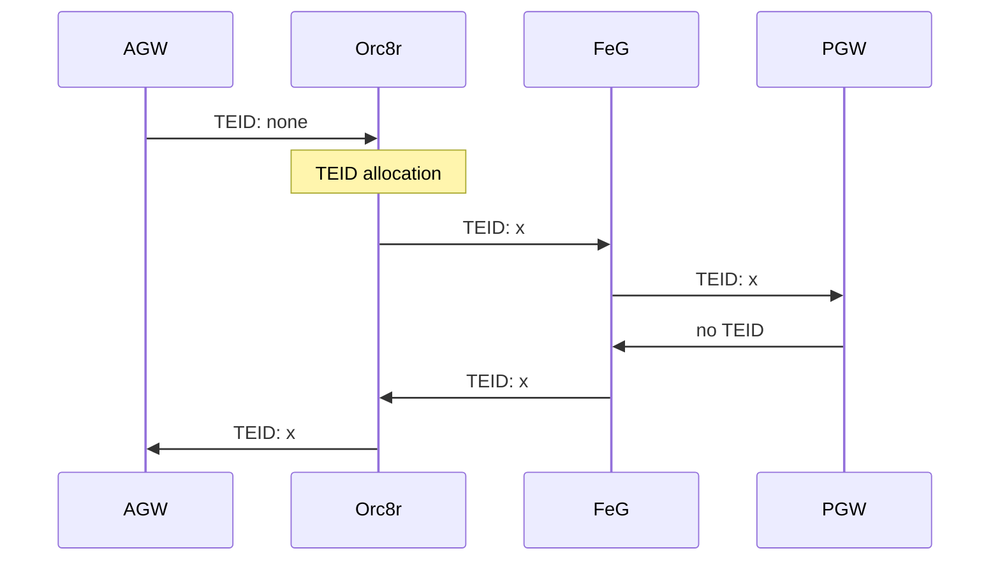

# TEID Allocation

TEID are identifiers used to set GTP connections. During setup between two
specific entities, both parties provide a TEID to the other end to identify
their connection. Each connection is identified with two different TEIDs.

Note that to uniquely identify connections across different entities we use
F-TEID which includes IP and TEID.

## Local Subscriber TEID Allocation

Local subscribers are those subscribers that are native to Magma network.
Those subscribers are served by same operator core (they are non
roaming subscribers)

For those subscribers, allocation of TEID happens
at NNE. In each AGW, MME keeps a hash map with the active
TEIDs and avoids collisions of TEIDs within the same AGW

TEID is only used on GTP connection between MME And eNB. Since an eNB will
be connected only to one AGW, TEID collision between AGW is not possible.
So in this case uniqueness of TEID is only needed within same AGW.

## Roaming Subscriber TEID Allocation

In case of Roaming scenarios, Magma is seen as a single GTP entity to the
Home operator core. That means Magma needs to provide unique GTP TEIDs across
different AGW of the same network.

Besides in this Roaming case, GTP is not only used between eNB and AGW but
also between FeG and PGW (control plane) and AGW and PGW (user plane)

So in this case to maintain uniqueness of TEIDs across different AGW TEID
allocation must happen at Orc8r level.

On `create session request`, AGW will send a request
without TEID (neither control nor user plane TEID). Orc8r will catch that
request at `feg_relay` service and request `directoryd` for an available
control and user plane TEID. `feg_relay` will then inject those TEIDs in
the request and sent to the FeG.

Once the PGW sends `create session response`, FEG will include on the response
the previously injected TEIDs and send it back to AGW

AGW will use those TEIDs to identify GTP-C and GTP-U. So all the messages
received from the PGW to AGW will use those TEIDs Orc8r generated.

Note roaming TEIDs are independent of Local Subscribers TEIDs, and they do not
have to maintain uniqueness between Local and Roaming subscribers.

Note each connection has a pair of TEIDs, local (AGW) and remote (PGW). TEID
allocation is in reference of local TEIDs. Remote TEIDs are provided by
the PGW itself.
