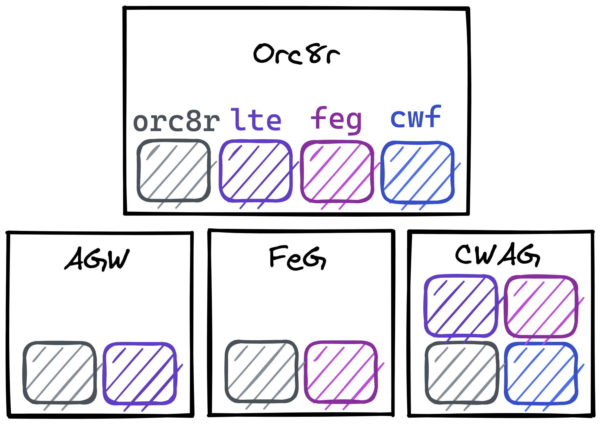

# Modularity

The Orchestrator follows a modular design, supporting domain-specific applications under an extendable service mesh architecture. This document describes the Orchestrator's service mesh architecture motivations, implementation, and how to extend Orchestrator for your own domain-specific purposes.

## Motivation

The Magma platform aims to provide unified access network management, across domains. Operators should be able to use the same, familiar Orchestrator interface to provision and monitor deployments targeting use-cases from fixed wireless access, federated fixed wireless access, private LTE, carrier Wi-Fi, etc.

To achieve this goal, the Orchestrator provides a set of core, domain-agnostic features, which are then extended by domain-specific functionality on a per-deployment basis. This logic-based extension occurs completely at runtime -- that is, while we provide Helm charts targeting a default set of use-cases, extending an Orchestrator deployment is, practically, as simple as spinning up a new service within the cluster.

For more background on microservice patterns, and the extension pattern specifically, refer to [this article on domain-oriented microservice architectures](https://eng.uber.com/microservice-architecture/).

## Implementation

### Overview

Orchestrator provides a discrete set of extensions for injecting functionality into the core services. These extensions (i.e. hooks) implement a per-extension gRPC servicer, where core Orchestrator services will handle making calls over-the-network to the servicer at the appropriate time. Each service in the deployment can implement any of the extensions, and the core services will automatically handle calling the extension implementation. Discovery is handled by assigning Kubernetes labels and annotations.

There are two categories of extensions

- *Producer* extensions export data to core services upon request
- *Consumer* extensions receive data from core services

### Supported extensions

We currently support 7 extensions

- **Analytics collector**
    - Calculate, write, and return new metrics derived from existing metrics
    - Producer, aggregated by the *analytics* service
    - Label: `orc8r.io/analytics_collector`
- **Mconfig builder**
    - Define configuration (mconfigs) for gateway services
    - Producer, aggregated by the *configurator* service
    - Label: `orc8r.io/mconfig_builder`
- **Metrics exporter**
    - Export metrics to chosen data sink
    - Consumer, pushed from the *metricsd* service
    - Label: `orc8r.io/metrics_exporter`
- **Obsidian handler** (REST API)
    - Define REST API endpoints
    - Producer/consumer, proxied by the *obsidian* service
    - Label: `orc8r.io/obsidian_handlers`
    - Annotations
        - `orc8r.io/obsidian_handlers_path_prefixes` determine which endpoints to proxy
- **State indexer**
    - Receive reported state for processing and/or indexing under new primary key
    - Consumer, pushed from the *state* service
    - Label: `orc8r.io/state_indexer`
    - Annotations
        - `orc8r.io/state_indexer_version` reindex all state when indexer version is incremented
        - `orc8r.io/state_indexer_types` which types of state to send to the indexer
- **Stream provider**
    - Push arbitrary objects to gateway services subscribed to the stream
    - Producer, aggregated by the *streamer* service
    - Label: `orc8r.io/stream_provider`
    - Annotations
        - `orc8r.io/stream_provider_streams` which streams the provider exposes
- **Swagger specifier**
    - Define the accompanying REST API endpoints by exposing a Swagger (OpenAPI) specification
    - Producer, aggregated by the *obsidian* service
    - Label: `orc8r.io/swagger_spec`

### Example extension

The interface between core service and extension implementation is defined per extension. Beyond that interface, functionality depends on the particular extension. For a concrete example, consider the state indexing diagram described in [State Indexers](./dev_indexers.md).

## Modules

Magma modules encapsulate domain-specific functionality by defining reusable code and deployments that span Orc8r and gateways. At the Orc8r, these modules use the extension pattern to inject their functionality.

You can see the full list of modules in [Module Dependencies](./dev_dependencies.md). These modules span both Orc8r and the relevant gateways, allowing domain-specific code to be shared and injected across the stack. As an example, the AGW, FeG, and CWAG are gateways that collectively share the *orc8r*, *lte*, *feg*, and *cwf* modules

## Extending Orchestrator

### Implement extension

You'll need to define a service executable which implements the gRPC servicer definition for one of the above extensions. Then, when packaging your Helm charts, be sure to include the relevant labels and annotations for your new service. After deploying the Helm charts to your K8s cluster, the core services should automatically discover and incorporate the new extension implementation.

### Add new extension

Reach out to us! Follow the "Community" tab in the header to get connected. For compelling use-cases, we can add and/or guide the addition of new extensions.
