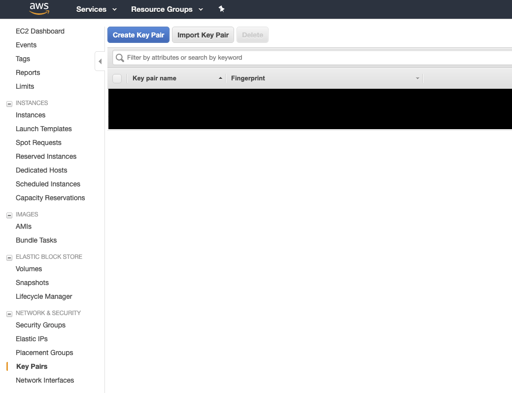

# Deploying Orchestrator

This page will walk through the full process of spinning up a full Orchestrator
deployment, from building the various containers that you'll need to deploying
them onto Amazon Elastic Kubernetes Service (EKS).

## Terraforming AWS Resources

### Pre-Terraform

First, copy the contents of [orc8r/cloud/deploy/terraform](https://github.com/facebookincubator/magma/tree/master/orc8r/cloud/deploy/terraform)
into a source-controlled directory that you control. This directory contains
bare-bones Terraform scripts to bring up the raw AWS resources needed for
Orchestrator. We highly recommend familiarizing yourself with [Terraform](https://www.terraform.io/)
before continuing - the rest of this guide will assume some familiarity with
both Terraform and the [AWS CLI](https://aws.amazon.com/cli/).

Adjust the example Terraform files as you see fit. If you aren't familiar with
Terraform yet, we recommend not changing anything here for now.

Next `cd` to where you've copied the contents of the Terraform directory and

```bash
terraform init
```

In the AWS console, create or import a new keypair to enable SSH access to the
worker nodes of the EKS cluster. This can be found in the EC2 dashboard under
"Key Pairs". If you're creating a new key pair, make sure not to lose the
private key, you won't be able to recover it from AWS.



Next, create a `vars.tfvars` file in your directory, *add it to your source
control's .ignore*, and specify your desired RDS password and the name of the
keypair that you imported or created in the above step:

```bash
$ cat vars.tfvars
db_password = "foobar"
key_name = "my_key"
```

Check the README under the original terraform directory for additional
variables that you can configure.

Now you're ready to move on:

### Applying Terraform

Execute your standard Terraform workflow and wait for the resources to finish
provisioning. If you are terraforming on an AWS account that's already being
used for other purposes, carefully examine Terraform's planned execution before
continuing.

Once `terraform apply` finishes, there is some additional manual setup to
perform before our EKS cluster is ready to deploy onto.

First find the public IP address of the metrics instance using
```bash
export METRICS_IP=$(aws ec2 describe-instances --filters Name=tag:orc8r-node-type,Values=orc8r-prometheus-node --query 'Reservations[*].Instances[0].PublicIpAddress' --output text)
echo $METRICS_IP
```

The Prometheus config manager application expects some configuration files to
be seeded in the EBS config volume (don't forget to use the correct private
key in `scp` with the `-i` flag):

```bash
scp -r config_defaults ec2-user@$METRICS_IP:~
ssh ec2-user@$METRICS_IP
[ec2-user@<metrics-ip> ~]$ sudo cp -r config_defaults/. /configs/prometheus
```

Now you've got your infra set up, we can move on to configuring the EKS cluster.

Assuming you don't have an existing Kubeconfig file in `~/.kube/config`, run
the following. If you do, you can use the `KUBECONFIG` environment variable
and `kubeconfig view --flatten` to concatenate the kubeconfig file that
Terraform created with your existing kubeconfig.

```bash
cp ./kubeconfig_orc8r ~/.kube/config
```

Now we can set up access to the EKS cluster:

```bash
kubectl apply -f config-map-aws-auth_orc8r.yaml
kubectl create namespace magma
```

At this point, our cluster is ready for deploying the application onto.

## Building the Containers

Start up your Docker daemon, `cd` to where you've cloned Magma, then:

```bash
cd magma/orc8r/cloud/docker
./build.py -a
```

This will kick off the build of all the Orchestrator components, which may
take a few minutes. When this job finishes, upload these images to your image
registry:

```bash
../../tools/docker/publish.sh -r REGISTRY -i proxy
../../tools/docker/publish.sh -r REGISTRY -i controller
../../tools/docker/publish.sh -r REGISTRY -i prometheus-cache
../../tools/docker/publish.sh -r REGISTRY -i config-manager
../../tools/docker/publish.sh -r REGISTRY -i grafana
```

While we're here, you can build and publish the NMS containers as well:

```bash
cd magma/nms/fbcnms-projects/magmalte
docker-compose build magmalte
../../../orc8r/tools/publish.sh -r REGISTRY -i magmalte
```

## Deploying to EKS

### Creating Secrets

IMPORTANT: in all the below instructions, replace `yourdomain.com` with the
actual domain/subdomain which you've chosen to host Orchestrator on.

We recommend storing the following secrets on S3 in AWS, or any similar
object storage service on your preferred cloud provider.

Start first by creating a new directory somewhere to hold the secrets while
you create them:

```bash
mkdir -p ~/secrets/
```

#### SSL Certificates

You will need the following certificates and private keys:

1. The public SSL certificate for your Orchestrator domain,
with CN=*.yourdomain.com. This can be an SSL certificate chain, but it must be
in one file
2. The private key which corresponds to the above SSL certificate
3. The rootCA certificate which verifies your SSL certificate.

If you already have these files, you can do the following:

1. Rename your public SSL certificate to `controller.crt`
2. Rename your SSL certificate's private key to `controller.key`
3. Rename your SSL certificate's root CA to `rootCA.pem`
4. Put these 3 files under a subdirectory `certs`

If you aren't worried about a browser warning, you can also self-sign these
certs. Change the values of the DN prompts as necessary, but pay *very* close
attention to the common names - these are very important to get right!

```bash
$ mkdir -p ~/secrets/certs
$ cd ~/secrets/certs
$ openssl genrsa -out rootCA.key 2048

Generating RSA private key, 2048 bit long modulus

$ openssl req -x509 -new -nodes -key rootCA.key -sha256 -days 3650 -out rootCA.pem

You are about to be asked to enter information that will be incorporated
into your certificate request.
What you are about to enter is what is called a Distinguished Name or a DN.
There are quite a few fields but you can leave some blank
For some fields there will be a default value,
If you enter '.', the field will be left blank.
-----
Country Name (2 letter code) []:US
State or Province Name (full name) []:CA
Locality Name (eg, city) []:Menlo Park
Organization Name (eg, company) []:Facebook
Organizational Unit Name (eg, section) []:Magma
Common Name (eg, fully qualified host name) []:rootca.yourdomain.com
Email Address []:admin@yourdomain.com

$ openssl genrsa -out controller.key 2048

Generating RSA private key, 2048 bit long modulus

$ openssl req -new -key controller.key -out controller.csr

You are about to be asked to enter information that will be incorporated
into your certificate request.
What you are about to enter is what is called a Distinguished Name or a DN.
There are quite a few fields but you can leave some blank
For some fields there will be a default value,
If you enter '.', the field will be left blank.
-----
Country Name (2 letter code) []:US
State or Province Name (full name) []:CA
Locality Name (eg, city) []:Menlo Park
Organization Name (eg, company) []:Facebook
Organizational Unit Name (eg, section) []:Magma
Common Name (eg, fully qualified host name) []:*.yourdomain.com
Email Address []:admin@yourdomain.com

Please enter the following 'extra' attributes
to be sent with your certificate request
A challenge password []:

$ openssl x509 -req -in controller.csr -CA rootCA.pem -CAkey rootCA.key -CAcreateserial -out controller.crt -days 365 -sha256

Signature ok
subject=/C=US/ST=CA/L=Menlo Park/O=Facebook/OU=Magma/CN=*.yourdomain.com/emailAddress=admin@yourdomain.com
Getting CA Private Key

$ rm controller.csr rootCA.key rootCA.srl
```

At this point, regardless of whether you self-signed your certs or acquired
them from a certificate provider, your `certs` subdirectory should look like
this:

```bash
$ ls
controller.crt  controller.key  rootCA.pem
```

#### Application Certificates and Keys

`certifier` is the Orchestrator service which signs client certificates. All
access to Orchestrator is authenticated by client SSL certificates, so you'll
need to create the verifying certificate for `certifier`.

Again, pay *very* close attention to the CN.

```bash
$ openssl genrsa -out certifier.key 2048

Generating RSA private key, 2048 bit long modulus

$ openssl req -x509 -new -nodes -key certifier.key -sha256 -days 3650 -out certifier.pem

...
Common Name (eg, fully qualified host name) []:certifier.yourdomain.com

$ openssl genrsa -out bootstrapper.key 2048

Generating RSA private key, 2048 bit long modulus

$ ls
bootstrapper.key  certifier.key     certifier.pem     controller.crt    controller.key    rootCA.pem
```

The last command created a private key for the `bootstrapper` service, which
is the mechanism by which Access Gateways acquire their client certificates
from `certifier`.

#### Environment Secrets

Go into the AWS management console, choose "RDS", and find the hostname of your
orc8r RDS instance (make sure not to choose the NMS RDS instance). Note this
down, then continue:

```bash
mkdir -p ~/secrets/envdir
cd ~/secrets/envdir
echo "STREAMER,EPS_AUTHENTICATION,SUBSCRIBERDB,METRICSD,CHECKIND,UPGRADE,MAGMAD,CERTIFIER,BOOTSTRAPPER,POLICYDB,METERINGD_RECORDS,ACCESSD,MESH,OBSIDIAN,LOGGER,DISPATCHER,CONFIG,DIRECTORYD" > CONTROLLER_SERVICES
echo "dbname=orc8r user=orc8r password=<YOUR ORC8R DB PASSWORD> host=<YOUR ORC8R RDS ENDPOINT>" > DATABASE_SOURCE
```

#### Static Configuration Files

Orchestrator microservices can be configured with static YAML files. In this
deployment, the only one you'll have to create will be for `metricsd`:

```bash
mkdir -p ~/secrets/config/orc8r
cd ~/secrets/config/orc8r
touch metricsd.yml
```

Put the following contents into `metricsd.yml`:

```
profile: "default"

prometheusQueryAddress: "http://orc8r-metrics:9090"
prometheusPushAddresses:
  - "http://orc8r-prometheus-cache:9091/metrics"

alertmanagerApiURL: "http://orc8r-metrics:9093/api/v2/alerts"
prometheusConfigServiceURL: "http://orc8r-metrics:9100"
alertmanagerConfigServiceURL: "http://orc8r-metrics:9101"
```

### Initial Helm Deploy

Copy your secrets into the Helm subchart where you cloned Magma:

```bash
cp -r ~/secrets magma/orc8r/cloud/helm/orc8r/charts/secrets/.secrets
```

We need to set up the EKS cluster before we can `helm deploy` to it:

```bash
cd magma/orc8r/cloud/helm/orc8r
kubectl apply -f tiller-rbac-config.yaml
helm init --service-account tiller --history-max 200
# Wait for tiller to become 'Running'
kubectl get pods -n kube-system | grep tiller

kubectl create namespace magma
```

Next, create a `vals.yml` somewhere in a source controlled directory that you
own (e.g. adjancent to your terraform scripts). Fill in the values in caps
with the correct values for your docker registry and Orchestrator hostname:

```
imagePullSecrets:
  - name: orc8r-secrets-registry

secrets:
  docker:
    registry: YOUR-DOCKER-REGISTRY
    username: YOUR-DOCKER-USERNAME
    password: YOUR-DOCKER-PASSWORD
  

proxy:
  image:
    repository: YOUR-DOCKER-REGISTRY/proxy
    tag: YOUR-CONTAINER-TAG

  replicas: 2

  service:
    type: LoadBalancer

  spec:
    hostname: controller.YOURDOMAIN.COM

  node-selector:
    worker-type: controller

controller:
  image:
    repository: YOUR-DOCKER-REGISTRY/controller
    tag: YOUR-CONTAINER-TAG

  replicas: 2

  migration:
    new_handlers: 1
    new_mconfigs: 1

  node-selector:
    worker-type: controller

metrics:
  imagePullSecrets:
    - name: orc8r-secrets-registry

  metrics:
    prometheus:
      nodeSelector:
        worker-type: metrics

    configmanager:
      image:
        repository: YOUR-DOCKER-REGISTRY/config-manager
        tag: "latest"
      nodeSelector:
        worker-type: metrics

    alertmanger: 
      nodeSelector:
        worker-type: metrics

    volumes:
      prometheusData:
        volumeSpec:
          hostPath:
            path: /prometheusData
            type: DirectoryOrCreate
      prometheusConfig:
        volumeSpec:
          hostPath:
            path: /configs/prometheus
            type: DirectoryOrCreate

  prometheusCache:
    create: true
    image:
      repository: YOUR-DOCKER-REGISTRY/prometheus-cache
      tag: "latest"
    nodeSelector:
      worker-type: metrics


nms:
  imagePullSecrets:
    - name: orc8r-secrets-registry

  magmalte:
    manifests:
      secrets: false
      deployment: false
      service: false
      rbac: false

    image:
      repository: YOUR-DOCKER-REGISTRY/magmalte
      tag: YOUR-CONTAINER-TAG

    env:
      api_host: controller.YOURDOMAIN.COM
      mysql_host: YOUR RDS MYSQL HOST
      mysql_user: magma
      mysql_pass: YOUR RDS MYSQL PASSWORD
  nginx:
    manifests:
      configmap: false
      secrets: false
      deployment: false
      service: false
      rbac: false

    service:
      type: LoadBalancer

    deployment:
      spec:
        ssl_cert_name: controller.crt
        ssl_cert_key_name: controller.key
```

NMS won't work without a client certificate, so we've turned off those
deployments for now. We'll create an admin cert and upgrade the deployment
with NMS once the core Orchestrator components are up.

At this point, if your `vals.yml` is good, you can do your first helm deploy:

```bash
cd magma/orc8r/cloud/helm/orc8r
helm template charts/secrets \
    --name orc8r-secrets \
    --namespace magma \
     | kubectl apply -f -
helm install --name orc8r --namespace magma . --values=vals.yml
```

### Creating an Admin User

First, find a `orc8r-controller-` pod in k8s:

```bash
$ kubectl -n magma get pods

NAME                                      READY   STATUS    RESTARTS   AGE
orc8r-controller-655ccf99b-bbq7x          1/1     Running   0          X
orc8r-controller-655ccf99b-v8zjv          1/1     Running   0          X
orc8r-grafana-7b4c447865-972xx            1/1     Running   0          X
orc8r-metrics-645ffcd47-phf2b             3/3     Running   0          X
orc8r-prometheus-cache-574c457b89-m6f8g   1/1     Running   0          X
orc8r-proxy-64bd4fdb5-77t7r               1/1     Running   0          X
orc8r-proxy-64bd4fdb5-rw9nh               1/1     Running   0          X
```

Then:

```bash
kubectl exec -it orc8r-controller-POD-ID bash

# The following commands are to be run inside the pod
cd /var/opt/magma/bin
envdir /var/opt/magma/envdir ./accessc add-admin -cert admin_operator admin_operator
openssl pkcs12 -export -out admin_operator.pfx -inkey admin_operator.key.pem -in admin_operator.pem
exit
```

Now on your host, copy down the client certificates for the admin operator we
just created into the secrets directory:

```bash
cd ~/secrets/certs
kubectl cp orc8r-controller-POD-ID:/var/opt/magma/bin/admin_operator.pem ./admin_operator.pem
kubectl cp orc8r-controller-POD-ID:/var/opt/magma/bin/admin_operator.key.pem ./admin_operator.key.pem
kubectl cp orc8r-controller-POD-ID:/var/opt/magma/bin/admin_operator.pfx ./admin_operator.pfx
```

`admin_operator.pem` and `admin_operator.key.pem` are the files that NMS will
use to authenticate itself with the Orchestrator API. `admin_operator.pfx` is
for you to add to your keychain if you'd like to use the Orchestrator REST API
directly (on MacOS, double-click this file and add it to your keychain).

### Deploying NMS

Now that we've got an admin operator cert, we can deploy NMS. Edit the
`vals.yml` from above, and change the `nms` section to the following:

```
nms:
  imagePullSecrets:
    - name: orc8r-secrets-registry

  magmalte:
    manifests:
      secrets: true
      deployment: true
      service: true
      rbac: false

    image:
      repository: YOUR-DOCKER-REGISTRY/magmalte
      tag: YOUR-CONTAINER-TAG

    env:
      api_host: controller.YOURDOMAIN.COM
      mysql_host: YOUR RDS MYSQL HOST
      mysql_user: magma
      mysql_pass: YOUR RDS MYSQL PASSWORD
  nginx:
    manifests:
      configmap: true
      secrets: true
      deployment: true
      service: true
      rbac: false

    service:
      type: LoadBalancer

    deployment:
      spec:
        ssl_cert_name: controller.crt
        ssl_cert_key_name: controller.key
```

You'll just flip all the `manifests` keys to `true` except `rbac`.

Next, copy your `secrets` directory back to the chart (to pick up the admin
certificate), and upload to to S3 (this step is optional, but you should have
some story for where you're storing these).

```bash
rm -r magma/orc8r/cloud/helm/orc8r/charts/secrets/.secrets
cp -r ~/secrets magma/orc8r/cloud/helm/orc8r/charts/secrets/.secrets
aws s3 cp magma/orc8r/helm/orc8r/charts/secrets/.secrets s3://your-bucket --recursive
# Delete the local secrets after you've uploaded them
rm -r ~/secrets
```

We can upgrade the Helm deployment to include NMS components now:

```bash
cd magma/orc8r/cloud/helm/orc8r
helm template charts/secrets \
    --name orc8r-secrets \
    --namespace magma \
     | kubectl apply -f -
helm upgrade orc8r . --values=vals.yml
kubectl -n magma get pods
```

Wait for the NMS pods (`nms-magmalte`, `nms-nginx-proxy`) to transition into
`Running` state, then create a user on the NMS:

```bash
kubectl exec -it -n magma \
  $(kubectl get pod -l app.kubernetes.io/component=magmalte -o jsonpath='{.items[0].metadata.name}') -- \
  yarn setAdminPassword <admin user email> <admin user password>
```

## DNS

In the following steps, replace `yourdomain.com` with the TLD or subdomain that
you've chosen to host Orchestrator on.

First, grab the public-facing hostnames for the ELB instance fronting the
internet-facing Orchestrator components
(`orc8r-bootstrap-legacy`, `orc8r-clientcert-legacy`, `nginx-proxy`):

```bash
$ kubectl -n magma get svc -o='custom-columns=NAME:.metadata.name,HOSTNAME:.status.loadBalancer.ingress[0].hostname'

NAME                      HOSTNAME
magmalte                  <none>
nginx-proxy               ELB-ADDRESS1.elb.amazonaws.com
orc8r-bootstrap-legacy    ELB-ADDRESS2.elb.amazonaws.com
orc8r-clientcert-legacy   ELB-ADDRESS3.elb.amazonaws.com
orc8r-controller          <none>
orc8r-graphite            <none>
orc8r-metrics             <none>
orc8r-prometheus-cache    <none>
orc8r-proxy               ELB-ADDRESS4.elb.amazonaws.com
```

Set up the following CNAME records for your chosen domain:

| Subdomain | CNAME |
|-----------|-------|
| nms.yourdomain.com | nginx-proxy hostname |
| controller.yourdomain.com | orc8r-clientcert-legacy hostname |
| bootstrapper-controller.yourdomain.com | orc8r-bootstrap-legacy hostname |

Wait for DNS records to propagate, then if you go to
`https://nms.yourdomain.com`, you should be able to log in as the admin user
that your created earlier and create your first network.

## Upgrading the Deployment

We recommend an upgrade procedure along these lines:

1. Check out the tag of the most recent release on Github
2. Rebuild all the images and push them
3. Update the image tabs in vals.yml
4. `aws s3 cp` the secrets bucket in S3 into `.secrets` under the secrets
subchart in Magma
5. Deploy secrets with `helm template ... | kubectl apply -f`
6. Upgrade helm deployment with `helm upgrade`
7. Delete the `.secrets` folder

We've automated steps 4-7 with a fabfile under
`magma/orc8r/cloud/helm/orc8r/fabfile.py`. You can upgrade your deployment
using this fabfile like this:

```bash
fab deploy:PATH_TO_VALS_YML,PATH_TO_TERRAFORM_KUBECONFIG,S3_BUCKET_NAME
```

where `PATH_TO_VALS_YML` is the full path to `vals.yml` on your machine,
`PATH_TO_TERRAFORM_KUBECONFIG` is the full path to the `kubeconfig_orc8r` file
produced by Terraform, and `S3_BUCKET_NAME` is the name of the S3 bucket where
you've uploaded your secrets.
