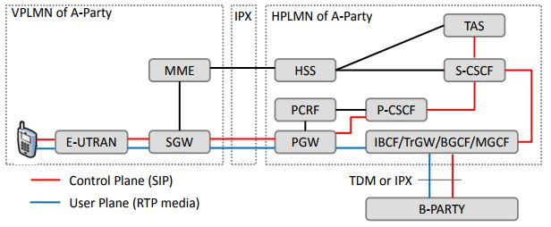
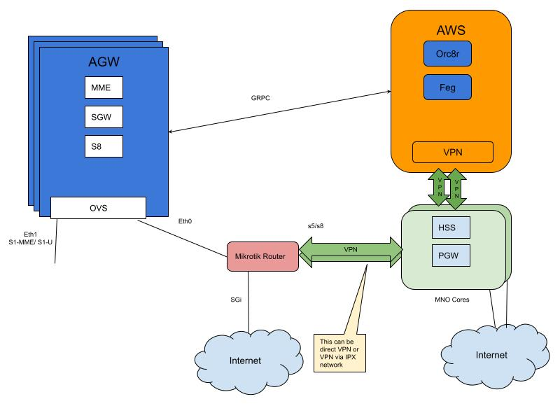

# Inbound Roaming (with SubscriberDb)

*Status: Accepted*\
*Feature owner:  @ssanadhya, @obatalla*\
*Feedback requested from: @emakeev, @kozat, @pbshelar*\
*Last Updated: 03/14/2021*

#### *Note:* for more detailed description check [DetailedDesign](https://docs.google.com/document/d/11m6VF4Grg0yPjjhoXdxJ-kVhvxrbW6Lk0iIue3d-814) and [Epic](https://app.zenhub.com/workspaces/magma-5fac75d3e2cd890011f1677a/issues/magma/magma/3277)

## Summary

Roaming support allows mobile users from one operator network to access
services while visiting areas outside their network coverage. In this document,
we consider the use case when a subscriber of a Roaming Partner Network (RPN)
tries to access LTE services while visiting an area covered by Magma Partner
Network (MPN).

## Use cases

The main use case of this feature is for an operator X using Magma to monetize
the network through an agreement with operator Y to allow subscribers from Y to
access X's network.

Currently, for this first proposal we will only consider the case where
operator X (Magma operator) uses SubscriberDb as an authenticator and operator
Y uses HSS to store their subscribers. Future proposals may bring other use
cases which include HSS for X operator (Magma operator).

## Architecture

To support inbound roaming we will need to modify current flow on control plane
on AGW and introduce a new service (s8_proxy) on FEG.

## Design

### 1. FEG - s8_proxy

Inbound roaming will require the implementation of S8 interface on the
Federated Gateway [3gpp - 29.274](https://www.etsi.org/deliver/etsi_ts/129200_129299/129274/16.05.00_60/ts_129274v160500p.pdf).

The new service will call s8_proxy and will implement Create Session
and Delete Session. This service should be stateless, so we can not
keep state on FEG. State like TEIDs will be kept on MME.

That interface is based on GTP (not Diameter), so that will also require
implementing GTP-U protocol. We suggest to use [go-gtp](https://github.com/wmnsk/go-gtp)
which is an implementation of GTP in go that covers the needs for those two
calls.

### 2. Or8cr - Dynamic Authentication Mapping

Currently, Access Gateway (AGW) is configured statically to process subscribers:
either they are authenticated locally using SubscriberDb, or they are all
authenticated using HSS.

In order to support inbound roaming we need to provide MME with a mapping that
allows MME to decide if the subscriber has to be authenticated through HSS
or SubscriberDb.

This mapping will consist for now of a `PLMN_id:mode`, where PLMN will be the
PLMN id of the roaming user, and mode will be `roaming_subscriber` to indicate
this has to be authenticated using HSS.

Note that this map will be extended on future features to support hybrid
Federated architectures.

### 3. MME
#### s6a_task
To support dynamic authentication `s6a_task` on MME will have to be extended to
support two simultaneous authentication methods depending on AGW configuration.

#### mme_task
To support dynamic selection of type of subscribers `mme_task` on MME will have
to be extended to support the decision if the subscriber needs to be sent to
`spgw_task` or to `s8_task`.

#### s8_task
A new task on MME will be required to implement the AGW S8 interface side.
That task will be similar to `spgw_task` on MME, but will implement
`CreateSessionRequest` and `DeleteSessionRequest` GRPC calls to communicate
with `s8_proxy` GRPC server.

### 4. OVS - Support of GTP-U
OVS will implement the user plane of the S8 interface. It will use GTP-U
(already supported by OVS). OVS will have to be able to set up a GTP-U tunnel
on the interface that is currently being used as a SGi, So from that interface
(normally eth0) we will have packets going to the local SGi (from Magma
subscribers) and to the remote PGW encapsulated with GTP-U.

## Testing

Each individual component should have its own unittest tests, or some kind
of integration test with mock services. For example for `s8_proxy` we should
create a mock PGW to use it to create go unittest. For `s8_task we` should
create a mock s8_proxy to be used s1ap on `lte_integ_test`.

TerraVM and HCore will be used as a full integration testing system once all
services are completed. However, to reduce friction on during full integration,
 we recommend testing individual services on TeraVM and HCore if possible.
For example in case of `s8_proxy`  there will be a `s8_cli` which will allow
testing `s8_proxy` with a PWG without the need of MME or Orc8r.
sy

Some partners have also offered their support to test in their own local
environment using a remote HSS and PGW. That will allow testing Magma in a
production environment that implements VPN between remote and local network.

## Implementation Phases

- FEG - s8_proxy: January 2021
- Or8cr - Dynamic Authentication Mapping: February 2021
- MME: March 2021
- OVS: March 2021
- Testing on TeraVM and HCore: during all phases
- SIT: April 2021

#### *Note:* for more detailed description check [DetailedDesign](https://docs.google.com/document/d/11m6VF4Grg0yPjjhoXdxJ-kVhvxrbW6Lk0iIue3d-814) and [Epic](https://app.zenhub.com/workspaces/magma-5fac75d3e2cd890011f1677a/issues/magma/magma/3277)
