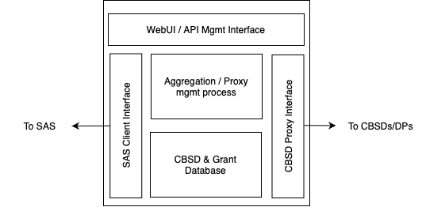

[TOC]

# Introduction

This document provides the Scope of Work definition for creating a
vendor neutral CBRS Domain Proxy (DP). A Domain Proxy provides proxy and
aggregation services for signaling between CBSD radios (eNBs or CPEs)
and a Spectrum Access System (SAS).

The interface between SAS and CBSD/DP is a standardized interface. The
interface between a DP and the CBSD is not standardized and can be based
on multiple protocols including the WInnForum defined SAS to CBSD/DP
REST API, TR-069, SNMP, or NETCONF. This SoW will include support for DP
to CBSD interface based on the standard WInnForum SAS to CBSD/DP
signaling protocol.

Support for additional DP to CBSD interface protocols is not in scope.

# References

|       |                                                                                                                                                                                                                                                                                                                                                                                            |
|-------|--------------------------------------------------------------------------------------------------------------------------------------------------------------------------------------------------------------------------------------------------------------------------------------------------------------------------------------------------------------------------------------------|
| \[1\] | SSC-Wireless Innovation Forum, “Signaling Protocols and Procedures for Citizens Broadband Radio Service (CBRS): Spectrum Access System (SAS) - Citizens Broadband Radio Service Device (CBSD) Interface Technical Specification”, WINNF-TS-0016-V1.x.x [<u>https://winnf.memberclicks.net/assets/CBRS/WINNF-TS-0016.pdf</u>](https://winnf.memberclicks.net/assets/CBRS/WINNF-TS-0016.pdf) |
| \[2\] | SSC-Wireless Innovation Forum, “Test and Certification for Citizens Broadband Radio Service (CBRS); Conformance and Performance Test Technical Specification; CBSD/DP as Unit Under Test (UUT)”, WINNF-TS-0122-V1.x.x [<u>https://winnf.memberclicks.net/assets/CBRS/WINNF-TS-0122.pdf</u>](https://winnf.memberclicks.net/assets/CBRS/WINNF-TS-0122.pdf)                                  |
| \[3\] | SSC-Wireless Innovation Forum, “CBRS Communications Security Technical Specification”, WINNF-TS-0065-V1.x.x [<u>https://winnf.memberclicks.net/assets/CBRS/WINNF-TS-0065.pdf</u>](https://winnf.memberclicks.net/assets/CBRS/WINNF-TS-0065.pdf)                                                                                                                                            |
| \[4\] | [<u>https://github.com/Wireless-Innovation-Forum/Citizens-Broadband-Radio-Service-Device</u>](https://github.com/Wireless-Innovation-Forum/Citizens-Broadband-Radio-Service-Device)                                                                                                                                                                                                        |
| \[5\] | [<u>https://github.com/Wireless-Innovation-Forum/Spectrum-Access-System</u>](https://github.com/Wireless-Innovation-Forum/Spectrum-Access-System)                                                                                                                                                                                                                                          |

# Motivation

A vendor neutral domain proxy provides a number of benefits to a CBRS
deployment:

-   The aggregation and proxy function allows for a single connection
    between a customer network of CBSDs and the SAS. This provides a
    small attack surface by reducing the number of outbound connections
    traversing the customer firewall and edge devices.

-   A domain proxy can be deployed in a controlled stable environment
    allowing it to provide a consistent interface to the SAS on behalf
    of a CBSD which may be subject to intermittent loss of power or
    connectivity.

-   It provides a point of coordination/control for radio channel
    allocation in a multi-vendor deployment.

-   It allows for the application of additional grant requesting and
    maintenance logic which can correct errant behavior and/or provide
    an optimization layer over vendor SAS client algorithms.

# System Architecture

The DP will sit between the SAS and the CBSD or downstream DP.

# 

Neutral DP System Architecture

The vendor neutral DP will run as kubernetes managed containers. The
deployment of the vendor neutral DP can be in any generic kubernetes
environment such as an on premise compute node (or set of nodes) or in a
cloud environment such as AWS.

Microservices in the DP

# Specification 

The following sections provide functional requirements included in the
scope of work.

## SAS Client Interface Requirements (interface toward SAS)

<table>
<tbody>
<tr class="odd">
<td><strong>Requirement ID</strong></td>
<td><strong>Description</strong></td>
<td><strong>Priority</strong></td>
</tr>
<tr class="even">
<td>SCI-01</td>
<td>The SAS client interface shall expose a single SSL connection between the DP and the SAS used for all proxied connections.</td>
<td>P1</td>
</tr>
<tr class="odd">
<td>SCI-02</td>
<td>
The SAS client interface shall be compliant with [1] when sending the following messages on behalf of proxied CBSDs:

<ol type="1">
<li>
Registration Request
</li>
<li>
Spectrum Inquiry Request
</li>
<li>
Grant Request
</li>
<li>
Heartbeat Request
</li>
<li>
CBSD Measurement Report
</li>
<li>
Relinquishment Request
</li>
<li>
Deregistration Request
</li>
</ol></td>
<td>P1</td>
</tr>
<tr class="even">
<td>SCI-03</td>
<td>The SAS client interface shall validate the SAS connection using a certificate that chains back to a Domain Proxy CA according to [3].</td>
<td>P1</td>
</tr>
<tr class="odd">
<td>SCI-04</td>
<td>The SAS client interface shall comply with all interface test cases defined in [2].</td>
<td>P1</td>
</tr>
<tr class="even">
<td>SCI-05</td>
<td>The SAS client interface shall be implemented with a TCP_NODELAY socket so that no extra queuing delay is added between the application and the wire.</td>
<td>P1</td>
</tr>
</tbody>
</table>

## 

## CBSD Proxy Interface Requirements (interface toward CBSD)

<table>
<tbody>
<tr class="odd">
<td><strong>Requirement ID</strong></td>
<td><strong>Description</strong></td>
<td><strong>Priority</strong></td>
</tr>
<tr class="even">
<td>CPI-01</td>
<td>
The CBSD proxy interface shall accept incoming connections from the SAS client interfaces in CBSDs as defined in [1], receiving and processing request message types including:

<ol type="1">
<li>
Registration Request
</li>
<li>
Spectrum Inquiry Request
</li>
<li>
Grant Request
</li>
<li>
Heartbeat Request
</li>
<li>
CBSD Measurement Report
</li>
<li>
Relinquishment Request
</li>
<li>
Deregistration Request
</li>
</ol></td>
<td>P1</td>
</tr>
<tr class="odd">
<td>CPI-02</td>
<td>The CBSD proxy interface shall comply with security validation requirements for incoming proxy connections according to [3] with certificates that chain to a SAS CA.</td>
<td>P1</td>
</tr>
<tr class="even">
<td>CPI-03</td>
<td>The CBSD proxy interface shall be implemented as a pluggable module to internal APIs such that other external interface protocol modules (TR-069, SNMP, NETCONF) can be supported in parallel to the SAS client interface defined in [1] on a per connection basis.</td>
<td>P1</td>
</tr>
<tr class="odd">
<td>CPI-04</td>
<td>The CBSD proxy interface shall be implemented with a TCP_NODELAY socket so that no extra queuing delay is added between the application and the wire.</td>
<td>P1</td>
</tr>
</tbody>
</table>

##  Aggregation and Proxy Management Requirements

<table>
<tbody>
<tr class="odd">
<td><strong>Requirement ID</strong></td>
<td><strong>Description</strong></td>
<td></td>
</tr>
<tr class="even">
<td>APM-01</td>
<td>The aggregation and proxy management process shall support two modes of operation including Active and Passive.</td>
<td>P1</td>
</tr>
<tr class="odd">
<td>APM-02</td>
<td>The aggregation and proxy management process shall allow the selection of Active or Passive operation as a global setting for all connections on the CBSD Proxy Interface.</td>
<td>P1</td>
</tr>
<tr class="even">
<td>APM-03</td>
<td>The aggregation and proxy management process shall allow the selection of Active or Passive operation on a per CBSD/DP basis on the CBSD Proxy Interface. This selection shall override the global configuration for the specified CBSD.</td>
<td>P2</td>
</tr>
<tr class="odd">
<td>APM-04</td>
<td>The aggregation and proxy management process in Passive mode shall perform a proxy and forward function for all messages received on the CBSD Proxy Interface without modification to message body contents.</td>
<td>P1</td>
</tr>
<tr class="even">
<td>APM-05</td>
<td>The aggregation and proxy management process in Active mode shall instantiate and maintain two state machines according to [1] on the SAS Client interface and separately on the CBSD Proxy Interface for each CBSD connection.</td>
<td>P2</td>
</tr>
<tr class="odd">
<td>APM-06</td>
<td>The aggregation and proxy management process in Active mode shall have an extensible logic module that can create and/or modify message body contents independently for SAS Client Interface and CBSD Proxy Interface for a given CBSD.</td>
<td>P2</td>
</tr>
<tr class="even">
<td>APM-07</td>
<td>The aggregation and proxy management process in Active mode shall allow logic modules to be specific to a CBSD class (e.g. FCC ID specific, list of FCC IDs).</td>
<td>P2</td>
</tr>
<tr class="odd">
<td>APM-08</td>
<td>
The aggregation and proxy management process shall log state information for CBSDs and grants of Passive and Active mode connections in the CBSD &amp; Grant Database with metadata including at least:

<ul>
<li>
CBSD ID (FCC_ID + Serial #)
</li>
<li>
State
</li>
<li>
Message Type
</li>
<li>
Message Body
</li>
<li>
Response code (if applicable)
</li>
<li>
Timestamp
</li>
<li>
SAS Operator Name
</li>
</ul></td>
<td>P1</td>
</tr>
<tr class="even">
<td>APM-09</td>
<td>The aggregation and proxy management process shall store state information for CBSDs and grants of Active mode connections in the CBSD &amp; Grant Database.</td>
<td>P2</td>
</tr>
</tbody>
</table>

## User Interface Requirements

<table>
<tbody>
<tr class="odd">
<td><strong>Requirement ID</strong></td>
<td><strong>Description</strong></td>
<td><strong>Priority</strong></td>
</tr>
<tr class="even">
<td>UI-01</td>
<td>
The DP UI shall provide the ability to configure a SAS operator with SAS specific details:

<ul>
<li>
Provider Name
</li>
<li>
Host URL
</li>
<li>
User ID
</li>
</ul></td>
<td>P1</td>
</tr>
<tr class="odd">
<td>UI-02</td>
<td>The DP UI shall provide the ability to configure a global default SAS operator from the configured SAS operator list.</td>
<td>P1</td>
</tr>
<tr class="even">
<td>UI-03</td>
<td>The DP UI shall provide the ability to configure an override SAS operator for a selected set of CBSDs.</td>
<td>P1</td>
</tr>
<tr class="odd">
<td>UI-04</td>
<td>The DP UI shall provide the ability to set the global default mode of operation to either Passive or Active</td>
<td>P1</td>
</tr>
<tr class="even">
<td>UI-05</td>
<td>The DP UI shall provide the ability to configure override Passive or Active mode on a per CBSD.</td>
<td>P1</td>
</tr>
<tr class="odd">
<td>UI-06</td>
<td>The DP UI shall display a table of current connections and their state.</td>
<td>P1</td>
</tr>
<tr class="even">
<td>UI-07</td>
<td>
The DP UI shall provide the ability to filter historical logs based on:

<ul>
<li>
FCC_ID
</li>
<li>
CBSD Serial #
</li>
<li>
State
</li>
<li>
Message Type
</li>
<li>
Message Body
</li>
<li>
Response code (if applicable)
</li>
<li>
Timestamp
</li>
<li>
SAS Operator Name
</li>
</ul></td>
<td>P1</td>
</tr>
<tr class="odd">
<td>UI-08</td>
<td>
The DP UI shall allow configuration of users with rights including at least:

<ul>
<li>
Read Only Users
</li>
<li>
Read/Write Users
</li>
</ul></td>
<td>P1</td>
</tr>
<tr class="even">
<td>UI-09</td>
<td>The DP UI shall authenticate user credentials upon login of a user and enforce user permissions for the user session duration.</td>
<td>P1</td>
</tr>
<tr class="odd">
<td>UI-10</td>
<td>The DP UI shall allow the export/download of log files in csv format that include all fields in requirement UI-07.</td>
<td>P1</td>
</tr>
<tr class="even">
<td>UI-11</td>
<td>
The DP UI shall allow the user to select a connection/CBSD ID to view real-time updates on messaging including:

<ul>
<li>
CBSD ID (FCC_ID + Serial #)
</li>
<li>
State
</li>
<li>
Message Type
</li>
<li>
Message Body
</li>
<li>
Response code (if applicable)
</li>
<li>
Timestamp
</li>
<li>
SAS Operator Name
</li>
</ul></td>
<td>P1</td>
</tr>
<tr class="odd">
<td>UI-12</td>
<td>
The DP UI shall provide a summary dashboard with graphical displays of:

<ul>
<li>
Session counts in each state per [1] including at least:

<ul>
<li>
Registered
</li>
<li>
Granted
</li>
<li>
Suspended
</li>
<li>
Authorized
</li>
</ul></li>
<li>
A table of sessions that have changed state in the last 24 hours
</li>
</ul></td>
<td>P1</td>
</tr>
<tr class="even">
<td>UI-13</td>
<td>The DP UI shall provide the ability to define a CBSD record based on FCC ID and Serial Number</td>
<td>P2</td>
</tr>
<tr class="odd">
<td>UI-14</td>
<td>
The DP UI shall provide configuration interface to allow creation, modification, or deletion of CBSD records including the following installation parameters:

<ul>
<li>
CBSD Serial Number
</li>
<li>
FCC ID
</li>
<li>
User ID (SAS account user ID)
</li>
<li>
cbsdCategory
</li>
<li>
CBSD Type
</li>
<li>
antennaAzimuth
</li>
<li>
antennaBeamwidth
</li>
<li>
antennaDowntilt
</li>
<li>
antennaGain
</li>
<li>
height
</li>
<li>
heightType
</li>
<li>
indoorDeployment
</li>
<li>
latitude
</li>
<li>
longitude
</li>
</ul></td>
<td>P2</td>
</tr>
<tr class="even">
<td>UI-15</td>
<td>The DP UI shall provide the ability to define a CBSD record as active or inactive allowing the DP to activate/deactivate CBSDs based on configuration.</td>
<td>P2</td>
</tr>
</tbody>
</table>

## Deployment Architecture Requirements

<table>
<tbody>
<tr class="odd">
<td><strong>Requirement ID</strong></td>
<td><strong>Description</strong></td>
<td><strong>Priority</strong></td>
</tr>
<tr class="even">
<td>DA-01</td>
<td>The DP shall be deployable as a kubernetes managed container system.</td>
<td>P1</td>
</tr>
<tr class="odd">
<td>DA-02</td>
<td>The DP shall be horizontally scalable based on number of connections/CBSDs.</td>
<td>P1</td>
</tr>
<tr class="even">
<td>DA-03</td>
<td>
The DP shall be self contained such that it is deployable in any standard kubernetes environment including:

<ul>
<li>
On premises x86 compute platform

<ul>
<li>
Specs TBD
</li>
</ul></li>
<li>
AWS EKS
</li>
</ul></td>
<td>P1</td>
</tr>
<tr class="odd">
<td>DA-04</td>
<td>The DP delivery shall include all helm charts and any necessary installation scripts and procedures</td>
<td>P1</td>
</tr>
<tr class="even">
<td>DA-05</td>
<td>
The DP shall support networking requirements on both SAS Client Interface and CBSD Proxy Interface including:

<ul>
<li>
1Gbps or 10Gbps NIC (copper or fiber for both)
</li>
<li>
DHCP or Static IP based on configuration
</li>
<li>
Multiple IP address support per interface
</li>
<li>
VLAN support based on configuration
</li>
</ul></td>
<td>P1</td>
</tr>
</tbody>
</table>

# Schedule and Milestones

|                                                              |          |          |          |          |          |          |          |
| ------------------------------------------------------------ | -------- | -------- | -------- | -------- | -------- | -------- | -------- |
| **Milestones**                                               | **T0+1** | **T0+2** | **T0+3** | **T0+4** | **T0+5** | **T0+6** | **T0+7** |
| MS1: Setup development infrastructure (Airspan eNB + DP)     | x        |          |          |          |          |          |          |
| MS2: POC Implementation of SAS-facing signaling service based on \[1\] |          | x        | x        | x        | x        |          |          |
| MS3: POC CBSD Proxy Interface in Passive mode                |          |          |          | x        | x        | x        |          |
| MS4: GUI development                                         |          |          |          | x        | x        | x        |          |
| MS5: Lab testing and iterative bug-fixing for SAS-signaling (SAS discovery, authentication, CBSD registration, CBSD Heartbeat etc.) |          |          |          | x        | x        | x        |          |
| MS6: Testing and bug-fixing with a small pilot deployment (3-5 CBSDs) |          |          |          |          | x        | x        | x        |
| MS7: Documentation and beta deployment support gate          |          |          |          |          |          |          | x        |

# Q/A Feedback

Q: Can we run on VMware

A: To make it more future proof, we should build it on k8s (not VMs);
but vSphere should have the ability to deploy and manage k8s. so it can
be VMware k8s

Q: High availability: will these be active-active or active-standby?

A: The app itself running on k8s will be active-active. k8s controller
will provide for HA by managing the individual DP application
containers; with k8s managed HA is active-active.

Q: multi-vendor SAS capabilities

A: Yes, the plan is for multi-vendor SAS support. We have UI-2 in place
to allow for selection of a default. UI-3 requirement has been edited to
more specifically allow for batch override of SAS vendor for a selected
set of CBSDs e.g. a vendor group, or all radios at a site.

Q: Audit trail abilities

A: Full audit details will be displayable and exportable including all
configuration changes and SAS and eNB message logging.

Q: Easy eNB location mapping

A: All CBSD data the DP has will be exportable and we can have a
selection pane to allow selection of attributes to export e.g. if you
just want name and lat/long.

Q: What are Active/Passive modes:

A: The idea is to start with a simple Passive mode where there is not
message mangling or internal logic applied as messages are proxied from
the CBSD interface to the SAS interface. However, we want the
architecture to plan for and allow the insertion of logic modules in the
future that sit between the CBSD and SAS interface to allow for more
than a simply proxy. The motivation here is it allows for a DP to mask
undesirable behavior in CBSDs and/or optimize a multi-vendor deployment
by separately controlling SAS and CBSD messaging per CBSD.
