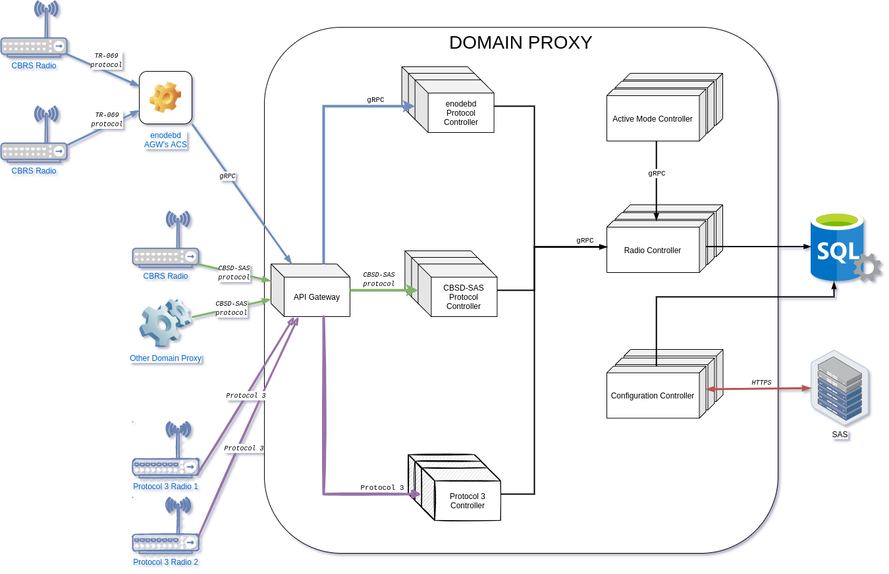

- [Proposal: Vendor Neutral CBSD Domain Proxy](#proposal-vendor-neutral-cbsd-domain-proxy)
- [Abstract](#abstract)
- [Background](#background)
  - [References](#references)
- [Proposal](#proposal)
  - [Vendor Neutral Domain Proxy HLD](#vendor-neutral-domain-proxy-hld)
  - [SAS Client Interface Requirements](#sas-client-interface-requirements)
  - [CBSD Proxy Interface Requirements](#cbsd-proxy-interface-requirements)
  - [Aggregation and Proxy Management Requirements](#aggregation-and-proxy-management-requirements)
  - [User Interface Requirements](#user-interface-requirements)
  - [Deployment Architecture Requirements](#deployment-architecture-requirements)
- [Rationale](#rationale)
- [Compatibility](#compatibility)
- [Observability and Debug](#observability-and-debug)
- [Implementation](#implementation)
  - [DP Microservices](#dp-microservices)
  - [Component Interactions](#component-interactions)
  - [Solution scaling](#solution-scaling)
  - [Batching of messages](#batching-of-messages)
  - [Architectural Discussion](#architectural-discussion)
    - [Relational database](#relational-database)
    - [Queuing mechanisms](#queuing-mechanisms)
    - [Message Queue Pros/Cons](#message-queue-proscons)
  - [Integration with Magma](#integration-with-magma)
  - [Resource requirements and estimates](#resource-requirements-and-estimates)
  - [System Architecture](#system-architecture)
  - [Schedule and Milestones](#schedule-and-milestones)
- [Q/A Feedback](#qa-feedback)

---

# Proposal: Vendor Neutral CBSD Domain Proxy

Authors:

- Boris Renski
- Joey Padden

Co-Authors:

- Vitalii Kostenko
- Tomasz Jędrośka
- Szymon Krasuski
- Marcin Trojanowski
- Wojciech Sadowy
- Artur Dębski

Last updated: 20.04.2021

Discussion at
[https://github.com/magma/magma/issues/5514](https://github.com/magma/magma/issues/5514).

# Abstract

This document provides the requirements and architectural design details for creating a
vendor neutral Citizens Broadband Radio Service Device (CBSD) Domain Proxy (DP).

A Domain Proxy provides proxy and aggregation services
for signaling between CBSD radios (eNBs or CPEs)
and a Spectrum Access System (SAS).

# Background

The interface between SAS and CBSD/DP is a standardized interface.

The interface between a DP and the CBSD is not standardized and can be based on
multiple protocols including the WInnForum defined SAS to
CBSD/DP REST API, TR-069, SNMP, or NETCONF.

This solution will include support for:
*  DP to CBSD interface based on the standard WInnForum SAS to CBSD/DP signaling protocol
*  TR-069 CBSD interface by utilising Magma's AGW ACS (enodebd)
   Note: The enodebd extension and Magma support for CBRS is covered in P019 proposal, [HERE](p019_enodeb_cbrs_support.md).
  

Support for additional DP to CBSD interface protocols is not in scope
but the design should take into consideration the ability to easily extend DP
functionality with in a plugin-based manner.

## References

|       |                                                                                                                                                                                                                                                                                                                                                                                            |
|-------|--------------------------------------------------------------------------------------------------------------------------------------------------------------------------------------------------------------------------------------------------------------------------------------------------------------------------------------------------------------------------------------------|
| \[1\] | SSC-Wireless Innovation Forum, “Signaling Protocols and Procedures for Citizens Broadband Radio Service (CBRS): Spectrum Access System (SAS) - Citizens Broadband Radio Service Device (CBSD) Interface Technical Specification”, WINNF-TS-0016-V1.x.x [<u>https://winnf.memberclicks.net/assets/CBRS/WINNF-TS-0016.pdf</u>](https://winnf.memberclicks.net/assets/CBRS/WINNF-TS-0016.pdf) |
| \[2\] | SSC-Wireless Innovation Forum, “Test and Certification for Citizens Broadband Radio Service (CBRS); Conformance and Performance Test Technical Specification; CBSD/DP as Unit Under Test (UUT)”, WINNF-TS-0122-V1.x.x [<u>https://winnf.memberclicks.net/assets/CBRS/WINNF-TS-0122.pdf</u>](https://winnf.memberclicks.net/assets/CBRS/WINNF-TS-0122.pdf)                                  |
| \[3\] | SSC-Wireless Innovation Forum, “CBRS Communications Security Technical Specification”, WINNF-TS-0065-V1.x.x [<u>https://winnf.memberclicks.net/assets/CBRS/WINNF-TS-0065.pdf</u>](https://winnf.memberclicks.net/assets/CBRS/WINNF-TS-0065.pdf)                                                                                                                                            |
| \[4\] | [<u>https://github.com/Wireless-Innovation-Forum/Citizens-Broadband-Radio-Service-Device</u>](https://github.com/Wireless-Innovation-Forum/Citizens-Broadband-Radio-Service-Device)                                                                                                                                                                                                        |
| \[5\] | [<u>https://github.com/Wireless-Innovation-Forum/Spectrum-Access-System</u>](https://github.com/Wireless-Innovation-Forum/Spectrum-Access-System)                                                                                                                                                                                                                                          |
|

# Proposal

The DP will sit between the SAS and the CBSD or downstream DP.

---

## Vendor Neutral Domain Proxy HLD

The vendor neutral DP will run as kubernetes managed containers
in a microservice architecture.
The deployment of the vendor neutral DP can be in any generic kubernetes
environment such as an on premise compute node (or set of nodes) or in a
cloud environment such as AWS.

---

## SAS Client Interface Requirements

The following section provides functional requirements for the SAS facing interface of the DP.

<table>
<tbody>
<tr class="odd">
<td><strong>Requirement ID</strong></td>
<td><strong>Description</strong></td>
<td><strong>Priority</strong></td>
</tr>
<tr class="even">
<td>SCI-01</td>
<td>The SAS client interface shall expose a single SSL connection between the DP and the SAS used for all proxied connections.</td>
<td>P1</td>
</tr>
<tr class="odd">
<td>SCI-02</td>
<td>
The SAS client interface shall be compliant with [1] when sending the following messages on behalf of proxied CBSDs:

<ol type="1">
<li>
Registration Request
</li>
<li>
Spectrum Inquiry Request
</li>
<li>
Grant Request
</li>
<li>
Heartbeat Request
</li>
<li>
CBSD Measurement Report
</li>
<li>
Relinquishment Request
</li>
<li>
Deregistration Request
</li>
</ol></td>
<td>P1</td>
</tr>
<tr class="even">
<td>SCI-03</td>
<td>The SAS client interface shall validate the SAS connection using a certificate that chains back to a Domain Proxy CA according to [3].</td>
<td>P1</td>
</tr>
<tr class="odd">
<td>SCI-04</td>
<td>The SAS client interface shall comply with all interface test cases defined in [2].</td>
<td>P1</td>
</tr>
<tr class="even">
<td>SCI-05</td>
<td>The SAS client interface shall be implemented with a TCP_NODELAY socket so that no extra queuing delay is added between the application and the wire.</td>
<td>P1</td>
</tr>
</tbody>
</table>

## CBSD Proxy Interface Requirements

The following section provides functional requirements for the CBSD Proxy Interface facing interface of the DP.

<table>
<tbody>
<tr class="odd">
<td><strong>Requirement ID</strong></td>
<td><strong>Description</strong></td>
<td><strong>Priority</strong></td>
</tr>
<tr class="even">
<td>CPI-01</td>
<td>
The CBSD proxy interface shall accept incoming connections from the SAS client interfaces in CBSDs as defined in [1], receiving and processing request message types including:

<ol type="1">
<li>
Registration Request
</li>
<li>
Spectrum Inquiry Request
</li>
<li>
Grant Request
</li>
<li>
Heartbeat Request
</li>
<li>
CBSD Measurement Report
</li>
<li>
Relinquishment Request
</li>
<li>
Deregistration Request
</li>
</ol></td>
<td>P1</td>
</tr>
<tr class="odd">
<td>CPI-02</td>
<td>The CBSD proxy interface shall comply with security validation requirements for incoming proxy connections according to [3] with certificates that chain to a SAS CA.</td>
<td>P1</td>
</tr>
<tr class="even">
<td>CPI-03</td>
<td>The CBSD proxy interface shall be implemented as a pluggable module to internal APIs such that other external interface protocol modules (TR-069, SNMP, NETCONF) can be supported in parallel to the SAS client interface defined in [1] on a per connection basis.</td>
<td>P1</td>
</tr>
<tr class="odd">
<td>CPI-04</td>
<td>The CBSD proxy interface shall be implemented with a TCP_NODELAY socket so that no extra queuing delay is added between the application and the wire.</td>
<td>P1</td>
</tr>
</tbody>
</table>

## Aggregation and Proxy Management Requirements

<table>
<tbody>
<tr class="odd">
<td><strong>Requirement ID</strong></td>
<td><strong>Description</strong></td>
<td></td>
</tr>
<tr class="even">
<td>APM-01</td>
<td>The aggregation and proxy management process shall support two modes of operation including Active and Passive.</td>
<td>P1</td>
</tr>
<tr class="odd">
<td>APM-02</td>
<td>The aggregation and proxy management process shall allow the selection of Active or Passive operation as a global setting for all connections on the CBSD Proxy Interface.</td>
<td>P1</td>
</tr>
<tr class="even">
<td>APM-03</td>
<td>The aggregation and proxy management process shall allow the selection of Active or Passive operation on a per CBSD/DP basis on the CBSD Proxy Interface. This selection shall override the global configuration for the specified CBSD.</td>
<td>P2</td>
</tr>
<tr class="odd">
<td>APM-04</td>
<td>The aggregation and proxy management process in Passive mode shall perform a proxy and forward function for all messages received on the CBSD Proxy Interface without modification to message body contents.</td>
<td>P1</td>
</tr>
<tr class="even">
<td>APM-05</td>
<td>The aggregation and proxy management process in Active mode shall instantiate and maintain two state machines according to [1] on the SAS Client interface and separately on the CBSD Proxy Interface for each CBSD connection.</td>
<td>P2</td>
</tr>
<tr class="odd">
<td>APM-06</td>
<td>The aggregation and proxy management process in Active mode shall have an extensible logic module that can create and/or modify message body contents independently for SAS Client Interface and CBSD Proxy Interface for a given CBSD.</td>
<td>P2</td>
</tr>
<tr class="even">
<td>APM-07</td>
<td>The aggregation and proxy management process in Active mode shall allow logic modules to be specific to a CBSD class (e.g. FCC ID specific, list of FCC IDs).</td>
<td>P2</td>
</tr>
<tr class="odd">
<td>APM-08</td>
<td>
The aggregation and proxy management process shall log state information for CBSDs and grants of Passive and Active mode connections in the CBSD &amp; Grant Database with metadata including at least:

<ul>
<li>
CBSD ID (FCC_ID + Serial #)
</li>
<li>
State
</li>
<li>
Message Type
</li>
<li>
Message Body
</li>
<li>
Response code (if applicable)
</li>
<li>
Timestamp
</li>
<li>
SAS Operator Name
</li>
</ul></td>
<td>P1</td>
</tr>
<tr class="even">
<td>APM-09</td>
<td>The aggregation and proxy management process shall store state information for CBSDs and grants of Active mode connections in the CBSD &amp; Grant Database.</td>
<td>P2</td>
</tr>
</tbody>
</table>

## User Interface Requirements

<table>
<tbody>
<tr class="odd">
<td><strong>Requirement ID</strong></td>
<td><strong>Description</strong></td>
<td><strong>Priority</strong></td>
</tr>
<tr class="even">
<td>UI-01</td>
<td>
The DP UI shall provide the ability to configure a SAS operator with SAS specific details:

<ul>
<li>
Provider Name
</li>
<li>
Host URL
</li>
<li>
User ID
</li>
</ul></td>
<td>P1</td>
</tr>
<tr class="odd">
<td>UI-02</td>
<td>The DP UI shall provide the ability to configure a global default SAS operator from the configured SAS operator list.</td>
<td>P1</td>
</tr>
<tr class="even">
<td>UI-03</td>
<td>The DP UI shall provide the ability to configure an override SAS operator for a selected set of CBSDs.</td>
<td>P1</td>
</tr>
<tr class="odd">
<td>UI-04</td>
<td>The DP UI shall provide the ability to set the global default mode of operation to either Passive or Active</td>
<td>P1</td>
</tr>
<tr class="even">
<td>UI-05</td>
<td>The DP UI shall provide the ability to configure override Passive or Active mode on a per CBSD.</td>
<td>P1</td>
</tr>
<tr class="odd">
<td>UI-06</td>
<td>The DP UI shall display a table of current connections and their state.</td>
<td>P1</td>
</tr>
<tr class="even">
<td>UI-07</td>
<td>
The DP UI shall provide the ability to filter historical logs based on:

<ul>
<li>
FCC_ID
</li>
<li>
CBSD Serial #
</li>
<li>
State
</li>
<li>
Message Type
</li>
<li>
Message Body
</li>
<li>
Response code (if applicable)
</li>
<li>
Timestamp
</li>
<li>
SAS Operator Name
</li>
</ul></td>
<td>P1</td>
</tr>
<tr class="odd">
<td>UI-08</td>
<td>
The DP UI shall allow configuration of users with rights including at least:

<ul>
<li>
Read Only Users
</li>
<li>
Read/Write Users
</li>
</ul></td>
<td>P1</td>
</tr>
<tr class="even">
<td>UI-09</td>
<td>The DP UI shall authenticate user credentials upon login of a user and enforce user permissions for the user session duration.</td>
<td>P1</td>
</tr>
<tr class="odd">
<td>UI-10</td>
<td>The DP UI shall allow the export/download of log files in csv format that include all fields in requirement UI-07.</td>
<td>P1</td>
</tr>
<tr class="even">
<td>UI-11</td>
<td>
The DP UI shall allow the user to select a connection/CBSD ID to view real-time updates on messaging including:

<ul>
<li>
CBSD ID (FCC_ID + Serial #)
</li>
<li>
State
</li>
<li>
Message Type
</li>
<li>
Message Body
</li>
<li>
Response code (if applicable)
</li>
<li>
Timestamp
</li>
<li>
SAS Operator Name
</li>
</ul></td>
<td>P1</td>
</tr>
<tr class="odd">
<td>UI-12</td>
<td>
The DP UI shall provide a summary dashboard with graphical displays of:

<ul>
<li>
Session counts in each state per [1] including at least:

<ul>
<li>
Registered
</li>
<li>
Granted
</li>
<li>
Suspended
</li>
<li>
Authorized
</li>
</ul></li>
<li>
A table of sessions that have changed state in the last 24 hours
</li>
</ul></td>
<td>P1</td>
</tr>
<tr class="even">
<td>UI-13</td>
<td>The DP UI shall provide the ability to define a CBSD record based on FCC ID and Serial Number</td>
<td>P2</td>
</tr>
<tr class="odd">
<td>UI-14</td>
<td>
The DP UI shall provide configuration interface to allow creation, modification, or deletion of CBSD records including the following installation parameters:

<ul>
<li>
CBSD Serial Number
</li>
<li>
FCC ID
</li>
<li>
User ID (SAS account user ID)
</li>
<li>
cbsdCategory
</li>
<li>
CBSD Type
</li>
<li>
antennaAzimuth
</li>
<li>
antennaBeamwidth
</li>
<li>
antennaDowntilt
</li>
<li>
antennaGain
</li>
<li>
height
</li>
<li>
heightType
</li>
<li>
indoorDeployment
</li>
<li>
latitude
</li>
<li>
longitude
</li>
</ul></td>
<td>P2</td>
</tr>
<tr class="even">
<td>UI-15</td>
<td>The DP UI shall provide the ability to define a CBSD record as active or inactive allowing the DP to activate/deactivate CBSDs based on configuration.</td>
<td>P2</td>
</tr>
</tbody>
</table>

## Deployment Architecture Requirements

<table>
<tbody>
<tr class="odd">
<td><strong>Requirement ID</strong></td>
<td><strong>Description</strong></td>
<td><strong>Priority</strong></td>
</tr>
<tr class="even">
<td>DA-01</td>
<td>The DP shall be deployable as a kubernetes managed container system.</td>
<td>P1</td>
</tr>
<tr class="odd">
<td>DA-02</td>
<td>The DP shall be horizontally scalable based on number of connections/CBSDs.</td>
<td>P1</td>
</tr>
<tr class="even">
<td>DA-03</td>
<td>
The DP shall be self contained such that it is deployable in any standard kubernetes environment including:

<ul>
<li>
On premises x86 compute platform

<ul>
<li>
Specs TBD
</li>
</ul></li>
<li>
AWS EKS
</li>
</ul></td>
<td>P1</td>
</tr>
<tr class="odd">
<td>DA-04</td>
<td>The DP delivery shall include all helm charts and any necessary installation scripts and procedures</td>
<td>P1</td>
</tr>
<tr class="even">
<td>DA-05</td>
<td>
The DP shall support networking requirements on both SAS Client Interface and CBSD Proxy Interface including:

<ul>
<li>
1Gbps or 10Gbps NIC (copper or fiber for both)
</li>
<li>
DHCP or Static IP based on configuration
</li>
<li>
Multiple IP address support per interface
</li>
<li>
VLAN support based on configuration
</li>
</ul></td>
<td>P1</td>
</tr>
</tbody>
</table>

# Rationale

A vendor neutral Domain Proxy provides a number of benefits to a CBRS
deployment:

- The aggregation and proxy function allows for a single connection
    between a customer network of CBSDs and the SAS. This provides a
    small attack surface by reducing the number of outbound connections
    traversing the customer firewall and edge devices.

- A domain proxy can be deployed in a controlled stable environment
    allowing it to provide a consistent interface to the SAS on behalf
    of a CBSD which may be subject to intermittent loss of power or
    connectivity.

- It provides a point of coordination/control for radio channel
    allocation in a multi-vendor deployment.

- It allows for the application of additional grant requesting and
    maintenance logic which can correct errant behavior and/or provide
    an optimization layer over vendor SAS client algorithms.

# Compatibility

Domain Proxy solution will reuse as much of the Magma services as possible.

It should be easily deployed within existing Magma environment.

As DP will be implementing radio interfaces, the intention is to follow
and comply with the Magma Community guidelines and codebase where applicable.

# Observability and Debug

The plan is to follow Magma best practices regarding application observability
(logging, telemetry, debugging applications and the DP state)
as well as utilize already existing tools and solutions in Magma infrastructure.

Applications should produce logs with a capability to ingest that data
into monitoring systems (like ElasticSearch).

Applications will gather and expose various telemetry data,
like number or requests received,
number or request failures,
generic application resource use (CPU, RAM, etc.)

# Implementation

## DP Microservices

Domain Proxy will consist of a number of components in a microservice architecture.

- **API Gateway**

  API Gateway will act as a central API router of the Domain Proxy.
  It will be responsible for receiving incoming CBSD requests
  and routing them to the appropriate Protocol Controllers
  based on the protocol.

- **Protocol Controller (PC)**

  Protocol Controller is responsible for receiving the ingest traffic
  from CBSDs (radios) or other systems (like proprietary DPs, ACS servers), translating the requests
  into a common API protocol and forwarding them to the Radio Controller.

  One PC will implement support for one ingest interface.
  The initial plan is to provide a PC that supports CBRS-SAS protocol (for eNBs or custom Domain Proxies support) and a PC that allows interaction with Magma's AGW ACS (enodebd)

  Protocol Controllers are ingestion abstractions which receive a specific incoming data format related to CBRS eBNs.
  To scale the system better we are decoupling PC (responsible for ingest protocol)
  from Radio controller (responsible for the business domain).
  Additional benefit is maintaining all of the protocol customizations
  and tricks at the PC level and making the PC layer scalable
  according to the number of eNBs of each type.

- **Radio Controller (RC)**

  RC is responsible for receiving the requests from
  and sending responses to  PCs.
  It manages all request data and state within the Database.

- **Configuration controller (CC)**

  CC is used process requests and communicate with the SAS server
  using CBSD-SAS protocol.
  This component issues a request to SAS and updates the request state
  after receiving a reply within the Database.

- **Active Mode Controller**
  
  Active mode controller is responsible for adding "Active Mode" functionality on top of other DP services.

  It will function as a CBSD-SAS request simulator. When enabled, it will generate SAS-related requests on behalf of a eNB towards SAS for registering and obtaining a grant.

  Enabling active mode functionality can be done globally (per DP deployment) and per individual eNBs.

- **Database**

  Relational DB storing the state CBSD requests and responses.

  DB allows to keep track of grants and CBSDs configuration limiting redundant CBSD - SAS connections.

## Component Interactions

- **API Gateway**
  API gateway will receive incoming requests from data sources (like CBSDs, other DPs, AGWs endoebd, etc).
  Depending on the incoming protocol it will route the traffic to appropriate
  Protocol Controller handling that protocol via a k8s service (which will act as a load balancer).

- **Protocol Controller**

  PC will interpret the requests and interact with Radio Controller over gRPC.

  PC will check for the request response with RC via gRPC
  and send the response back to the source system using respective protocol.

- **Radio Controller**

  RC receives requests from the PC via gRPC and puts them in
  the DB.

  RC accepts incoming request response check requests from PC.

- **Configuration Controller**

  CC fetches pending requests from the DB, batches them and sends them to SAS.

  After receiving the response from SAS, it updates the DB state
  for the requests processed.

- **Active Mode Controller**

  Active mode controller will calculate the state of CBSDs in the database and based on a desired configuration it will issue new requests on behalf of a CBSD via gRPC calls towards RC (therefore simulating the behavior of a CBSD-SAS protocol controller)

- **Database**

  Handles DB queries coming from RC and CC.

- **enodebd**

  Part of Access Gateway, the Auto Configuration Server that handles TR069 devices.
  enodebd shall be extended to support calls to DP service within the Orchestrator via service catalogue and known DP API. The details regarding the implementation are not covered in this document.

## Solution scaling

The Domain Proxy will be split into separate services in separate containers.

Every service will work in HA mode to provide service availability even in failover scenarios.

All DP components will be stateless services
which do not need synchronization between them
so it is not vital to create sync mechanisms.
Applications will take over processing of data
when one of the containers fail.

Because the DP applications/containers are stateless,
a horizontal scaling would be possible if there is a need to improve
DP application performance.
For instance, if there is a very big number or CBSD devices,
it would be possible to have multiple PC container instances,
each sharing a portion of the CBSD traffic.
Similarly, if there is a big number or requests that need to be processed, multiple RCs could be deployed to share the PC load.

## Batching of messages

Batching of messages allows to limit the number of connections to the SAS servers
which is useful in the case when a number of CBSDs send requests at once
(e.g. heartbeat requests are sent continuously).
Batching it limits a chance of failure on sending requests to the SAS,
because SAS has to process only a minimum number of requests
instead of numerous requests sent one by one.
In large infrastructures it may reduce the cost of SAS usage
and limit the chance of running out of requests per given time
(for Google SAS server it is 50,000 requests per day and 10 queries per second).

## Architectural Discussion

### Relational database

Since there is a planned UI and additionally we need to store basic,
well defined information about CBSD we suggest to reuse an already existing MySQL / PostgreSQL database
from the Magma Orchestrator component (with a new schema).
At the very beginning the database usage would be limited to:

- storing records for CBSDs (registration parameters, SAS `cbsd_id`, name, configuration, location, etc.)
- storing CBSD data
- storing grants
- storing Spectrum Inquiry data (as spectrum channels)
- storing all requests and SAS responses
- storing active mode configuration per CBSD
- user administration & access rights within DP system

We do not intend to use the Database to store the state changes.
This information will be logged with a possibility to expose it
to external monitoring systems (like ElasticSearch) for observability
and debugging purposes.

Because the use of a relational DB is necessary to fulfill the DP requirements,
this fact was one of the incentives to use the DB as a data exchange point
for the DP components, acting both as a persistent DP state
and data buffer/queue.

### Queuing mechanisms

One of the goals of the Domain Proxy is to provide a stable exchange
of information between CBSDs and SAS and minimize the network traffic
between them.
In the initial concept of the design, we took into consideration popular
existing queuing mechanisms which would gives us natural batching functionality
while the DB would only serve as a persistent state store.

There are many benefits where workload dispatching realized over a queue would give
(out-of-the-box batching, acknowledgement, retry, persistence, speed).
While those concepts could also be modeled within a relational DB,
the logic behind it would require application development support
and an increased transactional traffic to the DB.

### Message Queue Pros/Cons

- **RabbitMQ**
    - Pros:
        - Out-of-the-box fulfills our requirement for batching requests
        - Microservice approach: easier to split into components, mock & test
        - Event-based flow is a reasonable way when there can be multiple consumers
        - Utilizing a full-blown queue makes the architecture extendable - we don’t need to incorporate a pub/sub solution in each new subscribing component
        - The component is purely internal - it won’t affect other architecture components built by the community

    - Cons:
        - Additional infrastructure component to maintain (internal to th DP)
        - Pub/Sub overhead (minor in our scenario)

- **ZeroMQ**
    - Pros:
        - ZeroMQ implements queuing at a higher abstraction level - no need to deal with networking, sockets, etc.
        - Component is already used in the ecosystem

    - Cons:
        - It’s a very simple queue, the required functionalities like message batching, persistency, still would need to be implemented and later maintained as separate components (potentially bug-prone)
        - It would need to be separately added to each component which would need queuing functionalities
        - Cannot be easily replaced, mocked, up- or downscaled basing on the needs

Based on the Magma Community discussion and feedback, the additional cost
of development and DB transaction load is negligible. As a result, DP will
fully realize the DB for state persistence and data exchange, "queueing"
and batching.

## Integration with Magma

Domain proxy was was initially developed as a separate repository to Magma's codebase. [Existing DP code](https://github.com/magma/domain-proxy) will be moved to Magma repository as a new  `dp/` module in magma's top directory:
-  `dp/cloud` will contain the existing services.
-  `dp/gateway` will be empty, as TR069 support will be done as part of enodebd (lte module gateway service)
-  `dp/protos` will contain protobuf definition for the module and all its services.
   
As part of Magma integration, the plan is to utilize Magma's AGW ACS server (enodebd) to handle CBRS eNBs via TR-069 protocol ([see p019 proposal](p019_enodeb_cbrs_support.md) for details))
Enodebd will be extened to make gRPC calls towards the Orchestrator (via new DP service definition in the service catalogue) on specific situations for CBRS enabled eNBs.
DP will contain a Protocol Controller responsible for handling those enodebd calls and handle/respond accordingly.

An example data flow between CBRS eNB, enodebd and DP may look as follows:

As part of initial CBRS eNB support, a new data model and state will be created for Baicells Nova 436Q.

## Resource requirements and estimates

All requirements and estimates here are a subject to change as development
progresses.

Assuming DP will handle 10000 CBSDs,
we estimate the following total system requirements for each DP service
(if there is horizontal scaling,
those requirements are divided among the number of containers):

- **API Gateway**
  8 CPUs, 8GB RAM

- **Protocol Controller**
  16 CPUs, 16GB RAM

- **Radio Controller**
  16 CPUs, 16GB RAM

- **Configuration Controller**
  4 CPUs, 8GB RAM

Assuming DP will handle 10000 CBSD devices simultaneously, with 1 min heartbeat interval
we estimate the following Database traffic:

- DB `select` - up to 20000 select queries per minute (check request states and responses, request polling)
- DB `insert` - up to 70000 insert queries per minute (each request, each response, cbsd and grant)
- DB `update` - up to 35000 update queries per minute (update request state, update grant state, update cbsd state)

## System Architecture

Based on the analysis and Community discussions, the resulting architecture
of the DP is as follows:

Assuming the architecture, and example data flow for a Registration Request from a CBSD-SAS protocol source is as follows:

## Schedule and Milestones

|                                                              |          |          |          |          |          |          |          |
| ------------------------------------------------------------ | -------- | -------- | -------- | -------- | -------- | -------- | -------- |
| **Milestones**                                               | **T0+1** | **T0+2** | **T0+3** | **T0+4** | **T0+5** | **T0+6** | **T0+7** |
| MS1: Setup development infrastructure (Airspan eNB + DP)     | x        |          |          |          |          |          |          |
| MS2: POC Implementation of SAS-facing signaling service based on \[1\] |          | x        | x        | x        | x        |          |          |
| MS3: POC CBSD Proxy Interface in Passive mode                |          |          |          | x        | x        | x        |          |
| MS4: GUI development                                         |          |          |          | x        | x        | x        |          |
| MS5: Lab testing and iterative bug-fixing for SAS-signaling (SAS discovery, authentication, CBSD registration, CBSD Heartbeat etc.) |          |          |          | x        | x        | x        |          |
| MS6: Testing and bug-fixing with a small pilot deployment (3-5 CBSDs) |          |          |          |          | x        | x        | x        |
| MS7: Documentation and beta deployment support gate          |          |          |          |          |          |          | x        |
|

# Q/A Feedback

Q: Can we run on VMware

A: To make it more future proof, we should build it on k8s (not VMs);
but vSphere should have the ability to deploy and manage k8s. so it can
be VMware k8s

Q: High availability: will these be active-active or active-standby?

A: The app itself running on k8s will be active-active. k8s controller
will provide for HA by managing the individual DP application
containers; with k8s managed HA is active-active.

Q: multi-vendor SAS capabilities

A: Yes, the plan is for multi-vendor SAS support. We have UI-2 in place
to allow for selection of a default. UI-3 requirement has been edited to
more specifically allow for batch override of SAS vendor for a selected
set of CBSDs e.g. a vendor group, or all radios at a site.

Q: Audit trail abilities

A: Full audit details will be displayable and exportable including all
configuration changes and SAS and eNB message logging.

Q: Easy eNB location mapping

A: All CBSD data the DP has will be exportable and we can have a
selection pane to allow selection of attributes to export e.g. if you
just want name and lat/long.

Q: What are Active/Passive modes:

A: The idea is to start with a simple Passive mode where there is no
message mangling or internal logic applied as messages are proxied from
the CBSD interface to the SAS interface. However, we want the
architecture to plan for and allow the insertion of logic modules in the
future that sit between the CBSD and SAS interface to allow for more
than a simply proxy. The motivation here is it allows for a DP to mask
undesirable behavior in CBSDs and/or optimize a multi-vendor deployment
by separately controlling SAS and CBSD messaging per CBSD.
