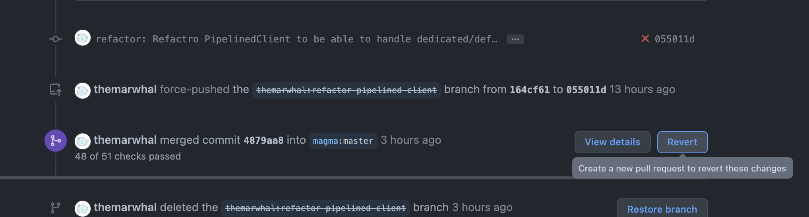
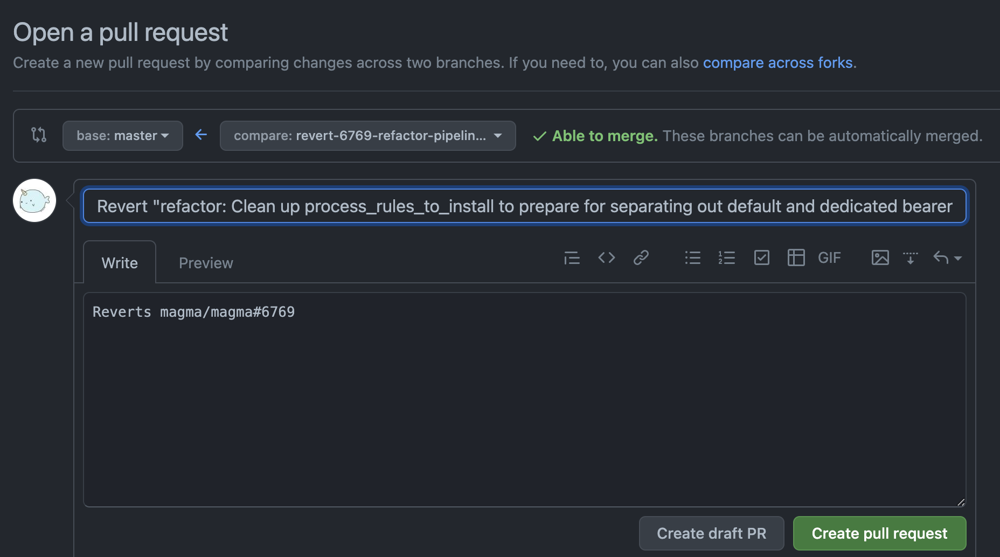

# CI Health Strategies 

This document outlines actions to be taken to better improve CI health on master.

## Current state of CI health

In the past 30 days (Mar 20 2021 - Apr 26 2021), less than half of our [325](https://gist.github.com/themarwhal/c17af06928237a21dbdfdef0dfe53f82) commits resulted in a deployable build.
*the per-job success rate for deploy jobs are higher because they are only run *if* the test jobs pass

|job name	|success rate per job	|success rate per commit	|longest breakage	|
|---	|---	|---	|---	|
|lte-integration-test	|42%	|N/A	|16 days	|
|cwf-integration-test	|59%	|N/A	|12 days	|
|agw-deploy	|90%	|38%	|16 days	|
|cwag-deploy	|87%	|51%	|12 days	|

## Problem statements

1. Our mandatory pre-commit CI checks severely lack in GW integration testing compared to post-commit checks
2. It takes the team around a day to notice CI failures and file GitHub issues
3. Fixing CI breakages on master is not treated as a high priority item
4. Merging PRs while CI is red adds additional problems on master that prolong CI recovery time

## Proposed solution to improve problem #1

While PR authors can optionally trigger Jenkins CWAG/LTE integration test to sanity check, they do not prevent bad PRs from merging as it is not mandatory. We cannot make them mandatory just yet as the infrastructure is not ready. The new [CI infrastructure](https://docs.google.com/document/d/16A7pZxILucJiPTMJQya3SlJ8mLEsMn2rdkDtwUbW98E/edit) has plans to make them mandatory.

In the meantime, we can try to catch more non-functional breakages at the precommit level by doing the following. A few more checks were added by the team during tech debt week to perform docker container build / basic health checks. 

## Proposed solution to improve problem #2, #3, #4

The current method for catching CI breakages on master is via the #ci slack channel. In the long term, we can set up a simple dashboard with the new CI to make breakage detection easier.

I propose we create an on-call rotation to manually monitor the #ci slack channel for any obvious breakages. If there is an actual breakage on master, the oncall will declare a merge freeze to all magma maintainers. By declaring a merge freeze, we should prevent any new breakages from sneaking into master.

As for enforcing the merge freeze, I've found a [Merge Freeze GH Action](https://docs.mergefreeze.com/) that seems interesting to try out. This essentially adds a failing check that can be toggled into a mandatory check when a merge freeze is in place. Administrators will still be able to bypass the check. The upside of this action is the Slack integration where the merge freeze can be triggered from Slack. Additionally, it can be configured to message a slack chennel when a branch is freezed / unfreezed.

For additional tooling, [Pager Duty](https://support.pagerduty.com/docs/slack-integration-guide) provides an oncall tracking service that also integrates with Slack.

### On-call Members
The Magma maintainers should nominate a set of maintainers that have shown to be good shepherds of CI health. 
To start off, I nominate the following people
* @tmdzk
* @hcgatewood
* @uri200

### On-call Duration
We can start off with a 1 week duration.

### On-call Responsibilities

####  Relevant Tests / Jobs
While all CI check failures should raise an alert, we should be most careful about checks that are not covered by or slightly differ from precommit checks.

Logical tests not covered in precommit
* cwf-integ-test
* lte-integ-test

Deploy jobs not covered in precommit
* nms-build
* cwag-deploy*
* xwfm-deploy-latest
* orc8r-build
* lte-agw-deploy
* feg-build

#### Responsibilities
1. If a same test / build fails more than 3 times in a row, the on-call should file a GH issue and announce a merge freeze
2. Look through merged commits since last healthy commit
   1. If it is clear which PR caused the breakage, use the GitHub UI (see below) to create a PR that reverts the change. Contact one of the TSC members so that it can be force merged into master 
   2. Consult the DevOps team if there seems to be an issue with infrastructure
3. Once the master has green checks, announce a merge unfreeze

#### How to revert a PR
Use the `revert` button to create a PR that reverts the original PR.

Add the TSC members as reviewers so that they are notified.

