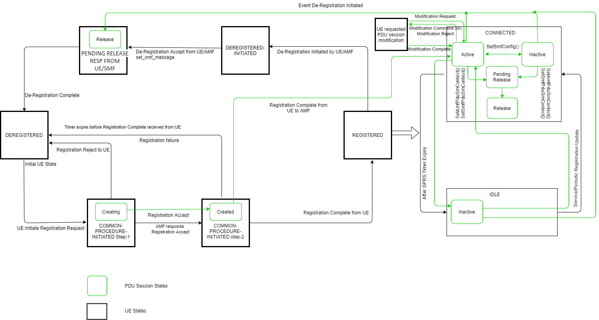

# Proposal: UE Requested PDU Session Modification In Magma

Author(s): @GANESH-WAVELABS 

Last updated: 07/12/2021

Discussion at
[https://github.com/magma/magma/issues/7971](https://github.com/magma/magma/issues/7971).

## **Purpose**

The PDU session modification procedure is used when modifying one or several
QoS parameters between the UE and the network. 

1. When the UE-requested PDU session modification procedure is used to indicate
   a change of 3GPP PS data off UE status for a PDU session (see subclause 6.2.
   10), the UE shall initiate the UE-requested PDU session modification. 

2. If the UE needs to revoke the previously indicated support for reflective QoS
   for a PDU session and timer T3396, T3584, or T3585 is running or is 
   deactivated, the UE shall not initiate the UE-requested PDU session 
   modification procedure and shall instead initiate the UE-requested PDU
   session release procedure. 

3. If the UE needs to initiate the UE-requested PDU session modification
   procedure to indicate to the network the relevant 5GSM parameters and
   capabilities (e.g. the UE's 5GSM capabilities, whether the UE supports more
   than 16 packet filters, the maximum data rate per UE for user-plane
   integrity protection supported by the UE for uplink, the maximum data rate
   per UE for user-plane integrity protection supported by the UE for downlink
   and whether the UE requests the PDU session to be an always-on PDU session in
   the 5GS) for a PDN connection established when in S1 mode, after the first
   inter-system change from S1 mode to N1 mode, the UE is operating in single-
   registration mode in the network supporting N26 interface and timer T3396 is
   running, the UE shall initiate the UE-requested PDU session modification
   procedure after expiry of timer T3396. 

4. When the UE-requested PDU session modification procedure is used to indicate
   to request specific QoS handling and segregation of service data flows 

## **Use Case**

The UE can request the network to modify or release PDU sessions. The network
can fulfill such a request from the UE by modifying a PDU session or releasing
a PDU session using network-requested procedures.  

When a UE establishes a PDU session to a DN, a default non-GBR (non-Guaranteed
Bit Rate) QoS Flow without any Packet Filter is also formed to carry the UE’s
traffic to the DN and vice versa. The UE or AFs (Application Functions) can
create additional QoS Flows with different QoS characteristics using the PDU
Session Modification procedures. For example, the UE can initiate a PDU Session
Modification to create a new GBR QoS Flow for a video conference session with
criteria such as: 

- UDP 	port = 1234 

- latency < 10ms 

- UL/DL bandwidth = 2 Mbps GBR, Etc… 

## **State changes in UE and PDU session**

## **Call Flows**

## **Proposal**

### **Detailed Design**

1.a. UE initiates the PDU Session Modification procedure by the transmission of
     a NAS message. The NAS message is forwarded by the RAN to the AMF with an
     indication of User location Information and AMF invokes API
     Nsmf_PDUSession_UpdateSMContext to SMF. 

1.b. RAN shall indicate to the SMF when the AN resource onto which a QoS Flow is
     mapped are released irrespective of whether notification control is
     configured. RAN sends the N2 message with SM information includes the QFI,
     User location Information and an indication that the QoS Flow is released.
     The AMF invokes Nsmf_PDUSession_UpdateSMContext  

     Below are the N1 SM container contents: 

     -  N1 SM container 

        --  PDU Session Modification Request  

             ---  PDU session ID,  

             ---  Packet Filters, 

             ---  Operation, 

             ---  Requested QoS, 

             ---  Segregation, 

             ---  5GSM Core Network Capability,  

             ---  Number Of Packet Filters,  

             ---  [Always-on PDU Session Requested],  

       --  UE Integrity Protection Maximum Data Rate 

     The NAS message is forwarded by (R)AN to AMF with indication of user
     location information. AMF calls Nsmf_PDUSession_UpdateSMContext (SM context
     ID, N1 SM container (PDU session modification request)). 

2. SMF responds AMF after updating SM_Context and SMF requests to transfer
   downlink N2 message to the UE and AN through the AMF. i.e. The SMF request
   to update activation of Data Radio Bearer and N3 tunnel for the PDU session. 

    Nsmf_PDUSession_UpdateSMContext Response 

    -  N2 SM information 

       --  PDU Session ID, 

       --  QFI(s), 

       --  QoS Profile(s), 

       --  Session-AMBR 

    -  N1 SM container 

       --  PDU Session Modification Command 

            ---  PDU Session ID, 

            ---  QoS rule(s), 

            ---  QoS rule operation, 

            ---  QoS Flow level QoS parameters if needed for the QoS Flow(s) associated with the QoS rule(s), 

            ---  Session-AMBR, 

            ---  [Always-on PDU Session]  

    For QoS configuration files, QoS rules and QoS flow level QoS parameters,
    please refer to TS 23.501 [2] Clause 5.7. QoS model 

    The N2 SM information carries the information that AMF must provide to
    (R)AN. It can include a QoS configuration file and corresponding QFI to
    notify (R) AN that one or more QoS flows have been added or modified. It can
    include only one or more QFIs to notify (R)AN that one or more QoS flows
    have been deleted. If the UE requests session modification for a PDU session
    of user plane resources that is not established, the N2 SM information
    provided to the (R)AN includes information for establishing user plane
    resources. 

    The N1 SM container carries the PDU session modification command that AMF
    must provide to the UE. It may include QoS rules, QoS flow-level QoS
    parameters required by QoS flows associated with QoS rules, and
    corresponding QoS rule operations and QoS flow-level QoS parameter
    operations to notify the UE that one or more QoS rules have been added or
    deleted or modify. 

3. The above N2 message gets propagate to RAN. 

4. The UE acknowledges the PDU Session Modification Command by sending a NAS
   message based on #5 action above. 

5. The RAN forwards the NAS message to the AMF. 

6.a. The AMF forwards the N1 SM container i.e., PDU Session Modification
     Command Ack and User Location Information received from the AN to the SMF
     via Nsmf_PDUSession_UpdateSMContext request.  

6.b. The SMF replies with a Nsmf_PDUSession_UpdateSMContext Response. 

7.a. The SMF updates N4 session of the UPF that is being affected in the PDU
     Session Modification procedure, by sending N4 Session Modification Request
     message to the UPF. 

7.b. UPF responds back to SMF, by sending N4 Session Modification Response
     message. 

## **N11 GRPC Message definition**

#### *Note:* for N11 GRPC Message definition check [N11GRPC](https://docs.google.com/document/d/1DgYfPbFI7ZPpBgpXSIWkSvpP3dccuema/edit) and [Epic](https://app.zenhub.com/workspaces/magma--5g-sa-60871e99b9326f001696b1ee/issues/magma/magma/7971)

## **Exit Criteria**

UE requested session modification should be tested with DSTester and TeraVM. 

## **References**

1. 3GPP TS 24.501 v15.6.0 Release 15 – 5G;
   Non-Access Stratum (NAS) protocol for 5G System (5GS);   
   https://www.etsi.org/deliver/etsi_ts/124500_124599/124501/15.06.00_60/ts_124501v150600p.pdf 

2. 3GPP TS 23.501 version 15.6.0 Release 15 – 5G;
   System architecture for the 5G System (5GS); 
   https://www.etsi.org/deliver/etsi_ts/123500_123599/123501/15.06.00_60/ts_123501v150600p.pdf 
