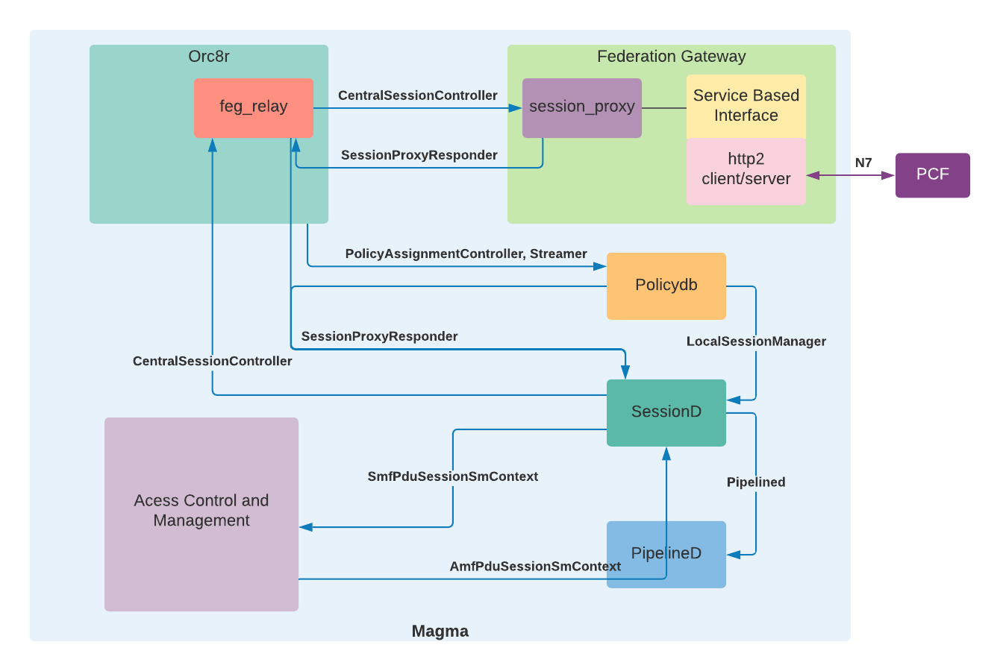
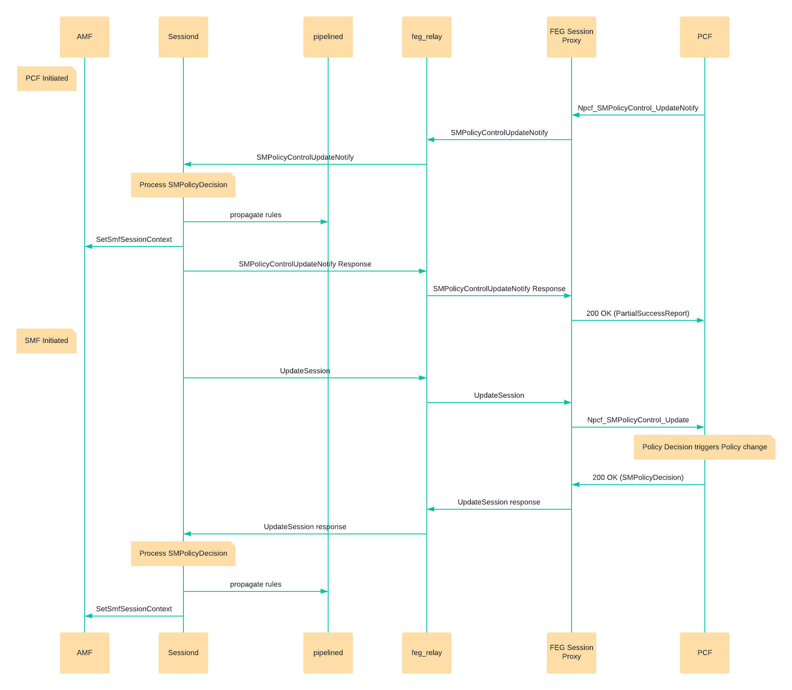

# Overview

*Author: @pmishra-wavelabs*\
*Last Updated: 07/12/2021*

## Background and Objective 
This document provides an approach for the following 
- Implementing N7 interface towards PCF through Federation Gateway
  -- Implement 5G Services Based Interface (SBI) for Federation Gateway
  -- Feg Relay for SM Policy control create, update, delete and update-notify
  -- Feg Session Proxy for SM Policy control create, update, delete and 
     update-notify 
- Implementing Network initiated session modification
  -- Network Initiated Session Policy association update
  -- Network initiated session Policy association termination
## Use Cases

#### N7 Interface to PCF

1. When a SM Context is created at SMF, Sessiond sends a 
   Npcf_SMPolicyControl_Create request to PCF. The policy decision received 
   is updated for the session context and propogated to pipelined.
2. When a SM Context is deleted at SMF, Sessiond sends a 
   Npcf_SMPolicyControl_delete request to the PCF.

#### Network initiated Session Modification
1. When using local policydb and when static rules are enabled or disabled, 
   Npcf_SMPolicyControl_UpdateNotify is sent to the SessionD to install or 
   remove the static rules.
2. When PCF sends a Npcf_SMPolicyControl_UpdateNotify to the SessionD the 
   following actions are performed by the SessionD
   - Update of policies associated with the PDU session
   - Deletion of SM Policy Association of a PDU sessions
   - Provisioning of PCC rules
   - Provisioning of policy control triggers
   - Provisioning of revalidation time
   - Policy provisioning and enforcement of authorized AMBR per PDU session

## Detailed Design

#### Service Based Interface
This component implements the SBI defined in 3GPP TS 29.500 and 29.501. 
SBI is a HTTP/2 protocol based interface. SBI is composed of both HTTP/2 client 
and server. The client is used to send requests and the server is used to 
receive callbacks and notifications. This SBI is part of Feg Session Proxy
for the N7 interface.

#### Session Proxy
Session Proxy is reused for interfacing with the PCF through N7 interface. 
The CentralSessionController GRPC service implementation in the Session Proxy 
invokes the N7 SBI requests when M5GSMSessionContext is received in the 
Create/Update/Terminate session requests.

When a Npcf_SMPolicyControl_UpdateNotify notification is received by the SBI 
HTTP/2 server, the SessionProxyResponder grpc is used to send the Policy updates
to the Sessiond. PolicyReAuth rpc from SessionProxyResponder grpc service is
reused for notifying the Sessiond.

When a  Npcf_SMPolicyControl_UpdateNotify with terminate session is received,
the AbortSessionResponder grpc is reused to terminate the session.

The information elements received from the REST message are converted to
protobuf and vice-versa as per the mapping given in section below.

#### FEG Relay
The session_proxy in the FEG Relay is reused for the Create, Update and
Termiante session requests of CentralSessionController grpc service.

The SessionProxyResponder and AbortSessionResponder relay implementation is
reused for the PolicyReAuth and terminate.

#### Sessiond
For sending Create/Update/Terminate session requests to FEG the
CentralSessionController GRPC client interface is reused. During a session 
update, if there is a policy change, it will be communicated through the update 
response. 

When Policy control changes initiated by the PCF are received using the 
PolicyReAuth rpc of SessionProxyResponder service as before.

The Policydb changes initiated are applied using the SetSessionRules rpc of the 
LocalSessionManager service as before.

The following tasks are performed during the policy control update when Update 
session response or  PolicyReAuth is received
- If usage monitoring credit is requested, then fill the usage monitoring 
  information in the response.
- If revalidation is required, schedule the session for revalidation
- When the policy control update is received with empty session-id apply the 
  policy update to all the session of the subscriber.
- If there are any rule removal/addition propogate the rule updates to
  pipelined.
After the Session updates are performed at the Sessiond and pipelined, 
SM Context changes are sent to AMF through SetSmfSessionContext of 
SmfPduSessionSmContext grpc service.
The AbortSessionResponder implementation is used for terminating the session.

#### Policydb
When static rules are enabled for a subscriber PolicyReAuth with the statically 
configured rules is sent to Sessiond. When the static rules are disabled  
PolicyReAuth is sent with all statically configured as rules to be removed to 
Sessiond.

#### Pipelined
No changes are proposed to Pipelined.

## Call Flows
The following call flow describes session modification triggered by both PCF 
and SMF.

## Information elements mapping
Information elements received or sent via N7 interface are mapped to proto 
attributes used in the GRPC messages as per the mapping given below.
#### Policy Rule
Policy Rule is defined in policydb.proto. For Gx interface the PolicyRule is 
created from Charging-Rule-Definition AVP found in Charging-Rule-Install AVP. 
For N7 interface the PolicyRule is created from the PccRule information element 
within the SMPolicyDecision information element. No new information element is
added for 5G.

| Policy DB                                | 5G N7                                                                                                   |
| ---------------------------------------- | ------------------------------------------------------------------------------------------------------- |
| id                                       | pccRuleId                                                                                               |
| priority                                 | precedence                                                                                              |
| rating_group                             | refChgData.ratingGroup                                                                                  |
| monitoring_key                           | refUmData                                                                                               |
| redirect (RedirectInformation)           | refTcData.redirectInfo (RedirectInformation)                                                            |
| flow_list (FlowDescription)              | flowInfos (FlowInformation)                                                                             |
| qos (Flow Qos)                           | refQosData (QosData) (In 5G, QCI is not used instead, 5QI is used. But both QCI and 5QI are compatible) |
| tracking_type                            | Determined based on rating_group and monitoring key                                                     |
| hard_timeout                             | Only in Policydb                                                                                        |
| service_identififer (ServiceIdentifier)  | Only in Policydb                                                                                        |
| app_name                                 | Only in Policydb                                                                                        |
| app_service_type                         | Only in Policydb                                                                                        |
| he (HeaderEnrichment)                    | Only in Policydb                                                                                        |

#### Other Policy Control Elements
Other Policy Control related attributes found in CreateSession, PolicyReAuth are 
mapped as below. These are defined in session_manager.proto. No new information 
element is added for 5G.
| Proto                     | 5G N7                                          |
| ------------------------- | ---------------------------------------------- |
| event_trigger             | policyCtrlReqTriggers                          |
| revalidation_time         | revalidationTime                               |
| usage_monitoring_credit   | umDecs (UsageMonitoringInformation)            |
| qos_information           | No mapping available. Qos defined per pccRule. |

## Exit Criteria
- N7 interface for create and terminate session should pass with DSTester and 
  TeraVM (PCF).
- Network requested session modification (Policy Update) should be tested with 
  DSTester and TeraVM (PCF).

References
1. [3GPP TS 23.502 v15.8.0 – Procedures for the 5G System](https://www.etsi.org/deliver/etsi_ts/123500_123599/123502/15.08.00_60/ts_123502v150800p.pdf)
2. [3GPP TS 29.500 v15.7.0 – Technical Realization of Service Based Architecture](https://www.etsi.org/deliver/etsi_ts/129500_129599/129500/15.07.00_60/ts_129500v150700p.pdf)
3. [3GPP TS 29.501 v15.8.0 – Principles and Guidelines for Services Definition](https://www.etsi.org/deliver/etsi_ts/129500_129599/129501/15.08.00_60/ts_129501v150800p.pdf)
4. [3GPP TS 29.512 v15.8.0 – 5G System, Session Management Policy Control Service](https://www.etsi.org/deliver/etsi_ts/129500_129599/129512/15.08.00_60/ts_129512v150800p.pdf)