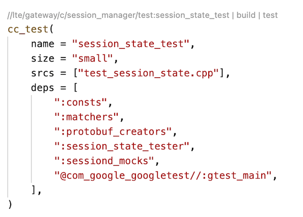
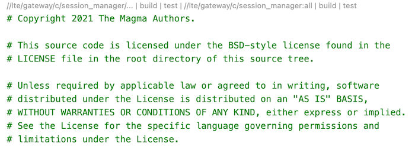
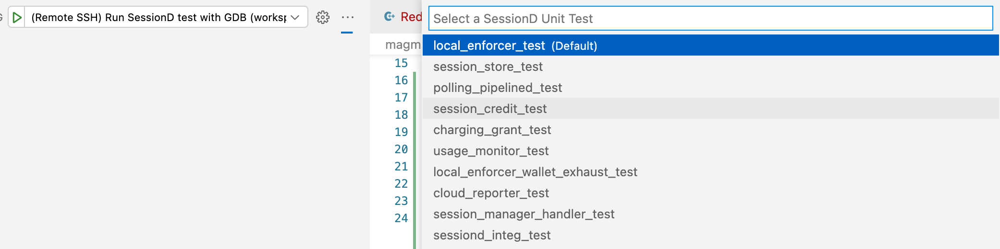
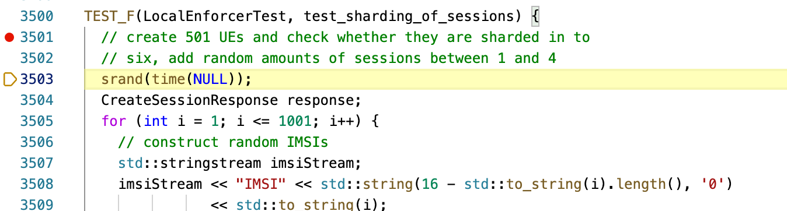
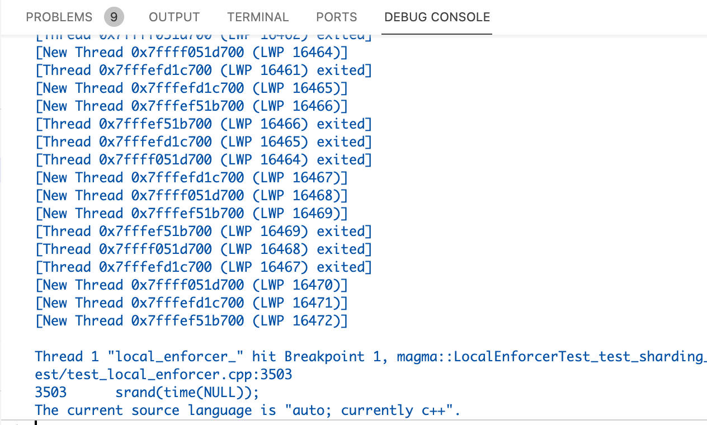
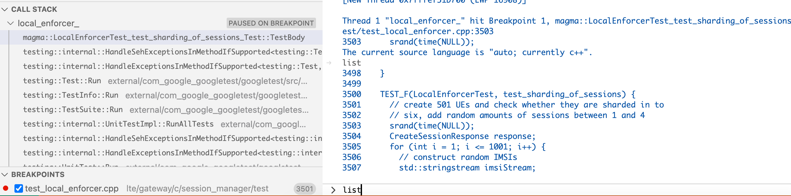

# Integrating Bazel into VSCode

**Prerequisite**: Follow [Setting Up VSCode For Magma VM](./VSCodeSetup.md) on setting up a Remote SSH workspace.

## Build and test all targets

Run **Command+Shift+B** to trigger the default build configuration. In this workspace, that is set as `bazel build --config=vm ...`.

## Build specific targets and unit tests via codelens

The **bazel-stack-vscode** plugin, which should already be installed if you meet the prerequisite, adds [codelens](https://code.visualstudio.com/blogs/2017/02/12/code-lens-roundup) directly into `BUILD.bazel` files. Utilizing this makes building and testing as easy as clicking a button.
For example, to run a single unit test for SessionD, open `lte/gateway/c/session_manager/test/BUILD.bazel` and click the `test` codelens. Similarly, click the `build` codelens to build only.

At the top of each `BUILD.bazel` file, there is a codelens to build and test all targets in the file.

## Code jumping and navigation for C++ ([Intellisense](https://code.visualstudio.com/docs/editor/intellisense))

In order to get code jumping and navigation working properly for C++, there are a few moving parts. We utilize [clangd](https://clangd.llvm.org) to enable smart code insights in VSCode. In order for [clangd](https://clangd.llvm.org) to work, we need to generate a `compile_commands.json` that serves as a compilation database for relevant targets.

Note that since external libraries and generated source files are only pulled in after a build, you will have to build the relevant target at least once for code jumping and completion to work. See above section on how to build specific targets.

As for compilation database generation, we have patched together a few commands into a task to make this easier. To generate the database, follow **Terminal->Run Task...->Refresh Compilation Database And Restart Clangd**. 

At this point, you should be able to jump to and have code completion for source files of generated and imported libraries.

## Run unit tests with GDB
> This is currently only configured for SessionD

Run **Command+Shift+D** to open the debug tab. In the drop down menu at the top of the tab, select **(Remote SSH) Run SessionD test with GDB** and press the gree arrow. This will open up a new drop down menu with all SessionD unit test targets. Once a test is selected, VSCode will build the target in debug mode and launch the test with GDB.

Once the task is launched, the test will start execution immeditately. It is recommended to add a breakpoint before triggering the debugger to halt the execution.

To add a breakpoint, simply click on the left most edge of the code to add a red circle.

With a breakpoint added, the debug console will show when the breakpoint is hit.

Finally, use the debug console like a normal GDB console to aid your testing!

