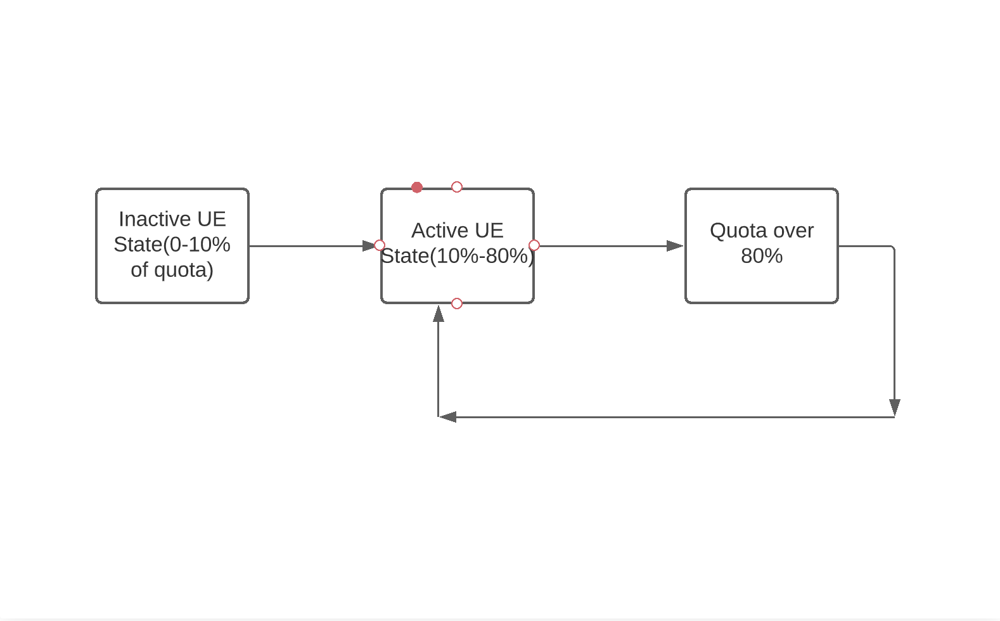
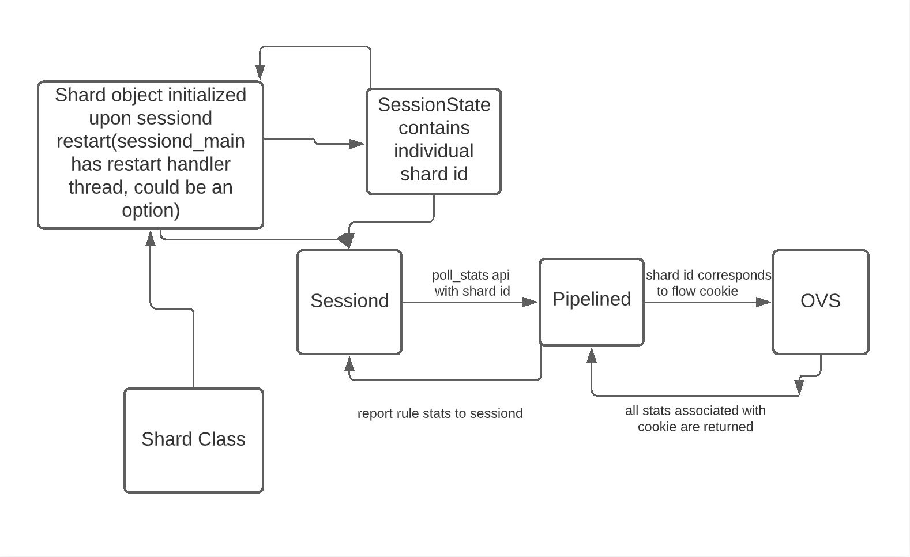

# Sharding for UEs Design Doc

## **Background**

Currently our stats polling model API will poll all stats for each individual UE. This is challenging because we do not have a system currently that identifies UEs individually, we just have unique IMSI identifiers. 


## **Motivation**

We want to scale up the model, to make it easier to process groups of UEs independently. With our current model, all UEs are treated identically in terms of polling, which is very inefficient for UEs that use low traffic. Our motivation here is to divide the UEs into different classes and assign different polling intervals. A potential interval assignment could look like the following:

* Class A. Connected UEs with inactive traffic: 20 s poll

* Class B- Connected UEs with active traffic: 10 s poll

* Class C- Connected UEs with quota over 80% of its grant: 1s poll

 One potential way of defining inactive traffic is the following: if the UE has used less than 10% of the quota every 20 seconds. This diagram demonstrates the likely flow of UE classification.



We’ll almost never(or rarely) return to the inactive UE state, unless over 10 times the amount of quota is reassigned. So what we could essentially do is put many of the UEs that are in the inactive traffic state into a separate shard. Once they become active they’d move into the active shard set. Rarely will a shard return back to the inactive state once it’s active, which means these inactive UE shards would be polled at a much lower frequency. 


## **Proposed Solution / Design**

There are two potentially viable solutions for maintaining this sharding structure. For both solutions we’d need to maintain some sort of structure in both SessionD.

1. Maintaining a mapping of shard ID(or a vector of index based shard IDs) to list of IMSIs(unique identifiers for UEs). Adding and removing shards is a matter of adding and removing from this mapping and returning the shard ID.

```
class UEShard{
   vector<vector<string>> shards;
   int number_of_shards;
   int max_shard_size;
   
   //returns shard id and index at id
   pair<int, int> find_ue_shard(string imsi)
   int add_ue(string imsi){ ... }
   void remove_ue(string imsi){ ... }
   ...
}
```

1. Maintaining a global state for shards, by maintaining a shard ID field for each session state. Adding and removing shards is a matter of incrementing or decrementing shard count field.

```
class UEShard{
   vector<int> numShards;
   int number_of_shards;
   int max_shard_size;
   
   //returns shard id and index at id
   int add_ue(){ numShards[index_to_add]++; }
   void remove_ue(){ numShards[index_to_remove]--; }
   ...
}
```


Both approaches have benefits and drawbacks:

Shard mapping:

Pros:

* Easily access all individual UEs in global object, through clear mapping of id to IMSI
* Addition and removal of UEs is easy to understand, and can perform rebalancing by  moving around the UEs within the object itself.

Cons:

* Potentially high cost of overhead(large two dimensional for thousands of UEs, or if shard size is not appropriately chosen)
* Inefficient additional and removal of UEs(especially for two dimensional vectors, O(max shard size))


Shard global state:

Pros:

* Low cost of overhead(we aren’t maintaining a list of strings proportional to the number of UEs). The space is O(number of shards). 
* Easy to add and remove shards, by altering a single field’s value and we can still determine an appropriate shard ID by checking which shards have the most availability.

Cons:

* Rebalancing could get difficult/messy. We’d need to alter each of the individual session state’s shard IDs for the UE, and there would be no easy way to keep rebalancing within the UE Shard class. We’d need to rebalance dynamically as much as possible(meaning decide appropriately which shard to assign to when the UE initally connects).


Between these two approaches for now the shard global state approach works better(we could add an array back for rebalancing later)

**Further implementation details**

* Add shard ID field to session state and add to redis
* Initialize global shard object(to maintain all shards), in session store
* Assign a shard ID for every subscriber on attach. We can use the flow cookie field in OVS
* Add shard ID to the activate flows request


**OVS**

OVS does not support the concept of a UE object either, but it contains a field that stores the IMSI value for a UE. We can pull stats from OVS using the cookie field, which corresponds directly with the shard ID. Thus, we’d only need to maintain our shard structure within sessiond. Here is a diagram demonstrating the flow of polling with the shard model:




The shard object should be initialized at some location, and when a subscriber is attached it should be added to the shard and a shard id is returned, which session states can set to for a particular UE. 
Note: in pipelined we’ll also need to set cookie to shard id so that when we poll OVS it’ll poll by shard id.

**Storing/Processing our shard object**

There are some potential ways to store and process our shard object. First, we could iterate through all sessions each time and reconstruct our shard object, based on the amount of UEs in each shard. The other option is to maintain a global structure and for any operation called to add a UE, we’d update this object. In terms of storing the shard object, it seems to make the most sense to avoid storing a shard_id to imsi mapping on redis, but instead to store our shard object in a location where it can be populated upon sessiond restarting(perhaps somewhere in sessiond_main, there’s a restart handler thread that seems to populate certain objects upon sessiond restarting). 

**Rebalancing**

The trickiest part of sharding is figuring out how to balance UEs appropriately, otherwise it wouldn’t even be more efficient than the current model of polling every individual UE. Here’s an example of what would happen if we just shard without considering rebalancing, if we consider the three cases of polling mentioned in the motivation.


|	|Shard ID(max of 2 UEs per shard)	|	|	|
|---	|---	|---	|---	|
|Time	|1	|2	|3	|
|
Shard composition	|A, B	|C	|	|
|
Poll all	|poll	|poll	|	|
|
A 80%	|poll	|X	|	|
|
C 80%	|X	|poll	|	|
|Add D, shard composition	|A, B	|C, D	|	|
|
C, D 80%	|X	|poll	|	|
|
Add E and F: shard composition	|A, B	|C, D	|E, F	|
|
Poll all	|poll	|poll	|poll	|
|
A, C and E 80%	|poll	|poll	|poll	|
|
Poll all	|poll	|poll	|poll	|
|
A,C,E 0% but B,D, F at 80%	|poll	|poll	|poll	|
|	|	|	|	|

The problem posed with no rebalancing is posed in some of the final cases. In the perfect scenario, the only cases where polling all shards is necessary is when we specifically request to do so(“poll all”). But if we only assign UEs by filling up a shard completely before creating a new one, we will inevitably run into the issue of polling all shards, effectively polling all UEs. 

Here’s what polling may look like if we have an appropriate rebalancing algorithm:


|	|Shard ID(max of 2 UEs per shard)	|	|	|
|---	|---	|---	|---	|
|Time	|1	|2	|3	|
|
Shard composition	|A, B	|C	|	|
|
Poll all	|poll	|poll	|	|
|
A 80%	|poll	|X	|	|
|
C 80%	|X	|poll	|	|
|Add D, shard composition	|A, B	|C, D	|	|
|
C, D 80%	|X	|poll	|	|
|
Add E and F: shard composition	|A, B	|C, D	|E, F	|
|
Poll all	|poll	|poll	|poll	|
|A, C, and E hitting near 80%	|A, C	|D, E	|B, F	|
|
A, C and E 80%	|poll	|poll	|X	|
|
Poll all	|poll	|poll	|poll	|
|
A,C,E 0% but B,D, F at 80%	|X	|poll	|poll	|
|	|	|	|	|

This is obviously fairly simplified, but the idea is as certain UEs in a shard are closer to hitting a threshold, we swap with or move them into a shard with UEs that will need to be polled soon as well. The single set of swaps when A, C, and E are hitting near 80% saves unnecessary extra shard polling, by only polling 2 shards versus 3. You can see how much can be saved at a larger scale, and we would almost never reach a case where we poll every shard.


