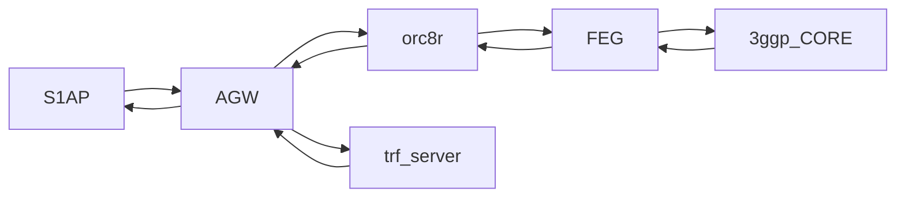

# Federated Integration Tests (EXPERIMENTAL)

The objective of Federated Integration Tests is to provide a test platform
where to run Magma with all its components.

As the diagram indicates, this test spins up AGW, FEG and Orc8r
and uses S1aP and trf server to run tests.



The processes will run on the following machines:
- AGW will run on **magma** vm.
- FEG and Orc8r will run on our **local docker**.
- Traffic server will run on **magma_trf** vm
- Test will be started from **magma_test** vm

## Build environment
### Automatic build
On your host machine go to
`cd  magma/lte/gateway/python/integ_tests/federated_tests` and run
```
fab build_all
```
Once it is built, start the traffic and test vm
```
cd magma/lte/gateway
vagrant up magma_test
vagrant up magma_trf
```

### Manual build
If you want to build the environment manually:
- AGW:
```
cd magma/lte/gateway
vagrant up magma
vagrant ssh magma
# inside vagrant vm
cd magma/lte/gateway
make run
```
- FEG:
```
cd magma/lte/gateway/python/integ_tests/federated_tests/docker
docker-compose build
docker-compose up -d
```
Orc8r
```
cd magma/orc8r/cloud/docker
./build -a
./run
# return to agw folder
cd magma/lte/gateway
# register gateways
fab --fabfile=dev_tools.py register_federated_vm
fab --fabfile=dev_tools.py register_feg_on_magma_vm
```
Test vm
```
cd magma/lte/gateway
vagrant up magma_test
vagrannt ssh magma_test
# inside vagrant vm
cd magma/lte/gateway/python
make
```
Traffic vm
```
cd magma/lte/gateway
vagrant up magma_trf
```

## Run test

Once you have built all the vms, you can try to run a test from
`magma_test` vm
```
cd magma/lte/gateway
vagrannt ssh magma_test
# inside vagrant vm
cd magma/lte/gateway/python/integ_test
make integ_test TESTS=s1aptests/test_attach_detach.py
```
