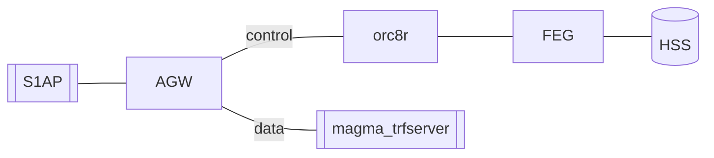

# Federated Integration Tests (EXPERIMENTAL)

The objective of Federated Integration Tests is to provide a test platform
to run Magma with all its components.

As the diagram indicates, this test spins up **AGW**, **FeG**, and **Orc8r**
and uses `S1aP` and `magma_trfserver` as an eNb and SGi emulator to run tests.



The services will run either on Vagrant VM or on Docker:

| Services          |  Vagrant VM       |  Docker   |
|-------------------|:-----------------:|:----------:|
| AGW               | magma             |           |
| FeG               |                   | &check;   |
| Orc8r             |                   | &check;   |
| Traffic server    | magma_trfserver   |           |
| S1AP tester       | magma_test        |           |


## Build environment

Next steps show you how to build the test environment automatically. If you
want to build this step by step go to [Manual build](#Manual-build)

Note commands for AGW will have to be run inside the vagrant VM. That is
why all the actions include the `vagrant ssh magma` command first. To leave
from vagrant just type `exit`. FeG and Orc8r will need to be run in the
host itself (no vagrant involved)

On your host machine execute this command to build, start and conigure AGW,
FEG and Orc8r and start them.
```bash
cd magma/lte/gateway/python/integ_tests/federated_tests
fab build_all_and_configure
```

After this is run you can check
if your gateways have been bootstrapped using magmad logs at AGW and FEG. The
command below will try to reach Orc8r From AGW And FeG and FeG from AGW
```basha
cd magma/lte/gateway/python/integ_tests/federated_tests
fab test_connectivity
```

Once it is built, start the magma_trfserver and magma_test VMs
```bash
cd magma/lte/gateway
vagrant up magma_test
vagrant up magma_trfserver
```

## Run test
Once you have built all the VMs, you can try to run a test from
`magma_test` VM
```bash
cd magma/lte/gateway
vagrant ssh magma_test
# inside vagrant vm
cd magma/lte/gateway/python/integ_test
make integ_test TESTS=s1aptests/test_attach_detach.py

# Once the test is done you can exit Vagrant VM
exit
```

This will run a simple attach-detach test.

## Other Commands
### Reconfigure
Once you have build the images you can stop and start the services

### Manual build
If you want to build the environment manually:
- AGW:
```bash
cd magma/lte/gateway
vagrant up magma
vagrant ssh magma

# inside vagrant vm
cd magma/lte/gateway
make run

# exit from Vagrant VM
exit
```
- FEG:
```bash
cd magma/lte/gateway/python/integ_tests/federated_tests/docker
docker-compose build
docker-compose up -d
```
- Orc8r:
```bash
cd magma/orc8r/cloud/docker
./build -a
./run
# return to agw folder
cd magma/lte/gateway
# register gateways
fab --fabfile=dev_tools.py register_federated_vm
fab --fabfile=dev_tools.py register_feg_gw
```
- Test vm:
```bash
cd magma/lte/gateway
vagrant up magma_test
vagrant ssh magma_test
# inside vagrant vm
cd magma/lte/gateway/python
make

# exit from vagrant vm
exit
```
- Traffic vm:
```bash
cd magma/lte/gateway
vagrant up magma_trfserver

# exit from vagrant vm
exit
```
