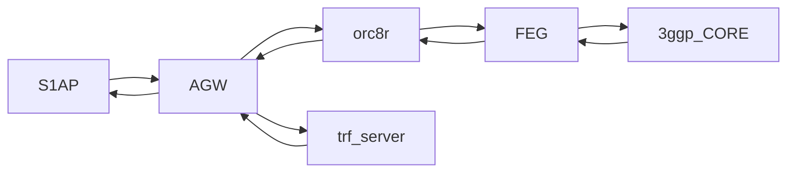

# Federated Integration Tests (EXPERIMENTAL)

The objective of Federated Integration Tests is to provide a test platform
where to run Magma with all its components.

As the diagram indicates, this test spins up AGW, FEG and Orc8r
and uses S1aP and trf server to run tests.



The processes will run on the following machines:
- AGW will run on **magma** vm.
- FEG and Orc8r will run on our **local docker**.
- Traffic server will run on **magma_trf** vm
- Test will be started from **magma_test** vm

Note commands for AGW will have to be run inside the vagrant VM. That is
why all the actions include the `vagrant ssh magma` command first. To leave
from vagrant just type `exit`. FEG and Orc8r will need to be run in the
host itself (no vagrant involved)

## Build environment
### Automatic build
On your host machine do
```bash
cd magma/lte/gateway/python/integ_tests/federated_tests
fab build_all
```
That will build AGW, FEG and Orc8r and start them all. It will also try to
register a federated AGW and a FEG gateway. After this is run you can check
if your gateways have been bootstrapped using magmad logs at AGW and FEG
```bash
#on AGW
cd magma/lte/gateway
vagrant ssh magma
sudo service magma@magmad logs
# exit from vagrant vm
exit

#on FEG
cd magma/lte/gateway/python/integ_tests/federated_tests
docker-compose logs -f magmad
```

You can also confirm communication between AGW-ORC8R-FEG using `feg_hello_cli`
```bash
cd magma/lte/gateway
vagrant ssh magma
magtivate
#this will let you access to a specific pyton environment
feg_hello_cli.py m 0
# which will return something like:
# resp:  greeting: "m"

# exit from vagrant vm
exit
```


Once it is built, start the traffic and test vm
```bash
cd magma/lte/gateway
vagrant up magma_test
vagrant up magma_trfserver
```

### Manual build
If you want to build the environment manually:
- AGW:
```bash
cd magma/lte/gateway
vagrant up magma
vagrant ssh magma
# inside vagrant vm
cd magma/lte/gateway
make run

# exit from vagrant vm
exit
```
- FEG:
```bash
cd magma/lte/gateway/python/integ_tests/federated_tests/docker
docker-compose build
docker-compose up -d
```
Orc8r
```bash
cd magma/orc8r/cloud/docker
./build -a
./run
# return to agw folder
cd magma/lte/gateway
# register gateways
fab --fabfile=dev_tools.py register_federated_vm
fab --fabfile=dev_tools.py register_feg_gw
```
Test vm
```bash
cd magma/lte/gateway
vagrant up magma_test
vagrannt ssh magma_test
# inside vagrant vm
cd magma/lte/gateway/python
make

# exit from vagrant vm
exit
```
Traffic vm
```bash
cd magma/lte/gateway
vagrant up magma_trfserver

# exit from vagrant vm
exit
```

## Run test

Once you have built all the vms, you can try to run a test from
`magma_test` vm
```bash
cd magma/lte/gateway
vagrannt ssh magma_test
# inside vagrant vm
cd magma/lte/gateway/python/integ_test
make integ_test TESTS=s1aptests/test_attach_detach.py

# exit from vagrant vm
exit
```
