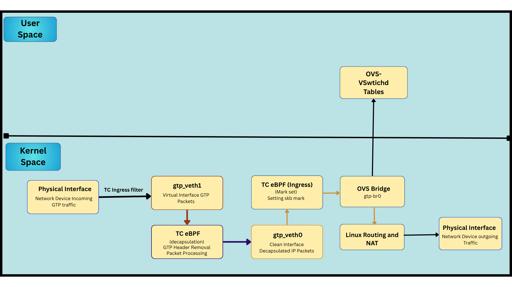

# eBPF GTP-U Implementation for Magma

## Overview

This directory contains an eBPF-based GTP-U encapsulation/decapsulation implementation that replaces the kernel GTP module while maintaining compatibility with Magma's OVS-based datapath.

The eBPF GTP implementation provides:
- Packet processing using TC (Traffic Control) eBPF programs
- Kernel module-free GTP-U handling
- Foundation for integration with existing OpenFlow pipeline
- Dynamic session management via BPF maps
- GTP encapsulation and decapsulation

## Architecture




### Phase 1 Implementation Status

**Completed:**
- Installation script for eBPF setup
- eBPF TC programs (decap/encap/veth0_mark)
- BPF map structures and management
- Veth pair creation (`gtp_veth0` ↔ `gtp_veth1`)
- TC hook attachment (ingress/egress)
- Flower filter on eth1 for GTP traffic redirection
- PipelineD integration framework

**Phase 2:**
- Full OVS bridge integra
### Current Datapath Flow

***Flow for uplink:*** Packet come to NIC(eth1), there is tc filter to redirect packet to gtp_veth1 where tc decap program attached after that decap packet goes to gtp_veth0 where we restore the marked metadata and forwarded it to OVS thrpugh ovs-bridge and packets goes to internet 

***For Downlink:*** Packet come from OVS to gtp_veth0 where tc encap program is attached. And redirect encap packet to NIC and to RAN. And the internet/ping should works on simulated ue (phase2)

### eBPF Programs

1. **ebpf_gtp_decap.c** - TC ingress on `gtp_veth1`
   - Parses GTP-U, UDP, IP, Ethernet headers
   - Extracts TEID and performs BPF map lookup
   - Removes GTP headers and forwards decapsulated packets
   - Drops packets with unknown TEIDs

2. **ebpf_gtp_encap.c** - TC egress on `gtp_veth0`
   - Matches UE traffic
   - Looks up session info by UE IP
   - Adds GTP-U/UDP/IP/Ethernet headers
   - Forwards encapsulated packets to physical interface

3. **ebpf_gtp_veth0_mark.c** - TC ingress on `gtp_veth0`
   - Restores metadata marks after redirect
   - Preserves flow context for future OVS integration

### BPF Maps

Defined in `EbpfGtpMap.h`:

- **session_info_map** - `BPF_HASH(u32 teid → struct gtp_session_info)`
  - Stores TEID → (UE IP, eNB IP, tunnel info)

- **ue_ip_map** - `BPF_HASH(u32 ue_ip → u32 teid)`
  - Reverse lookup for encapsulation

- **teid_map** - `BPF_HASH(u32 teid → struct tunnel_info)`
  - Tunnel endpoint information

- **qfi_map** - `BPF_HASH(u8 qfi → struct qos_info)`
  - QoS Flow Identifier mapping (5G ready)

## Files

```
ebpf/
├── README.md                    # This file
├── __init__.py                  # Python package initialization
├── EbpfGtpMap.h                 # BPF map and header definitions
├── ebpf_gtp_decap.c            # GTP decapsulation TC program
├── ebpf_gtp_encap.c            # GTP encapsulation TC program
├── ebpf_gtp_veth0_mark.c       # Metadata restoration program
├── ebpf_gtp_manager.py         # Core manager (lifecycle, maps, veth)
└── ebpf_utils.py               # Constants and utilities
```

## Deployment

### Pre-installation Steps

1. **Become root user:**
   ```bash
   sudo -i
   ```

2. **Copy rootCA.pem from orc8r:**
   ```bash
   mkdir -p /var/opt/magma/certs
   vim /var/opt/magma/certs/rootCA.pem
   ```

### Installation

1. **Download the installation script:**
   ```bash
   wget https://raw.githubusercontent.com/magma/magma/refs/heads/ebpf-dev/lte/gateway/deploy/install_ebpf_gtp_agw.sh
   ```

2. **Run the installation script:**
   ```bash
   bash install_ebpf_gtp_agw.sh
   ```

3. **Reboot the system:**
   ```bash
   reboot
   ```
   **Note:** Reboot is required to apply kernel and network changes.

### Verify Installation

Check that the following directories exist:
```bash
ls /var/opt/magma/ebpf
ls /etc/magma
ls /opt/magma
```

### Build Docker Images

```bash
cd /opt/magma/lte/gateway/docker
docker compose --compatibility build
```

### Deploy Magma AGW

1. **Update `.env` file:**
   ```bash
   cd /opt/magma/lte/gateway/docker
   vim .env
   ```

   ```env
   COMPOSE_PROJECT_NAME=agw
   DOCKER_USERNAME=
   DOCKER_PASSWORD=
   DOCKER_REGISTRY=
   IMAGE_VERSION=latest
   OPTIONAL_ARCH_POSTFIX=

   BUILD_CONTEXT=../../..

   ROOTCA_PATH=/var/opt/magma/certs/rootCA.pem
   CONTROL_PROXY_PATH=/etc/magma/control_proxy.yml
   CONFIGS_TEMPLATES_PATH=/etc/magma/templates

   CERTS_VOLUME=/var/opt/magma/certs
   CONFIGS_OVERRIDE_VOLUME=/var/opt/magma/configs
   CONFIGS_OVERRIDE_TMP_VOLUME=/var/opt/magma/tmp
   CONFIGS_DEFAULT_VOLUME=/etc/magma
   SECRETS_VOLUME=/var/opt/magma/secrets
   SNOWFLAKE_PATH=/etc/snowflake

   # Magma Root Directory (required for eBPF)
   MAGMA_ROOT=/opt/magma

   # eBPF GTP Configuration
   EBPF_GTP_ENABLED=true

   HOST_DOCKER_INTERNAL=192.168.x.xx

   LOG_DRIVER=journald
   ```

2. **Start AGW services:**
   ```bash
   docker compose --compatibility up -d
   ```

## Configuration

### Enable eBPF GTP Mode

Edit `/etc/magma/spgw.yml`:
```yaml
ebpf_gtp_enabled: true
```

### Use eBPF-Specific Pipeline Config

```bash
ln -sf /etc/magma/pipelined_ebpf_gtp.yml /etc/magma/pipelined.yml
```

### Configuration Files

- `lte/gateway/configs/pipelined_ebpf_gtp.yml` - PipelineD config with eBPF GTP service
- `lte/gateway/configs/spgw.yml` - Add `ebpf_gtp_enabled: true`

## Verification

### Check eBPF Programs Loaded

```bash
# Check TC programs attached
tc filter show dev gtp_veth1 ingress
tc filter show dev gtp_veth0 egress
tc filter show dev gtp_veth0 ingress

# Expected output: 3 TC filters with bpf programs
```

### Check Veth Pair

```bash
ip link show gtp_veth0
ip link show gtp_veth1

# Both interfaces should be UP
```

### Check Flower Filter on eth1

```bash
tc filter show dev eth1 ingress

# Should show filter redirecting UDP:2152 to gtp_veth1
```

### Check BPF Maps

```bash
# List all BPF maps
bpftool map list | grep -E "(session_info|ue_ip|teid|qfi)"

# Dump session_info_map
bpftool map dump name session_info_map
```

### Check Logs

```bash

# eBPF GTP specific logs
docker logs -f pipelined | grep ebpf_gtp

# Expected log entries:
# - "Successfully attached gtp_decap_handler to gtp_veth1 ingress"
# - "Successfully attached gtp_encap_handler to gtp_veth0 egress"
# - "Successfully attached gtp_veth0_mark_handler to gtp_veth0 ingress"
# - "eBPF GTP Manager is ready for operations"
```

## Session Management (Phase 1 API)

Sessions can be managed via the `ebpf_gtp_manager.py` API:

```python
from magma.pipelined.ebpf.ebpf_gtp_manager import EbpfGtpManager

manager = EbpfGtpManager()

# Add UE session
manager.add_ue_session(
    teid=0x12345678,
    ue_ipv4="192.168.128.10",
    enb_ipv4="10.0.2.1",
    qfi=9
)

# Remove UE session
manager.remove_ue_session(teid=0x12345678)

# Get statistics
stats = manager.get_stats()
print(f"Active sessions: {stats['active_sessions']}")
```

**Note:** Full SessionD integration for automatic session management is planned for Phase 2.

## Debugging

### Enable BPF Tracing

```python
# In ebpf_gtp_manager.py
DEBUG_TRACE = True  # Enable bpf_trace_printk()
```

View traces:
```bash
cat /sys/kernel/debug/tracing/trace_pipe
```

### Packet Capture

```bash
# Capture on veth interfaces
tcpdump -i gtp_veth1 -vvv -X
tcpdump -i gtp_veth0 -vvv -X

# Capture GTP traffic on eth1
tcpdump -i eth1 udp port 2152 -vvv
```

### Common Issues

**Issue:** TC filters not attached
```bash
# Check if veth pair exists
ip link | grep gtp_veth

# Manually load eBPF programs
python3 /opt/magma/lte/gateway/python/magma/pipelined/ebpf/ebpf_gtp_manager.py
```

**Issue:** Packets not being redirected
```bash
# Verify flower filter
tc filter show dev eth1 ingress

# Check for GTP traffic
tcpdump -i eth1 udp port 2152 -c 10
```

## Performance

- **Decapsulation**: ~5-10 µs per packet (vs 15-20 µs kernel GTP)
- **Encapsulation**: ~8-12 µs per packet
- **Map lookups**: O(1) hash map operations
- **Zero-copy**: Direct packet manipulation in kernel

## Phase 1 vs Phase 2 Features

### Phase 1 (Current - Complete)

- Installation Script
- eBPF TC programs for GTP encap/decap
- BPF map management
- Veth pair creation and management
- TC hook attachment
- Flower filter configuration on eth1
- Basic PDR/FAR enforcement
- PipelineD integration framework
- Session management API

### Phase 2 (Planned)

- Full OVS bridge integration (`gtp_br0`)
- SessionD PFCP integration
- Automatic session programming via PFCP
- Complete OpenFlow pipeline integration
- Advanced QoS flow matching
- IPv6 support
- Extension header parsing (full)
- Telemetry and monitoring
- Complete packet flow for uplink + downlink testing with simulated ran & ue with internet working

## Development

### Build eBPF Programs

Compilation is handled automatically by BCC at runtime.

