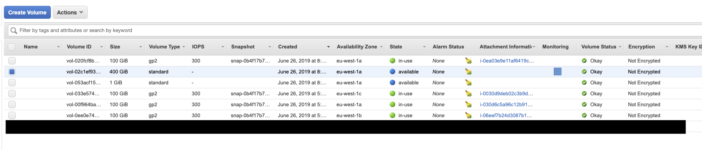
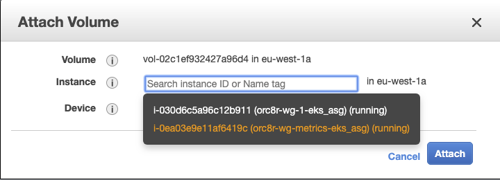

# Example Terraform for Orchestrator EKS

This directory contains a bare-bones Terraform script to set up an EKS cluster
which the cloud component of Orchestrator can be deployed to. Copy this
directory to a location of your choice and `terraform apply` to provision the
resources.

You should check in the generated .tfstate files after a `terraform apply`, so
consider copying this directory into your project's source control repository.
The terraform script will also output a kubeconfig file for `kubectl` and an
aws auth config map to manage access to the EKS cluster. These files should
also be checked in.

## Prerequisites

This script depends on Terraform >= 0.12.0, and you'll need a few other
dependencies to manage and deploy orc8r to the cluster. If you're on a Mac:

```bash
brew install terraform aws-iam-authenticator kubernetes-cli kubernetes-helm awscli
```

Next `cd` to where you've copied the contents of this directory and

```bash
terraform init
```

In the AWS console, create or import a new keypair to enable SSH access to the
worker nodes of the EKS cluster. This can be found in the EC2 dashboard under
"Key Pairs". If you're creating a new key pair, make sure not to lose the
private key :)


Next, create a `vars.tfvars` file in this directory, *add it to your source
control's .ignore*, and specify your desired RDS password and the name of the
keypair that you imported or created in the above step:

```
$ cat vars.tfvars
db_password = "foobar"
key_name = "my_key"
```

Now you're ready to move on:

## Terraform Workflow

You should always run a `terraform plan` before `terraform apply`. This will
let you preview what Terraform is going to do. Always sanity-check the output
of `terraform plan` before you run `terraform apply`.

1. `terraform plan`: check the output to make sure you're not deleting any 
resources which shouldn't be deleted
2. `terraform apply`
3. Check the generated .tfstate files into source control

In a team setting, refrain from running `terraform apply` before tfstate files
have been checked in after another apply. You may end up with nasty conflicts
in the state files. If that happens, just `terraform refresh` and commit those
changes.

## Setup Steps After Terraforming

We need to attach the 2 EBS volumes that Terraform provisioned to the worker
node which we'll be running the metrics stack on. At the moment these steps are
manual, but we will be automating these shortly with userdata in the launch
configuration. For now, follow these steps:

In the EC2 console, find the EBS volume for the prometheus tsdb, which by
default has a capacity of 400GiB:



Go to Actions -> Attach, and in the popup select the metrics worker. The
"device" field should autofill once you select the instance.



In the EC2 console, find the public IPv4 address of this EC2 machine, then
SSH into it. Don't forget to use the private key corresponding to the keypair
that you created/imported above.

Follow the shell commands in the below snippet. You should see output similar
to this snippet. (Replace `/dev/xvdf` with your mount device if necessary).

```
ssh ec2-user@<public IP here>

[ec2-user@ip-10-10-1-X ~]$ lsblk
NAME    MAJ:MIN RM  SIZE RO TYPE MOUNTPOINT
xvda    202:0    0  100G  0 disk
└─xvda1 202:1    0  100G  0 part /
xvdf    202:80   0  400G  0 disk

[ec2-user@ip-10-10-1-X ~]$ sudo file -s /dev/xvdf
/dev/xvdg: data

[ec2-user@ip-10-10-1-X ~]$ sudo mkfs -t ext4 /dev/xvdf
mke2fs 1.42.9 (28-Dec-2013)
Filesystem label=
OS type: Linux
Block size=4096 (log=2)
Fragment size=4096 (log=2)
Stride=0 blocks, Stripe width=0 blocks
26214400 inodes, 104857600 blocks
5242880 blocks (5.00%) reserved for the super user
First data block=0
Maximum filesystem blocks=2252341248
3200 block groups
32768 blocks per group, 32768 fragments per group
8192 inodes per group
Superblock backups stored on blocks:
	32768, 98304, 163840, 229376, 294912, 819200, 884736, 1605632, 2654208,
	4096000, 7962624, 11239424, 20480000, 23887872, 71663616, 78675968,
	102400000

Allocating group tables: done
Writing inode tables: done
Creating journal (32768 blocks): done
Writing superblocks and filesystem accounting information: done

[ec2-user@ip-10-10-1-X ~]$ sudo mkdir -p /data
[ec2-user@ip-10-10-1-X ~]$ sudo mount /dev/xvdf /data
[ec2-user@ip-10-10-1-X ~]$ sudo chmod 766 /data
```

**Now do the same series of steps for the prometheus config EBS volume**. This
volume by default is allocated with 1GiB of storage. It will likely get
attached to `/dev/xvdg`, but check `lsblk` to make sure. You want to mount this
device to `/configs/prometheus`, and
`sudo chmod 766 /configs && sudo chmod 766 /configs/prometheus`.

The Prometheus config manager application expects some configuration files to
be seeded in the EBS config volume (don't forget to use the correct private
key in `scp` with the `-i` flag:

```
scp -r config_defaults ec2-user@<public IP here>:~
ssh ec2-user@<public IP here>
[ec2-user@ip-10-10-1-239 ~]$ sudo cp -r config_defaults/. /configs/prometheus
```

Now you've got your infra set up, we can move on to configuring the EKS cluster.

Assuming you don't have an existing Kubeconfig file in `~/.kube/config`:

```bash
cp ./kubeconfig_orc8r ~/.kube/config
```

Now we can set up access to the EKS cluster:

```bash
kubectl apply -f config-map-aws-auth_orc8r.yaml
kubectl create namespace magma
```

Label the EKS worker nodes appropriately, so we can schedule the metrics pod on
the metrics worker and the Orchestrator pods on the Orchestrator worker nodes:

```bash
aws ec2 describe-instances --filters Name=tag:orc8r-node-type,Values=orc8r-worker-node \
  --query 'Reservations[].Instances[].[PrivateDnsName]' --region eu-west-1 --output text \
  | xargs -I % kubectl -n magma label nodes % worker-type=controller --overwrite

aws ec2 describe-instances --filters Name=tag:orc8r-node-type,Values=orc8r-prometheus-node \
  --query 'Reservations[].Instances[].[PrivateDnsName]' --region eu-west-1 --output text \
  | xargs -I % kubectl -n magma label nodes % worker-type=metrics --overwrite
```

At this point, if everything succeeded, you're ready to move on to the initial
Helm deployment. Follow the README in `magma/orc8r/cloud/helm`.

## Variables

| Name | Description | Type | Default | Required |
|------|-------------|:----:|:-----:|:-----:|
| db_password | The password for the RDS instance | string | "" | **yes** |
| key_name | The name of the EC2 keypair for SSH access to nodes | string | "" | **yes** |
| region | The AWS region to provision the resources in | string | "eu-west-1" | no |
| vpc_name | The name of the provisioned VPC | string | "orc8r-vpc" | no |
| cluster_name | The name of the provisioned EKS cluster | string | "orc8r" | no |
| map_users | Additional IAM users to add to the aws-auth configmap | list(map(string)) | [] | no |
| map_users_count | How many users are in map_users | string | 0 | no
