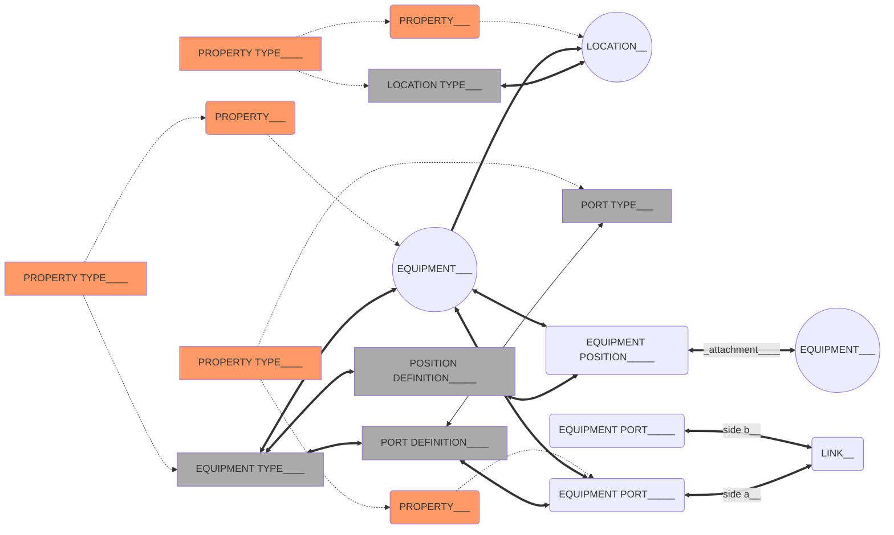

> Manage and track your equipment, deployments and connections.

### [Configure](/inventory/configure)
- Add or edit location types. These can be countries, cities, streets etc., their hierarchy in relation to other location types and properties unique to them.
- Add or edit equipment types. These can be splitters, cards, antennas etc., their ports, positions and properties.

### [Map](/inventory/map)
- See where your network is deployed. Location instances with latitude & longitude will be displayed here.

### [Inventory](/inventory/inventory)
- A tree view of the locations and equipment under each one.
- Add and edit location instances.
- Add, edit and link equipment instances.
- Data model:

### [Search](/inventory/search)
- Filter equipment by name/type/properties/locations etc..
- Export the list to CSV.

### [Services](/inventory/services)
- Filter service by name/type/properties etc..
- Export the list to CSV.
- Add or edit service instances

# Workforce Management
> Manage and track your projects and work orders.

### [Configure](/workorders/configure)
- Add or edit work order templates.
- Add or edit project templates. Project templates allow you to quickly create similar projects containing the same work order types.

### [Projects View](/workorders/projects)
- See all projects in either list or map view.
- Add or edit project instances.

### [Work Orders Search](/workorders/search)
- Filter work orders by type/location/name etc. View them in either list or map view.
- Add or edit work order instances.
